# SAD-043 — Solution Architecture Document

**Document ID:** SAD-043
**Version:** 1.0
**Status:** Draft for Product Office Review
**Type:** Solution Architecture (Engineering Blueprint)
**Scope contract:** governed by [APS-046 Engineering Baseline Freeze](./APS-046_Engineering_Baseline_Freeze.md)

> **What this document is:** the technical translation of the frozen Product Office specs
> ([APS-044 Identity](./APS-044_Auriva_Identity_and_Workspace_Platform.md),
> [APS-045 Experience](./APS-045_Auriva_Experience_Platform_Surface_Model.md)) into an implementable
> architecture. It explains **HOW**, never **WHAT** — it introduces no new scope. It is the foundation
> for PRS-043 (functional requirements) and the later HTML prototypes.
>
> **What this document is not:** code, migrations, APIs, schema changes, or UI. Read-only design.
>
> **Precondition:** implementation of this architecture begins only after **Phase 0 Repository
> Cleanup** (APS-046 §4) has merged to `main`. Authoring the blueprint now does not change that order.

**Engineering principles upheld throughout:** Clean Architecture · Domain-Driven Design · Single
Responsibility · Feature Flags · Zero-Downtime Migration · Backward Compatibility · Tenant Isolation ·
Security First.

---

## 1. Executive Summary

Auriva is becoming a multi-tenant Healthcare Operating System where **one human being** may be a
patient, a doctor in two clinics, and the owner of a third — all under **one credential**, with
**absolute isolation** between those contexts. SAD-043 describes the architecture that makes this
true without a rewrite.

The architecture rests on one idea: **separate the things that change at different rates and belong to
different owners.**

- **Identity** changes rarely and belongs to the *individual*. It answers "who is this human?"
- **Membership** changes with employment and belongs to the *organization*. It answers "what is this human's relationship to this org/clinic, and what may they do there?"
- **Workspace / Surface** is a *rendering* of a membership. It answers "what does this person see right now?"
- **Operational data** belongs to the *clinic*. It never follows the professional.

Fusing these (as a naïve `User → one StaffProfile → one Clinic` model does) makes multi-clinic
professionals, multi-owner organizations, and safe suspension impossible. Separating them makes each a
small, independently evolvable concern — and, critically, **the current codebase already leans this
way**: identity resolution is multi-profile-aware, capabilities are additive, and the patient session
already carries a server-resolved "acting-as" pointer. SAD-043 promotes these existing patterns rather
than inventing new ones.

The single largest change is relaxing one 1:1 assumption (`StaffProfile.user_id @unique`) into 1:N so
that one identity can hold many memberships. Everything else — the workspace selector, capability-driven
surfaces, multi-owner — composes cleanly on top of that and the existing capability framework.

---

## 2. Platform Layers

Eight layers, each with a single responsibility. Data and authority flow **downward**; a request is
resolved **upward** (from a session token to the surface it may render).

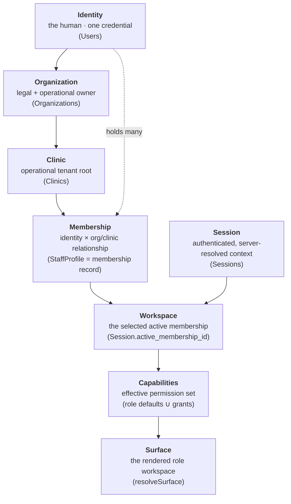

| Layer | Owns | Responsibility | Backing store |
|---|---|---|---|
| **Identity** | The individual | Permanent identity; credential; survives employment & orgs | `Users` |
| **Organization** | The org | Subscription, billing, legal + operational ownership | `Organizations` |
| **Clinic** | The org | Operational tenant root; owns appointments/billing/schedules | `Clinics` |
| **Membership** | The org (per APS-044 P1) | The identity↔org/clinic relationship: role, fee, availability, status, capability grants | `Staff_Profiles` (promoted to 1:N) + `Organization_Members` (role/ownership) |
| **Workspace** | The session | Which membership the session is currently acting in | `Sessions.active_membership_id` |
| **Session** | The platform | Authenticated context; server-resolved; never trusts client | `Sessions` |
| **Capabilities** | Derived | Effective permission set for the active membership | `effectiveCapabilities()` over `StaffProfile.capabilities` |
| **Surface** | Derived | The role workspace to render | `resolveSurface()` |

> **Key invariant:** the two bottom layers (Capabilities, Surface) are **pure functions** of the
> active membership — never persisted authority, never client-supplied. This is what keeps a workspace
> switch from leaking authority (§6, §8).

---

## 3. Authentication Architecture

Two credential worlds remain separate (APS-044 §9). A patient authenticates by OTP into the patient
world; staff authenticate by password into the professional world, which resolves through membership →
workspace → surface.

### 3.1 Patient login

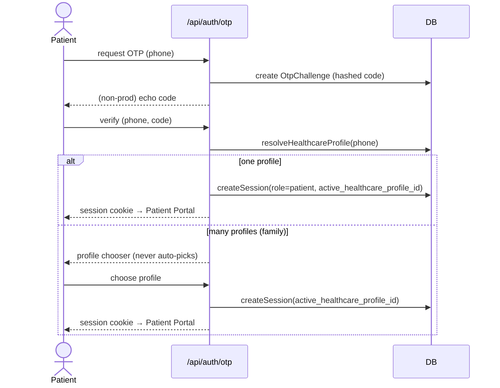

The patient world is **unchanged** by APS-044/045. It is shown here because its "resolve one context,
never trust the client, present a chooser when ambiguous" pattern is the exact template the staff side
adopts for memberships.

### 3.2 Staff login (the APS-044/045 flow)

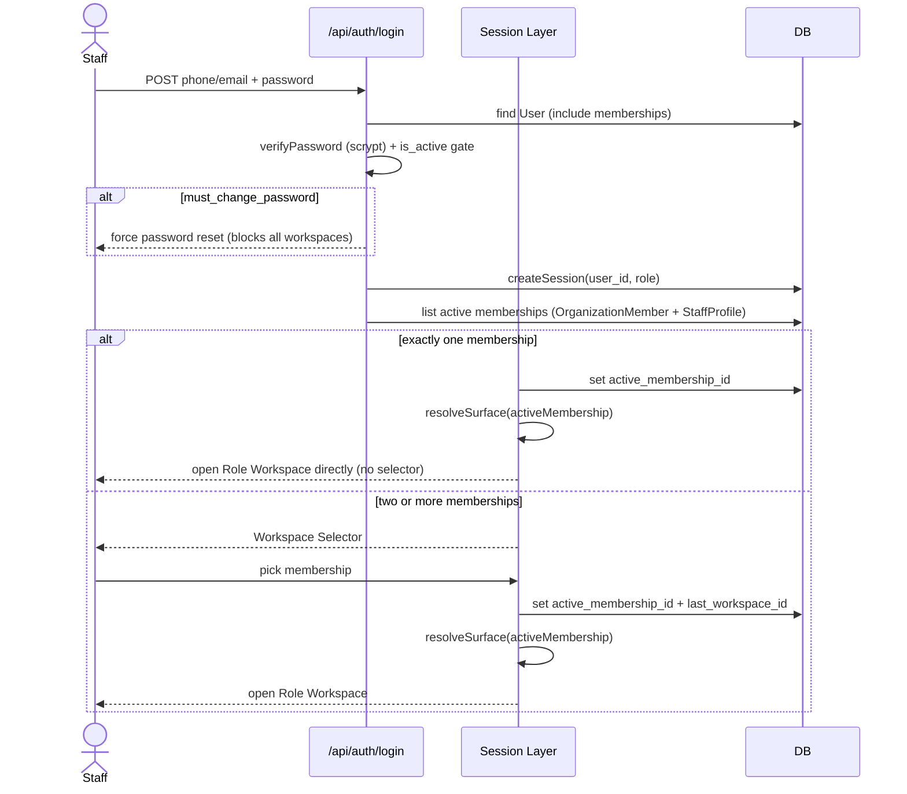

**Security properties:** the credential check (scrypt, rate-limited, `is_active` gate) is unchanged and
proven. The role/surface is **never** taken from the client — it is resolved server-side from the
active membership on every request. A single random 32-byte token (SHA-256 at rest, 12h TTL) backs the
session; workspace switching does **not** reissue it (§6).

---

## 4. Identity Resolution

### 4.1 The model

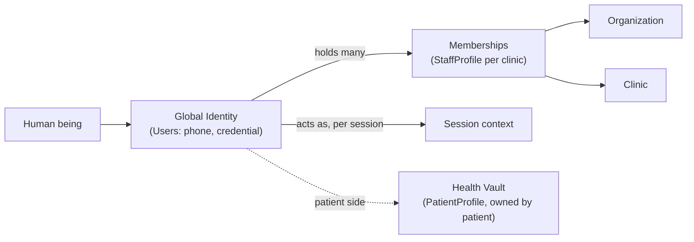

- **Global Identity** = the `Users` row (one credential, `phone_number` unique). Permanent; survives job changes and organizations.
- **Membership** = a `StaffProfile` (promoted to 1:N) bound to one clinic, carrying role, fee, availability, status, capability grants. Organizations own memberships (P1).
- **Health Vault** = `PatientProfile`, owned by the patient, never following a professional (P3).

### 4.2 How duplicate identities are handled — and why onboarding never blocks

APS-044 P5 is absolute: **identity matching never blocks onboarding.** The existing
`resolveHealthcareProfile` already implements the correct philosophy — ranked, advisory, never merging:

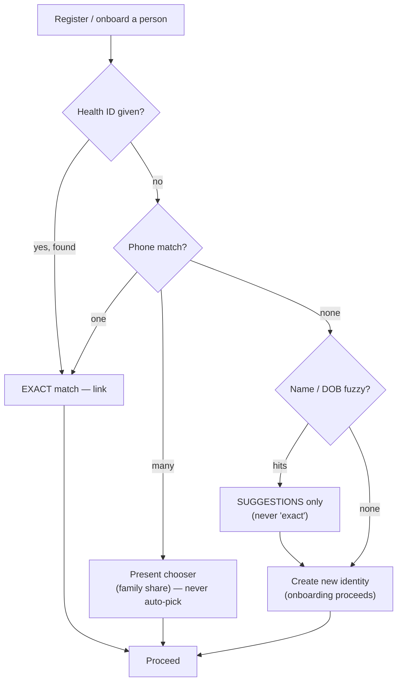

- **Clinic A creates Dr Ravi → Auriva ID A. Clinic B independently creates Dr Ravi → Auriva ID B.** This is *allowed*. Two identities for one human is acceptable; a false-positive auto-merge is worse than a duplicate (healthcare safety rule).
- **Reconciliation is optional and manual** (APS-044 §19a): if the human later wants the two merged, that is a Support/Verification-assisted action — never automatic, never a blocking precondition to operating a clinic.
- **The same principle for staff memberships:** creating a membership never requires resolving the person's other memberships. `Contact.value` is intentionally non-unique to allow family phone sharing; uniqueness lives only on `Users.phone_number` (the credential), never on contact data.

---

## 5. Workspace Resolution Engine

A **workspace** is a *selected active membership*. Resolution is deterministic and capability-driven.

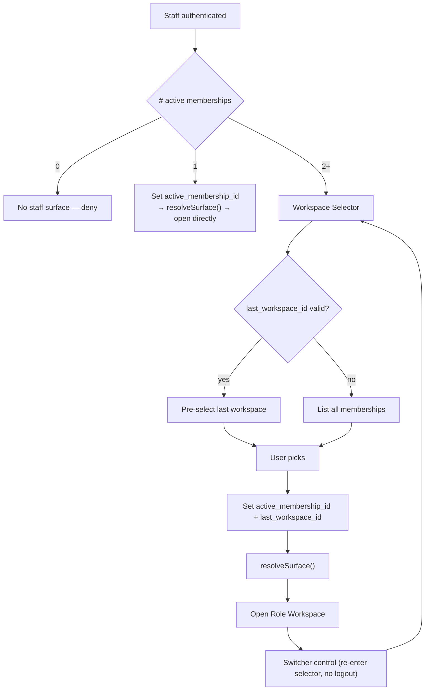

**Every decision, explained:**

- **One membership → auto-open.** No selector; the solo/single-clinic staffer never sees friction.
- **Two or more → selector.** The only case that needs a choice.
- **Remember last workspace** (`Users.last_workspace_id`): a convenience pre-selection, re-validated against current memberships (a revoked membership is silently dropped, never opened).
- **Switch** re-enters the selector *without* a full logout: server sets a new `active_membership_id`, re-resolves capabilities + surface. No token reissue (§6).
- **`resolveSurface()`** (APS-045 §6) maps the active membership's capabilities to one of four surfaces:

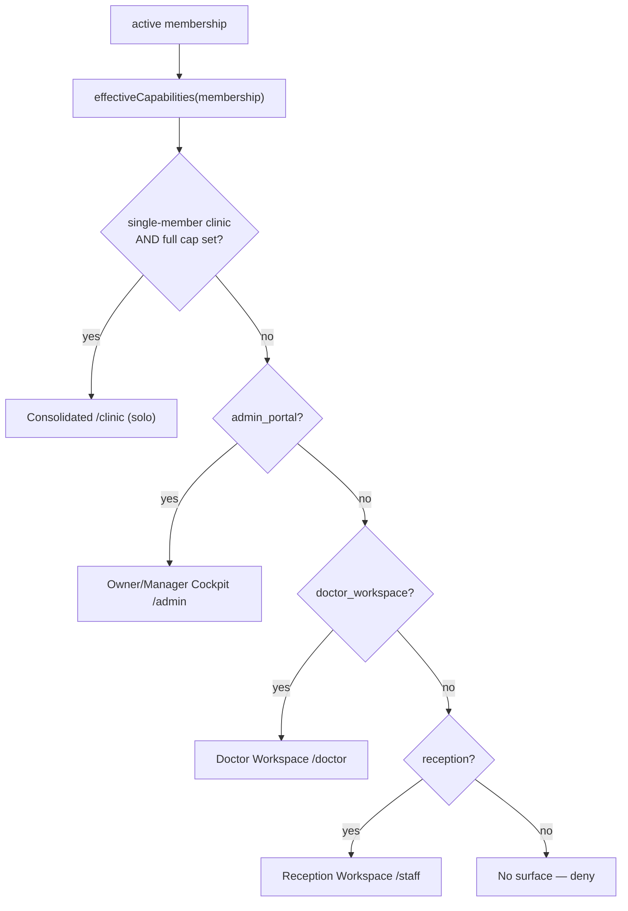

The "grow into a team" transition falls out for free: the moment a solo owner hires the first staff
member, the clinic is no longer single-member, so the owner's surface becomes the Cockpit and the hire
lands in their role workspace — no migration, no manual switch.

---

## 6. Session Architecture

### 6.1 Lifecycle

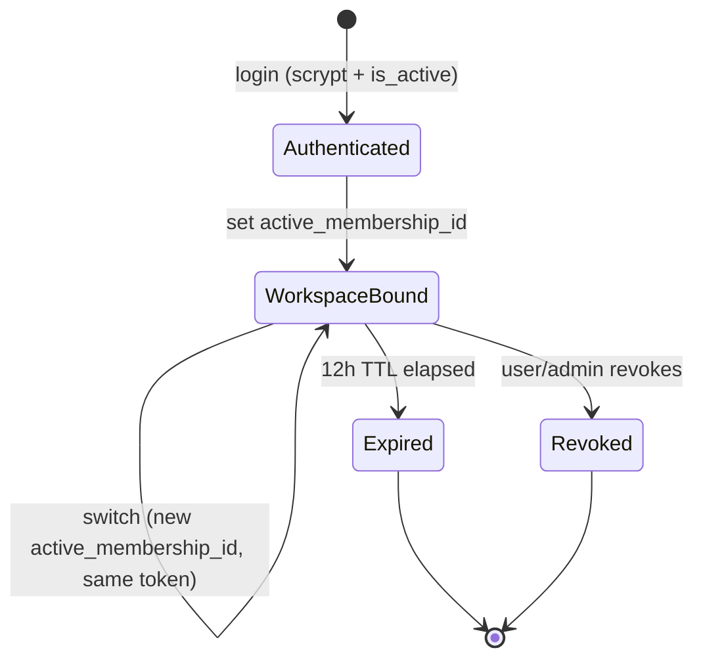

### 6.2 Storage & properties

- **Token:** random 32 bytes, stored **only** as a SHA-256 hash (`Sessions.token_hash`), `httpOnly` + `sameSite=lax` + `secure` in prod. 12h TTL (one shift).
- **New field:** `Sessions.active_membership_id` (nullable) — the staff twin of the existing `active_healthcare_profile_id`. Null for patient sessions and for staff before selection.
- **Capability resolution is per-request, never cached across a switch.** On every guarded request, the session layer loads the active membership and recomputes `effectiveCapabilities`. This is the single most important anti-privilege-escalation property (§11).
- **Workspace switching does not reissue the token** — the token is not the trust boundary; the server-resolved `active_membership_id` is. This avoids session-fixation concerns while allowing instant context change.
- **Invalidation:** logout deletes the row; a suspended/archived membership is denied at the request boundary regardless of a still-live token (defense-in-depth alongside the `is_active` login gate); session listing/revocation per user already exists.
- **Isolation:** a session in membership A can never resolve to clinic B's scope, because scope derives from the active membership, which is verified to belong to the caller.

---

## 7. Authorization Architecture

Authorization is **capability-driven, not role-driven.** A role is merely a *default bundle of
capabilities*; access checks consult the effective set, never a role string.

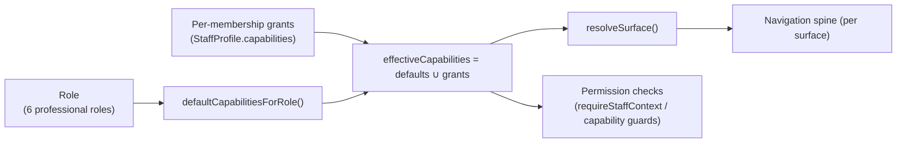

**Why capability-driven and not role-driven:**

- A **solo practitioner** is a doctor who *also* needs reception. In a role-driven system that is an
  impossible hybrid; in a capability-driven system it is a doctor membership *granted* `reception`.
- **Practice Manager, Nurse, Technician** are new roles expressed as different default bundles —
  adding them touches one map, not scattered `if role == …` branches.
- The check surface stays **centralized** (`authorization.ts` is the only place role→capability logic
  lives — the codebase already enforces "no `role === …` outside this module").

**The six professional roles** (APS-044 §11, locked) and their default bundles:

| Role (stored value) | Default capabilities | Primary surface |
|---|---|---|
| Owner (`super_admin`) | reception, doctor_workspace, admin_portal | Cockpit (or consolidated `/clinic` when solo) |
| Practice Manager | admin_portal (minus clinical write) | Cockpit |
| Doctor | doctor_workspace | Doctor Workspace |
| Receptionist | reception | Reception Workspace |
| Nurse | doctor_workspace (scoped: vitals/assist) | Doctor Workspace (variant) |
| Technician | doctor_workspace (scoped: results) | Doctor Workspace (variant) |

> "Owner" is a **display label**; the stored role value remains `super_admin` (avoids a large,
> pointless blast radius across sessions/audit/tests). Nurse/Technician are **capability-scoped
> variants** of the Doctor Workspace, not new surfaces (APS-045 §5).

---

## 8. Tenant Isolation

Isolation is the platform's most important invariant (APS-044 P7 + §13a). It is enforced **server-side
at every layer**, never by UI hiding.

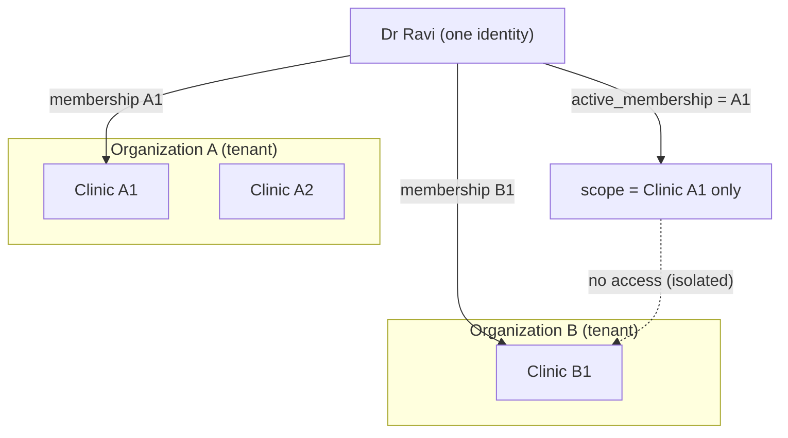

| Isolation kind | Enforcement |
|---|---|
| **Organization** | Every org-scoped op resolves via `requireOrganizationContext` against ownership; no cross-org read |
| **Clinic** | `requireStaffContext` scopes to the active membership's clinic; client-supplied `clinic_id` is ignored for clinic-bound staff, validated against ownership for owners |
| **Membership** | Each membership is an independent contractual relationship; scope derives from the *active* one only |
| **Patient** | `PatientProfile` owned by patient; `requirePatientContext` resolves the acting profile from the session, never the client |
| **Financial** | Invoices/payments are clinic-scoped; a membership in clinic A cannot read clinic B's ledger |
| **Workspace** | Capabilities + surface recomputed per active membership; a switch cannot carry authority across |

**Cross-Tenant Suspension Rule** (APS-044 §13a, the Membership Isolation Rule): suspension, archival,
promotion, fee change, availability, and signatures in Clinic A have **no effect** in Clinic B. This is
structurally natural in this architecture because those attributes live on the **per-clinic
`StaffProfile`** (membership record), not on the shared identity. Only the Global Identity is shared.

**Cross-Tenant Visibility Rule:** a person's presence in the Workspace Selector reveals only *their
own* memberships; no tenant can enumerate another tenant's members through any staff surface.

Both rules are **CI-gated by isolation tests** (§14): a request in membership A must be structurally
unable to read clinic B.

---

## 9. Database Architecture

*Schema evolution described only — no migrations here (APS-046).* All changes are **additive**; the one
constraint relaxation (`StaffProfile.user_id`) is reversible while no user holds two profiles.

### 9.1 Evolving entities

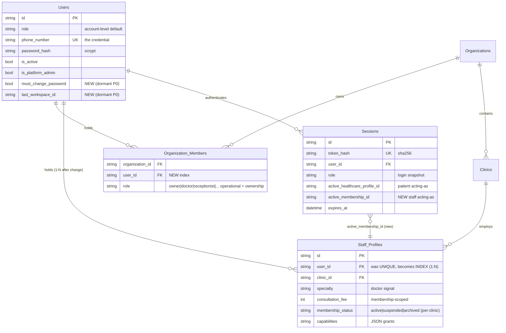

### 9.2 Changes, by table

| Table | Change | Rate/type |
|---|---|---|
| `Sessions` | **+`active_membership_id`** (nullable) | Additive, dormant in Phase 0 |
| `Users` | **+`must_change_password`** (default false), **+`last_workspace_id`** (nullable) | Additive, dormant in Phase 0 |
| `Organization_Members` | **+`@@index([user_id])`** (selector lookup); becomes multi-owner source (`role='owner'`) | Additive index |
| `Staff_Profiles` | **`user_id @unique` → `@index`** (1:1 → 1:N). Becomes the Membership record. | Constraint relaxation (Batch B) |

### 9.3 Relationships, indexes, extensibility

- **New relationship:** `Sessions.active_membership_id → Staff_Profiles.id` (nullable FK).
- **Indexes:** `Organization_Members(user_id)` for "my memberships"; `Staff_Profiles(user_id)` replaces the dropped unique so membership lookup stays indexed; existing `Sessions(token_hash)` unique unchanged.
- **Future extensibility (no action now):** `Staff_Profiles` can later carry `signature`, richer employment status, and per-membership scheduling without further structural change — it is already the membership record. `Organization_Members.role` can host the six roles without a new table.
- **What is deliberately NOT changed:** `owner_user_id` on `Organizations` stays (legal owner anchor); `Contact.value` stays non-unique (family sharing / identity-never-blocks); no clinical/billing table is touched.

---

## 10. API Architecture

*Future endpoint shapes only — no implementation. Existing endpoints listed where they evolve.*

| Concern | Endpoint (proposed) | Notes |
|---|---|---|
| **Authentication** | `POST /api/auth/login` (evolve) | On success returns membership list; routes to selector when >1 |
| **Mandatory reset** | `POST /api/auth/password/change` (new) | Blocks workspace access until `must_change_password` cleared |
| **Password reset** | `POST /api/auth/password/reset-request`, `/reset` (new) | Standard token flow |
| **Workspace list** | `GET /api/workspaces` (new) | Caller's active memberships for the selector |
| **Workspace switch** | `POST /api/workspace/switch` (new) | Verifies caller holds the membership; sets `active_membership_id` + `last_workspace_id`; no token reissue |
| **Surface resolution** | server-side (`resolveSurface`) | Not a public endpoint; consumed by routing/layout |
| **Provisioning** | `POST /api/organizations/[id]/staff` (evolve onboarding) | Issues temp password + `must_change_password`; forbids 2nd profile until GA |
| **Ownership** | `requireOrganizationContext` (evolve) | Ownership via `OrganizationMember.role='owner'` (multi-owner) |
| **Staff context** | `requireStaffContext` (evolve) | Resolves clinic/capabilities from active membership |

All new/evolved endpoints inherit the existing contract-test discipline; the **isolation property is a
test, not a comment**.

---

## 11. Security Architecture

### 11.1 Threat model (STRIDE-lite, focused on the new surface)

| Threat | Vector | Mitigation |
|---|---|---|
| **Cross-tenant leakage** | Client supplies another clinic's `clinic_id`/`membership_id` | Scope derives from server-verified active membership; client values ignored/validated; isolation CI gate |
| **Privilege escalation via switch** | Retain clinic-A authority after switching to B | Capabilities recomputed per request from active membership; never cached across switch |
| **Session hijacking** | Steal cookie | `httpOnly`+`secure`+`sameSite`; token only stored hashed; 12h TTL; revocation list |
| **Session fixation** | Fix a token pre-auth | New random token per login; switch does not reuse a pre-auth token |
| **Identity spoofing** | Claim another's membership | Membership ownership verified on every switch and request |
| **Suspended-user access** | Use a live token after suspension | Membership status checked at request boundary (per-clinic) |
| **Temp-password abuse** | Long-lived temp credentials | `must_change_password` forces reset before any workspace loads; optional `password_set_at` for rotation |

### 11.2 Controls

- **Permission validation:** centralized in `authorization.ts` + `requireStaffContext`; single choke point.
- **Audit logging:** membership lifecycle (invite/suspend/reactivate/archive), workspace switches, provisioning, and plan/ownership changes recorded in `Audit_Logs` (org-scoped).
- **Mandatory password reset:** middleware-enforced gate ahead of all staff surfaces.
- **Future MFA (🔵):** the session model accommodates a second-factor step between credential check and session creation; out of scope for this release but not precluded.

---

## 12. Migration Strategy

Zero-downtime, additive, feature-flagged (`FEATURE_MULTI_WORKSPACE`, default off). Aligns to APS-046 §4.

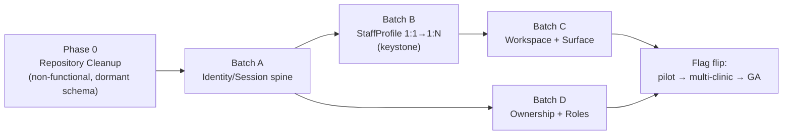

| Phase | Contents | Behavior change? | Rollback |
|---|---|---|---|
| **Phase 0** | Remove vestigial type; consolidate role literals; expand role union (dormant); add dormant nullable columns + index | **No** | Drop columns/index |
| **Batch A** | Activate `active_membership_id`; managed provisioning + `must_change_password` | Behind flag | Flag off |
| **Batch B** | Drop `StaffProfile.user_id @unique`; membership-scoped `requireStaffContext`; guard against 2nd profile until GA | Behind flag | Re-add unique (safe while no user has 2 profiles) |
| **Batch C** | Workspace Selector + switch + `resolveSurface()`; reconnect `/doctor`,`/staff`,cockpit | Behind flag | Flag off → single-membership routing |
| **Batch D** | Multi-owner checks; assign new roles; retire `memberRoleFromSpecialty` (last) | Behind flag | Flag off; heuristic retained until D completes |

**Backward compatibility:** every additive column is nullable/defaulted → existing rows behave
identically; `active_membership_id` backfills trivially (each user has ≤1 membership today). No token
format change → no forced logout on rollback.

---

## 13. Performance Considerations

| Concern | Design | Scale note |
|---|---|---|
| **Workspace resolution** | Pure function over an already-loaded membership; O(1) | No DB round-trip beyond loading the active membership |
| **Membership lookup ("my workspaces")** | Indexed by `Organization_Members(user_id)` / `Staff_Profiles(user_id)` | Bounded by a person's membership count (small, even for locums) |
| **Caching** | `last_workspace_id` avoids a selector round-trip on re-login; capabilities recomputed per request (correctness > cache) | Capability recompute is a single indexed read; acceptable |
| **Session creation** | Unchanged cost (one insert) | — |
| **Hospital scale** | `Organization_Members`/`Staff_Profiles` fan-out is per-clinic and indexed; no full scans | A 500-staff hospital lists a member's own memberships in an index seek, not a scan |

The deliberate non-cache of capabilities across a switch is a **security-over-performance** choice; the
cost is one indexed read per request, which is negligible against the isolation guarantee it buys.

---

## 14. Testing Architecture

| Layer | What it proves |
|---|---|
| **Unit** | `resolveSurface()` maps capability sets → surfaces correctly; `effectiveCapabilities` union; membership-role resolution |
| **Integration** | Login → selector vs auto-open; switch sets scope; provisioning forces password change |
| **Security / Isolation (CI GATE)** | Membership A cannot read clinic B; client-supplied `clinic_id`/`membership_id` mismatching session → 403, not silent-narrow; suspended-in-A/active-in-B |
| **Migration** | Additive columns backfill; `active_membership_id` populated for every existing user; re-adding `@unique` succeeds while no user has 2 profiles |
| **Regression** | Every solo/single-membership flow byte-identical with flag off (protects frozen solo UX) |
| **E2E** | Doctor with 2 clinic memberships consults in each; data never crosses; selector + remember-last works |
| **Performance** | Selector + membership lookup at hospital scale with indexes |

The **isolation suite is the release gate** — it encodes the Membership Isolation Rule as executable
truth, not documentation.

---

## 15. Engineering Risks

| # | Risk | Type | Mitigation |
|---|---|---|---|
| R1 | Relaxing `StaffProfile` 1:1 breaks `findUnique(user_id)` call sites | Technical | Grep-gate every site; convert to membership-scoped `findFirst`; contract tests (audit §14) |
| R2 | Cross-tenant leak once N memberships exist | Technical/Security | Scope from active membership only; verify ownership; isolation CI gate |
| R3 | Stale capability cache across switch | Security | Recompute per request; never cache across switch |
| R4 | Reconnecting `/doctor`,`/staff` re-exposes stale auth gaps (they predate current hardening) | Technical | Re-verify session guards on those trees before flag flip |
| R5 | Removing `memberRoleFromSpecialty` too early | Technical | Replace → migrate → delete last (Batch D) |
| R6 | Rollback blocked if a user gains 2 profiles pre-GA | Operational | Service-layer forbids 2nd profile until GA |
| R7 | Hospital-scale selector latency | Scalability | Indexes + bounded membership count; measured in perf tests |

No risk rises to blocking; all are localized and mitigated by the phased, flagged plan.

---

## 16. Implementation Dependencies

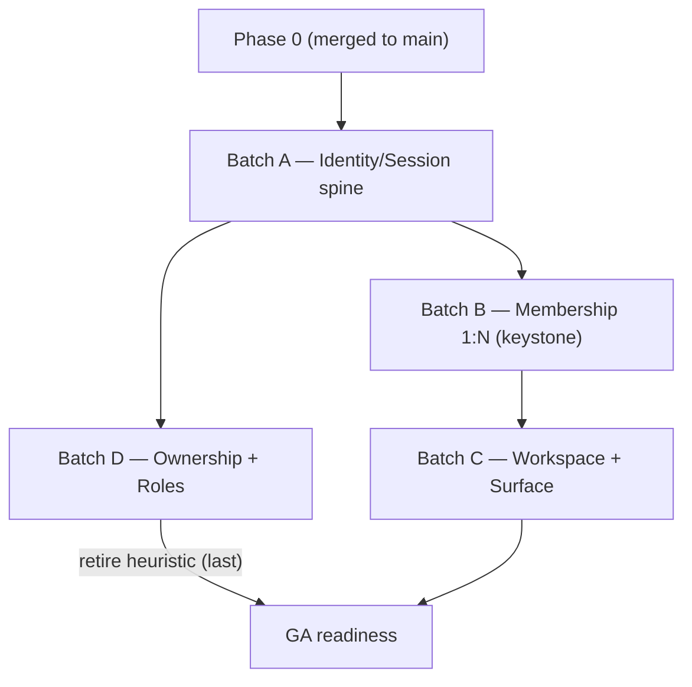

- **Phase 0** blocks everything (clean baseline first).
- **Batch A** blocks B and D (both need session/membership context).
- **Batch B** blocks C (surface resolution needs 1:N memberships to be real).
- **Batch C** and **Batch D** run in parallel after their prerequisites; both must complete for GA.
- **`memberRoleFromSpecialty` deletion** is the *last* action inside Batch D.

Branch mapping (APS-046 §5): `phase-0-cleanup` → `identity-platform` (A+B) → `workspace-platform` (C+D).

---

## 17. Out of Scope

Per APS-046 §3, the following are **explicitly excluded** from APS-044/045 implementation. Each is a
separate BRD; no branch may widen scope to include them.

- **Billing** (invoices, payments, invoice-centric workflow)
- **Encounter Ledger** (its own future billing BRD)
- **EMR / Clinical records**
- **Prescriptions** (including the legacy `prescription_*` read-path migration)
- **Labs / Diagnostics / Test Recommendations**
- **Finance / Revenue / Command Center analytics logic**
- **Patient Journey / Patient UX** (booking, records, family, portal)
- **Notifications** (delivery channels)
- **Release Management** (APS-036)
- **Marketing site**

> If a change is about *who a person is, which workspace they enter, or how they are routed/authorized*
> → in scope. If it is about *what happens inside a clinical or financial workflow* → out of scope,
> raise a separate BRD.

---

## Appendix — Traceability

| Frozen decision | SAD-043 section |
|---|---|
| APS-044 P1 Orgs own memberships | §2, §4, §9 |
| APS-044 P6 One credential, many workspaces | §4, §5, §9 (1:N) |
| APS-044 §13a Membership Isolation Rule | §8, §14 |
| APS-044 §19a Legal vs operational owner | §7, §9, §10 |
| APS-045 Workspace Selector → Role Workspace | §3, §5 |
| APS-045 `resolveSurface()` capability-driven | §5, §7 |
| APS-045 Reconnect `/doctor`+`/staff` | §5, §12 (Batch C) |
| APS-046 Phase 0 / Phase 1 split + branches | §12, §16 |
| Audit: four refactor seams | §9, §12, §15 |

**Next:** on approval, PRS-043 (Functional Requirements & User Flows), then interactive HTML
prototypes for UI review, then implementation (Phase 0 first).
