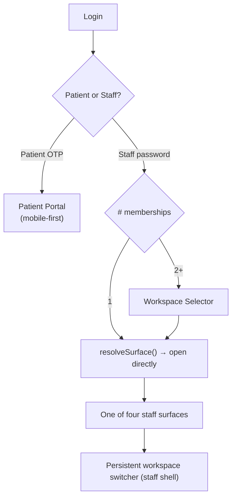
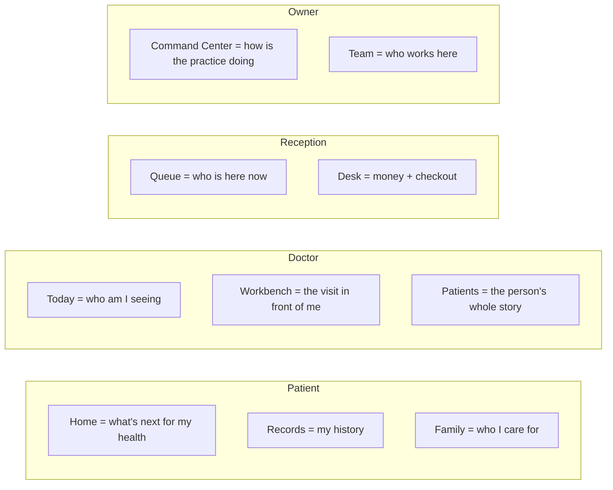
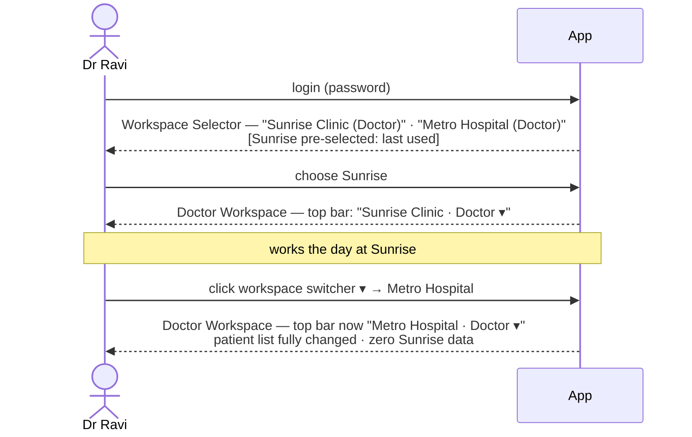

# UXS-043 — Auriva Experience Specification

**Document ID:** UXS-043
**Version:** 1.0
**Status:** Draft for Review (Product Office · Design · Clinical · Business)
**Type:** Experience Specification — the UI/UX source of truth for the APS-044/045 surface model
**Scope contract:** [APS-046 Engineering Baseline Freeze](./APS-046_Engineering_Baseline_Freeze.md)

> **Purpose.** This is the *experience* Bible: how every screen should feel, how people move through the
> product, and what each persona needs to answer "what do I do next?" It translates the frozen
> [APS-045 Surface Model](./APS-045_Auriva_Experience_Platform_Surface_Model.md) into concrete journeys,
> screens, states, and interaction rules — the brief the interactive HTML prototype is built from and
> reviewed against, *before* PRS-043 commits it to functional requirements.
>
> **Grounded, not invented.** Auriva already has a design system (Auriva Design System v1.0, live in
> [globals.css](../src/app/globals.css)) and an existing design corpus (`design/aps-003…008`,
> per-surface mockups in `design/mockups/`). UXS-043 **consolidates and re-anchors** those to the four
> frozen surfaces — it does not restart the visual language. The exhaustive atomic component/token
> standards live in the companion **APS-047 — Design System & Component Standards**; UXS-043 references
> them at the usage level.
>
> **Not in scope** (APS-046 §3): billing/EMR/labs/finance/notifications/marketing UX. This spec covers
> **identity, workspace, and the surfaces that render a membership.**

---

## 1. Experience Principles (from APS-045)

The surface model exists to serve one truth: **a clinic is a busy place, and the software must reduce
cognitive load, never add to it.** Five principles, each traceable to APS-045:

1. **One person, one credential, the right room.** The product opens people into the *single* surface their active membership calls for — never a generic dashboard they must decode (APS-045 X1–X3).
2. **The surface is earned by capability, not announced by title.** What you can do shapes what you see; a solo owner-doctor sees everything consolidated, a hired receptionist sees the front desk (APS-045 §6).
3. **Switching contexts is instant and unmistakable.** A multi-clinic professional always knows *which* clinic they are acting in; the active workspace is always visible and one click from change (APS-045 §7).
4. **Isolation is felt as trust.** A person never sees another tenant's data, and the UI never even hints it exists (APS-044 §13a).
5. **Grow without a migration.** Hiring the first staff member re-shapes the owner's surface automatically; the product grows with the practice, invisibly (APS-045 §6).

---

## 2. Navigation Architecture

### 2.1 The two worlds and the selector

### 2.2 Navigation spine per surface (frozen structure, APS-045 §8)

| Surface | Nav spine | Nav pattern |
|---|---|---|
| **Patient Portal** | Home · Book · Records · Family · You | Bottom tab bar (mobile-first; centered phone column on desktop) |
| **Doctor Workspace** | Today · Workbench · Schedule · Patients · Practice · Profile | Left rail (desktop) / top tabs (tablet) |
| **Reception Workspace** | Queue · Appointments · Walk-in · Desk (Billing) · Lab worklist | Left rail; Queue is the default landing |
| **Owner / Manager Cockpit** | Command Center · Team · Clinics · Finance · Plan · Settings | Left rail; Command Center default |
| **Consolidated Clinic (solo)** | Frozen Release 1.2 v1.0 IA (Today · Calendar · Treatments · Payments · Practice · Settings) | Single adaptive surface |

**The workspace switcher** is a persistent control in every staff shell (never in the patient world):
shows the active clinic + role, opens the selector on click, no logout. Single-membership staff see the
current-workspace label but no switch affordance (nothing to switch to).

---

## 3. Information Architecture

Information is grouped by **the question the person is answering right now**, not by database entity.

IA rules:
- **Primary object per surface** is unmistakable: Doctor → the visit; Reception → the queue; Owner → the practice health; Patient → the next action.
- **Depth ≤ 3 taps** to any routine action.
- **Cross-surface objects (a patient, an appointment) keep a stable identity card** wherever they appear (§8.4) so recognition transfers.
- **Multi-clinic context is always in the chrome**, never buried — the active-workspace label sits in the top bar of every staff surface.

---

## 4. Screen Inventory

Grounded in the existing route trees (`src/app/doctor|staff|admin|clinic|patient`). ★ = new for
APS-044/045; ↺ = existing surface reconnected (APS-045 §9).

| Surface | Screens |
|---|---|
| **Entry** | Login (patient/staff) · ★ Workspace Selector · ★ Mandatory Password Change · Forgot/Reset Password |
| **Patient Portal** | Home · Book (find care → doctor → slot) · Records (visits, prescriptions, results) · Family (profiles + switch) · You (profile, settings, sessions) |
| **Doctor Workspace ↺** | Today (mission control) · Consult Workbench · Schedule · Patients (list + detail/timeline) · Practice · Profile |
| **Reception Workspace ↺** | Queue board · Appointments (day/list) · Walk-in registration · Desk / Checkout · Lab worklist · Patient lookup/detail |
| **Owner/Manager Cockpit ↺** | Command Center · Team roster (+ invite, ★ suspend/archive, ★ provisioning) · Clinics · Finance summary · Plan · Settings (Practice/Team/Plan) · Departments · Events |
| **Consolidated Clinic (solo)** | Today · Calendar · Treatments · Payments · Practice · Settings (unchanged frozen IA) |

★ **New screens introduced by APS-044/045** (the design focus): **Workspace Selector**, **Mandatory
Password Change** (managed provisioning first-login), **Suspend/Archive member** flows, **multi-owner**
affordances, and the **active-workspace switcher** present across all staff surfaces.

---

## 5. User Journeys

Seven personas. Each journey = *entry → surface resolution → primary loop*. New APS-044/045 moments are
marked ★.

### 5.1 Owner (solo) — the consolidated experience preserved
Login → single membership, full capabilities, single-member clinic → **Consolidated `/clinic`** (frozen
Release 1.2 UX). Primary loop: Today → see a patient → take payment. No selector, no switcher. **★ The
moment they invite their first staff member**, their next login resolves to the **Owner Cockpit**, and
the hire lands in their own role workspace — surfaced with a one-time "Your practice grew — here's your
new command center" explainer so the transition is a delight, not a surprise.

### 5.2 Owner / Practice Manager (multi-person)
Login → admin capability → **Owner/Manager Cockpit**. Primary loop: Command Center (how's the practice)
→ Team (who works here) → Finance summary. Practice Manager sees the same cockpit **minus clinical write
and minus plan/billing mutation** (capability-scoped).

### 5.3 Doctor (single or multi-clinic) ★
Login → doctor capability. **★ If they hold memberships in two clinics → Workspace Selector** (pre-selects
last workspace). Enter **Doctor Workspace**. Primary loop: Today (my patients) → Workbench (the visit) →
sign & complete → next. **★ Switching to the second clinic** is one click; the active-clinic label
changes, the patient list changes, and *nothing from clinic A is visible*.

### 5.4 Receptionist
Login → reception capability → **Reception Workspace**, landing on **Queue**. Primary loop: check-in /
walk-in → move through queue → **Desk / checkout** → next patient.

### 5.5 Nurse ★
Login → doctor_workspace capability, **scoped variant** → **Doctor Workspace (Nurse view)**: vitals
capture, assist, patient prep. No prescription authority; those controls are absent (not disabled-greyed
— absent, per §7 capability model).

### 5.6 Technician ★
Login → doctor_workspace capability, **results-scoped variant** → **Doctor Workspace (Technician view)**:
results entry / worklist only. No consult authoring.

### 5.7 Patient
OTP login → Patient Portal (mobile-first). **If the phone maps to multiple profiles (family) → profile
chooser** (never auto-picks). Primary loop: Home ("what's next") → Book → Records. Family switch changes
the acting profile server-side.

---

## 6. Storyboards (major journeys)

### 6.1 Staff login with two memberships → selector → switch ★

**Storyboard beats:** (1) selector cards show clinic name + role + last-active hint; (2) pre-selection
reduces the common case to one Enter; (3) the switch is visually decisive — the whole content region
re-renders and the active-clinic chip changes color-anchored to that clinic; (4) an isolation
reassurance is *implicit* — nothing from the other clinic bleeds through.

### 6.2 Owner hires first staff member → surface transition ★
Solo owner (Consolidated `/clinic`) → invites a receptionist → on the invitee's acceptance, owner's next
login resolves to **Owner Cockpit** with a one-time welcome overlay: *"You're now running a team.
Here's Command Center."* The Treatments/Payments they used daily are still one tap away. **No data
migration, no re-onboarding.**

### 6.3 Managed provisioning first-login ★
Owner creates a doctor account (temp password, no SMS needed) → shares credentials → doctor logs in →
**forced Mandatory Password Change screen** (blocks all workspaces) → sets password → lands in Doctor
Workspace. The screen states *why* ("Your practice created this account — set your own password to
continue") — never a dead-end.

### 6.4 Doctor consult loop
Today → tap patient → Workbench (left clinical rail: history, allergies, last visit; center: notes,
diagnosis, prescription) → sign & complete → auto-advance to next. Follow-up date, if set, becomes a
real booking.

### 6.5 Reception queue → checkout
Queue (who's here) → check-in a walk-in (register in <20s) → patient flows to doctor-ready → after
consult, **Desk** shows the amount to collect → take payment → print/receipt → patient leaves.

---

## 7. States: Empty · Loading · Error · Offline · Permissions

**Governing rule (UX Principle, §11): never a blank page, never a dead end.** Every state answers "what
now?"

| State | Pattern |
|---|---|
| **Empty (no data)** | Illustrative empty state + one-line reason + **primary next action**. e.g. empty Queue → "No one's checked in yet. Register a walk-in →". Never a bare "No results." |
| **Loading** | Skeletons that match the final layout (cards/rows), not spinners, for content regions; inline spinners only for button-scoped actions. Perceived-instant < 400ms. |
| **Error** | Plain-language cause + a recovery action ("Retry", "Go to Queue"). Never a stack trace, never "Something went wrong" alone. |
| **Offline / lost connection** | Non-blocking banner "You're offline — changes will retry." Read views stay visible from last state; write actions queue or disable with explanation. |
| **Permission (capability) denied** | Not a 403 wall. The affordance is **absent** if a capability isn't held (not greyed). If reached by URL: "This workspace doesn't include that — switch workspace or ask your practice owner," with the switcher inline. |
| **Suspended/archived membership** | On the affected clinic only: "Your access to *this* clinic is paused. Contact the practice owner." Other memberships open normally (Isolation Rule made visible). |

---

## 8. Component Library (usage level — atomic specs in APS-047)

Built on the existing shadcn/ui primitives ([src/components/ui](../src/components/ui)) + Auriva domain
composites. Each domain component defines **anatomy + states**; pixel/token specs → APS-047.

### 8.1 Primitives (existing, keep)
Button · Input · Select · Textarea · Label · Card · Dialog · Sheet · Dropdown Menu · Table · Badge ·
Avatar · Tooltip · Skeleton · Separator · Scroll Area · Toast (sonner) · Command (⌘K).

### 8.2 Structural composites
- **Cards** — the platform's primary container. Elevation via border + subtle shadow on `--card`; radius `--radius` (0.85rem). Header / body / action-footer anatomy.
- **Tables** — dense operational lists (team roster, appointments). Sticky header, row hover, tabular-nums for money/counts, row → detail. Horizontal scroll contained (never body scroll).
- **Forms** — label-above-input, inline validation on blur, primary action bottom-right, destructive actions separated. Never validate-on-keystroke for required fields.
- **Dialogs / Sheets** — Dialog for focused decisions (confirm archive), Sheet for contextual detail (appointment drawer) on desktop; full-screen on mobile.
- **Calendar** — day/week/month for Doctor Schedule; slots reflect availability + time blocks; booked/available/blocked visually distinct.
- **Timeline** — the patient's clinical story (visits, prescriptions, results) as a vertical, reverse-chronological thread with type-coded markers.
- **Queue** — column/board of live patients by status (waiting → ready → in-consult); each a Queue Card with wait time + priority.

### 8.3 Identity composites (★ APS-044/045)
- **Workspace Selector Card** — clinic name · role chip · last-active hint · clinic color anchor. Keyboard-navigable list; Enter opens.
- **Active-Workspace Switcher** — top-bar chip "Clinic · Role ▾"; opens selector; single-membership renders as a static label.

### 8.4 Domain identity cards (stable across surfaces, §3)
- **Patient Card** — avatar/initials · name · age/sex · health ID · key flags (allergies). Same anatomy in Queue, Timeline, Booking.
- **Appointment Card** — time · patient · doctor · status chip · reason. Appears in Today, Queue, Calendar, Drawer.
- **Doctor Card** — photo · name · specialty · clinic · fee (patient-facing Find Care) / availability (staff-facing).
- **Status Chip** — semantic-colored (success/info/warning/destructive), constant across light/dark (clinical safety, §13).

---

## 9. Interaction Rules

| Dimension | Rule |
|---|---|
| **Hover** | Reveal affordance, never hide information; pointer cursor only on actionable elements; row-hover highlights the whole target. |
| **Click / tap** | One primary action per view; destructive actions require confirmation (Dialog) and are visually separated. Optimistic UI for reversible actions, with toast + undo where safe. |
| **Animation** | Purposeful only: surface/workspace switch = decisive content re-render (150–250ms); state changes ease-in-out; respect `prefers-reduced-motion` (no motion → instant). No decorative motion in operational surfaces. |
| **Keyboard** | ⌘K command palette (existing `command`); Tab order follows visual order; every action reachable without a mouse; Enter confirms, Esc cancels dialogs. Visible focus ring (`--ring` teal). |
| **Mobile** | Patient Portal is mobile-first (bottom nav, thumb-reachable primary action). Staff surfaces are responsive but desktop-primary (a busy desk is a desktop). |
| **Accessibility** | WCAG 2.1 AA: contrast ≥ 4.5:1 (the palette is tuned for it); semantic colors never the *sole* signal (pair with label/icon); all interactive elements have accessible names; forms announce errors. |

---

## 10. Responsive Behaviour

| Breakpoint | Behaviour |
|---|---|
| **Mobile (<640px)** | Patient Portal native-feeling (bottom tabs, full-screen sheets). Staff surfaces collapse rail → top menu; Queue and Workbench remain usable for on-the-move check but optimize for desktop. |
| **Tablet (640–1024px)** | Doctor/Reception rails become top tabs; two-pane layouts (list + detail) collapse to list → drilldown. |
| **Laptop (1024–1440px)** | Primary target for staff surfaces: rail + content + optional context panel (e.g., Workbench clinical rail). |
| **Desktop (>1440px)** | Content max-width capped; extra width goes to context panels and calendar density, not stretched line length. |

Rule: **wide content (tables, calendar, timeline) scrolls within its own container** — the page body
never scrolls horizontally.

---

## 11. UX Principles (operational north star)

Every screen must satisfy all five, verifiable in review:

1. **Never show a blank page** — empty states carry a reason + next action (§7).
2. **Never a dead end** — every state offers a way forward (retry, switch, go-to).
3. **Always suggest the next action** — the primary CTA answers "what do I do now?"
4. **Always show system status** — loading, saved, offline, syncing are visible; the active workspace is always shown.
5. **Always answer "what do I need to do next?"** — the Doctor's Today, the Reception Queue, the Patient Home each open on the single most useful next thing.

---

## 12. Visual Hierarchy

| Level | Use | Treatment |
|---|---|---|
| **Primary** | The one action/object that matters most on this screen | `--primary` teal fill, largest weight, top-left or bottom-right anchor |
| **Secondary** | Supporting actions/data | Outline/ghost buttons, `--secondary` surfaces, medium weight |
| **Tertiary** | Metadata, timestamps, counts | `--muted-foreground`, small, tabular-nums |

Honey (`--honey`) is the **warm highlight** — reserved for patient-facing warmth and provider "money"
moments, never a second primary. One accent, spent deliberately.

---

## 13. Design Tokens (anchored to the live system)

Source of truth: [globals.css](../src/app/globals.css) (Auriva Design System v1.0). APS-047 is the
exhaustive spec; the essentials:

| Token group | Value / rule |
|---|---|
| **Color — brand** | Background `#FBF8F4` (warm cream) · Foreground `#241F1A` · Primary/teal `#0E7466` · Accent `#E4EFEC` · Honey `#E8A24C` (warm highlight) |
| **Color — semantic** | success `#3F9D5A` · info `#2A7DA3` · warning `#C77D24` · destructive `#C9584E` — **constant across light/dark** (a red/amber that shifts at night is a clinical-safety risk) |
| **Color — neutrals** | Warm-biased (not pure grey): border `#ECE3D6`, muted `#F4EEE6`, muted-fg `#8C8477` — chosen, not defaulted |
| **Radius** | Base `0.85rem`; scale sm(.6×)/md(.8×)/lg(1×)/xl(1.4×)/2xl(1.8×)… |
| **Typography** | Sans: Inter · Heading: rounded (SF Pro Rounded/Nunito) — the warm, approachable voice · Mono: Geist Mono (data/IDs) |
| **Spacing** | 4px base scale (4/8/12/16/24/32/48); layout via flex/grid `gap`, not per-element margins |
| **Icons** | Single consistent line-icon set (lucide); 1.5px stroke; paired with text for actions |
| **Dark mode** | Full parity (`.dark` tokens): bg `#14100D`, card `#201A15`, primary lightens to `#3BAF9E`; semantic colors hold constant. Theme-aware, both designed with equal care. |

**Identity note:** the palette is a *warm clinical* voice — cream + teal + honey with rounded headings.
This is deliberately **not** the generic "cream + serif + terracotta" AI-doc cliché; the teal primary,
honey money-accent, and rounded-heading pairing are Auriva's specific signature and must be preserved.

---

## 14. HTML Prototype Requirements

The next deliverable after UXS-043 sign-off. **Exactly what to build:**

**Technology:** pure, self-contained **HTML + CSS** (inline), light vanilla JS for clicks/nav only.
**NOT** React, **NOT** Next.js, **NOT** a Tailwind build. Clickable, navigable, throwaway — a
*prototype*, not an implementation. (When published for review it becomes a shareable Artifact.)

**Must demonstrate (the APS-044/045 net-new experience — the point of prototyping):**
1. Staff login → **Workspace Selector** (2 memberships) → enter → **switcher** → switch clinic (content visibly changes, isolation felt).
2. Single-membership auto-open (no selector).
3. **Mandatory Password Change** first-login.
4. Owner **first-hire surface transition** (solo `/clinic` → Cockpit welcome).
5. One representative screen per surface: Doctor Today+Workbench · Reception Queue+Desk · Owner Cockpit · Consolidated solo `/clinic` · Patient Home.
6. At least one **empty**, one **loading (skeleton)**, and one **permission-absent** state.

**Fidelity & rules:**
- Use the **real tokens** (§13) — cream/teal/honey, rounded headings, the radius scale. Both light and dark.
- Responsive: patient screen at 390px, staff screens at 1280px; no horizontal body scroll.
- Every screen passes the five UX Principles (§11) — reviewers will check for blank pages / dead ends.
- Reuse the existing `design/mockups/*` as visual reference so the prototype reads as *this* product.

**Review gate:** Product Office · Design · **Clinicians** · Business sign off on the prototype **before**
PRS-043 is written — so PRS describes the *approved* experience, not an imagined one.

---

## Appendix — Traceability & existing assets

| UXS-043 area | Frozen source / existing asset |
|---|---|
| Experience principles, surfaces | APS-045 §3/§5/§6 |
| Isolation-as-trust, suspended state | APS-044 §13a |
| Six roles, capability-scoped views | APS-044 §11 · SAD-043 §7 |
| Navigation spines | APS-045 §8 |
| Tokens, palette, dark mode | `globals.css` (Auriva Design System v1.0), `design/auriva-design-system.html`, `design/aps-031-design-system.html` |
| IA, journeys, screen inventory, nav, interactions | existing `design/aps-003…008` (consolidated & re-anchored here) |
| Per-surface visual reference | `design/mockups/*`, `design/*-hifi-mockup.html` |

**Next:** on sign-off → **Interactive HTML Prototype** (§14) → review cycle → **PRS-043** (describing the
approved experience) → Phase 0 → implementation. The companion **APS-047 — Design System & Component
Standards** can be authored in parallel to lock the atomic component/token specifications this document
references.
