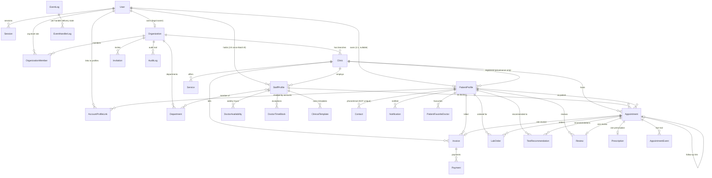

# 11 — Database Concepts

← [10 Design System](./10-design-system.md) · [Index](./00-README.md) · Next: [12 API Concepts](./12-api-concepts.md)

High-level entities and relationships — a product view of `prisma/schema.prisma` (PostgreSQL), not a migration-by-migration history. Money is always integer INR. Most JSON-blob columns (`vitals_json`, `items_json`, etc.) are deliberate free-text/semi-structured choices for MVP, documented in-schema as "a future clinical-data-model decision, not MVP."

## Entity overview

| Entity | What it represents |
|---|---|
| `User` | An Auriva **Account** — one login identity (`phone_number` unique). Role string: `patient`, `super_admin`, `doctor`, `receptionist`, `practice_manager`, `nurse`, `technician` |
| `Organization` | The real parent tenant — a "practice"/"health group." Owns Clinics, Members, Invitations, Departments, Audit Logs |
| `OrganizationMember` | A lightweight org-level role join (`owner`/`doctor`/`receptionist` today) — distinct from `StaffProfile`, which is the clinic-scoped membership record |
| `Clinic` | A physical branch/location. Carries operational config (hours, booking policy, fees), marketplace/profile fields (logo, gallery, geo) |
| `Department` | Groups staff org-wide or per-branch; no separate permission model |
| `StaffProfile` | **= "membership."** One person's employment record at one clinic — role-adjacent fields (specialty, fees), lifecycle (`membership_status`: active/suspended/archived), and `capabilities` grants |
| `DoctorAvailability` | A doctor's recurring weekly hours grid |
| `DoctorTimeBlock` | A date-specific exception (block) to that grid |
| `PatientProfile` | The **Healthcare Profile** — a patient's clinical identity. Can exist without any `User` account |
| `Contact` | A phone/email value on a `PatientProfile` — deliberately **not unique** (family phone sharing) |
| `AccountProfileLink` | Many-to-many: which `PatientProfile`s a `User` (Account) may act as |
| `Appointment` | The spine — a booked/queued/completed visit, carrying both operational (status/queue) and clinical (chief_complaint/diagnosis/prescription fields, being migrated out to `Prescription`) data |
| `Prescription` | First-class prescription record, one per visit, extracted from `Appointment`'s legacy JSON columns |
| `Invoice` + `Payment` | The cash ledger — draft/issued/paid/void invoice, one-to-many payments |
| `LabOrder` | Clinic-run lab order — ordered/resulted/cancelled |
| `TestRecommendation` | Patient-driven diagnostics referral — pending/booked/completed/report_uploaded |
| `ClinicalTemplate` | Reusable SOAP note templates, owned by a doctor within a clinic |
| `Service` | A named offering (duration + price) — the solo practice's core "Treatments" object |
| `Review` | Patient → doctor review, optionally tied to a specific completed appointment (`@unique` — at most one review per appointment) |
| `PatientFavoriteDoctor` | A patient's starred doctors |
| `Notification` | In-app, patient-facing projection of Event Platform events |
| `AuditLog` | Organization-scoped audit trail (admin/org-level actions) |
| `AppointmentEvent` | Appointment-scoped fact trail (check-in, status changes) — the historical seed of the platform-wide audit concept |
| `EventLog` / `EventHandlerLog` | The Event Platform's durable log + per-handler delivery/retry/DLQ state (see [13-events.md](./13-events.md)) |
| `Invitation` | A pending/accepted/revoked/expired staff invite (72h window) |
| `Session` | Server-side session — carries `active_membership_id` (staff) and `active_healthcare_profile_id` (patient) |
| `OtpChallenge` | A hashed, expiring, single-use patient OTP code |
| `Release` / `ReleaseHighlight` / `ReleaseView` / `Sprint` | Auriva's own platform release-notes system (APS-036) — deliberately NOT organization-scoped; gated by `is_platform_admin`, not the customer `super_admin` role |

## ER Diagram

## Nullability / cascade rules that matter to product

| Rule | Why it matters |
|---|---|
| `PatientProfile.user_id` nullable, `onDelete: SetNull` | A Healthcare Profile can exist and keep its full clinical history even if its linked Account is ever removed — the clinical record is not tied to login existence |
| `Contact.value` is **NOT unique** | This is what makes family-phone-sharing representable at all — one number, many profiles |
| `PatientProfile.health_id` **is unique** | The one immutable, shareable, phone-independent identifier — safe to print, say aloud, or hand to another clinic |
| `AccountProfileLink` uniqueness is `(account_user_id, healthcare_profile_id)`, not a DB-level "one active claimant" constraint | A profile's "claim" by an account is enforced at the service layer on purpose — a future identity-transfer feature needs to move a claim between accounts without a hard constraint fighting it |
| `StaffProfile.user_id` — was `@unique` (1:1), now indexed only (1:N) | Batch B's keystone migration: relaxed so one identity can hold a membership per clinic. No code path creates a second profile for an existing user *yet* — accept/provision both mint a new user — so the single-profile invariant still holds today even though the schema allows more |
| `OrganizationMember` `@@unique([organization_id, user_id])` + a separate `@@index([user_id])` | The composite unique can't serve a "my memberships" lookup by user alone — the extra index exists specifically for the Workspace Selector's "list all my memberships" query |
| `Invoice.appointment_id` is `@unique` (nullable) | At most one invoice per appointment; `onDelete: SetNull` if the appointment is ever removed, so the invoice survives as a standalone financial record |
| `Appointment.follow_up_source_appointment_id` is `@unique` | At most one auto-scheduled follow-up per source visit — matches the rule that `transitionStatus()` only ever reaches `completed` once |
| `Review.appointment_id` is `@unique` (nullable) | At most one review per appointment; older seed rows predate the field and simply have no appointment link |
| `Notification.source_event_id` is `@unique` | Makes notification generation idempotent under the Event Platform's at-least-once delivery — a redelivered event just hits the constraint rather than double-notifying |
| `AuditLog.organization_id` is **NOT NULL** | A real, unrelaxed constraint — self-registered, phone-only patients with no registering clinic produce audit calls that are a **documented no-op** (`recordAudit` skips rather than fabricating a tenant) |
| `Release`/`Sprint` are **not** organization-scoped | They describe the Auriva platform itself, not any customer's clinic — deliberately excluded from the tenant model and from the customer-facing event bus (which requires an `organization_id` on every event) |
| `Department.clinic_id` nullable | `null` = an org-wide department spanning every branch |
| Most per-clinic operational fields (`timezone`, `working_days`, `opens_at`, …) are nullable scalars | `null` = "no policy set, behave as before this feature shipped" — additive by construction, not a settings-table redesign |

## JSON-blob columns (intentional, not an anti-pattern here)

| Column | Shape | Why JSON, not rows |
|---|---|---|
| `Appointment.vitals_json` | `{ bp, pulse, temp, spo2, weight }` | Structured vitals taxonomy is a future clinical-data-model decision |
| `Appointment.prescription_medicines_json` / `Prescription.medicines_json` | `[{ name, dosage, frequency, duration }]` | Same reasoning; a full drug-interaction/dosage-catalog model is out of MVP scope |
| `Invoice.items_json` | `[{ description, qty, unit_price, amount }]` | Line items don't need independent relational identity for MVP reporting |
| `LabOrder.tests_json` / `result_values_json` | `[{ name }]` / `[{ test, value, unit, reference }]` | Same reasoning as vitals |
| `Clinic.facilities_json`/`gallery_json`/`documents_json`/`social_json` | Small descriptive blobs | Presentation content, not transactional data |
| `Release.aps_items`/`sprint_numbers`/`feature_flags` | Loosely-tagged reference lists | Explicitly **not** the same anti-pattern as the transactional blobs above — these carry no aggregation need and have no entity of their own elsewhere in the schema |

The schema comments are explicit that Prescription/Invoice/LabOrder JSON blobs are a **conscious MVP trade-off**, distinguished from a genuine "JSON instead of relational rows" anti-pattern — worth knowing when advising on a future clinical-data-model investment.

See also: [08-business-rules.md](./08-business-rules.md) for the lifecycle/status rules layered on top of this schema, and [14-security.md](./14-security.md) for how sessions/tenancy isolation are enforced against it.
