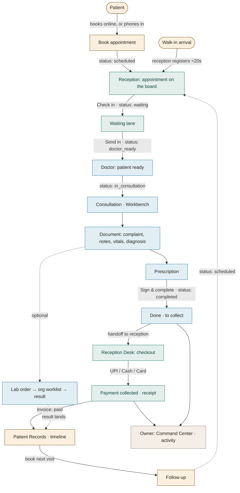

# 22 — Product Journey Map

> **The one question this answers:** *"How does a single patient flow through every actor and surface, and where does ownership hand off?"*
> This is the connective tissue of Auriva — the appointment **status machine** is what links the surfaces (see [08 Business Rules](08-business-rules.md)).

## The one diagram — end to end



## The handoff ledger (single visible owner at every step)

Healthcare systems fail when a task has **two owners** or **no owner**. In Auriva the **status flip is the ownership transfer**.

| Stage | Status | Owner | How the handoff is visible |
|---|---|---|---|
| Booking | `scheduled` | Patient (self) or Reception (phone-in) | Confirmation screen / appears on the board |
| Arrival | `checked_in` → `waiting` | **Reception** | Lands in the **Waiting** lane with a per-doctor count |
| Called | `doctor_ready` | **Reception → Doctor** | "Send in" moves the card; doctor sees "patient ready" |
| Seen | `in_consultation` | **Doctor** | "In consultation" lane + Workbench header |
| Finished | `completed` | **Doctor → Reception** | Card flips to **"Done · to collect"** — the reception inbox |
| Paid | invoice `paid` | **Reception** | Desk checkout → receipt; visit leaves the desk |
| Recorded | — | **Patient** (owns their vault) | Visit + Dx + Rx + "Paid" appear in the patient timeline |
| Follow-up | `scheduled` | Patient / Reception | Next-visit surfaces on patient Home; loop repeats |

## What travels with the patient (nothing silently disappears)

| Data | Enters at | Persists through |
|---|---|---|
| Identity (name, phone, Health ID `AUR-…`) | Signup / walk-in | Queue → Workbench header → Invoice → Records |
| Chief complaint / reason | Booking or walk-in | **Pre-filled** into the Workbench "Chief complaint (from booking)" |
| Diagnosis & prescription | Doctor Workbench | Patient Records visit detail |
| Amount | Doctor fee / service | Desk invoice → "Paid" in the patient timeline |
| Allergies / conditions | Profile / history | Workbench read-only **Clinical Safety** chips |

## The emotional arc (why it feels like care, not software)

```
Landing ──► Book ──► "You're booked ✓" ──► (staff handle the visit) ──► "Payment completed" ──► Records "you're all caught up"
  calm       warm        reinforced             patient never sees               reassured                held / rising
                                                 the cash desk
```

The operational "coldness" (queues, invoices, cash) is **deliberately confined to staff surfaces the patient never touches**. See [10 Design System](10-design-system.md) (honey vs pine) and [02 Product Constitution](02-product-constitution.md).
