# 26 — Future Vision (3 Years)

> **The one question this answers:** *"Where is Auriva going, and in what order?"*
> This is the **strategic arc**, not a dated backlog (that's [17 Roadmap](17-roadmap.md)). It shows how today's product compounds into a platform. Stages beyond "Clinic Network" are **`[SPECULATIVE]`** — directionally consistent with the six pillars, not commitments.

## The arc

```mermaid
flowchart LR
    A[Now<br/>Single clinic<br/>encounter→cash core] --> B[Professional<br/>Pilot-hardened<br/>+ notifications + telehealth]
    B --> C[Clinic Network<br/>Multi-clinic depth<br/>+ analytics]
    C --> D[Healthcare OS<br/>Full pillar coverage<br/>+ integrations]
    D --> E["Platform<br/>APIs + extensibility<br/>(3rd-party modules)"]
    E --> F["Marketplace<br/>Labs · pharmacy · services<br/>ecosystem"]
    F --> G["AI<br/>Clinical intelligence<br/>+ operational autopilot"]

    classDef now fill:#0E7466,stroke:#083F37,color:#fff;
    classDef near fill:#E4EFEC,stroke:#0E7466,color:#083F37;
    classDef mid fill:#FBF0DF,stroke:#7A4E12,color:#241F1A;
    classDef far fill:#F4EEE6,stroke:#8C8477,color:#241F1A;
    class A now;
    class B,C near;
    class D,E mid;
    class F,G far;
```



## Stage by stage

### Stage 0 — Now (implemented)
**One clinic, encounter-to-cash.** Booking → reception → consult → prescription → checkout → records → follow-up, with team/RBAC, multi-clinic scaffolding, events, and audit. The core is production-grade for a single busy clinic. See [21 Maturity Matrix](21-product-maturity-matrix.md).

### Stage 1 — Professional (next ~6 months) `[stated + inference]`
Harden the pilot into a real product:
- **Notifications delivery** (SMS/email/push) — reminders, results, confirmations (closes TD-04).
- **Live SMS/OTP provider**, TLS/proxy, persistent rate limiting (closes TD-01/02/05).
- **Telehealth** — the clearest competitive gap vs Cliniko/Jane.
- Deeper **Command Center / reporting**.
> Outcome: a clinic can run *entirely* on Auriva and reach its patients.

### Stage 2 — Clinic Network (~year 1) `[inference]`
Make multi-clinic first-class:
- Per-clinic capability grants (TD-08), multi-clinic analytics without N+1 (TD-07).
- Cross-clinic doctor scheduling, group-level roll-ups, room/resource scheduling.
- The multi-workspace doctor + owner-of-many flows become effortless.
> Outcome: Auriva scales *with* a growing group, not against it.

### Stage 3 — Healthcare OS (~year 2) `[speculative]`
Fill the six pillars to depth:
- Structured clinical data model (beyond free-text) enabling real analytics + interoperability (TD-19).
- Insurance/claims *where a market needs it* (still a deliberate non-goal for India cash-first).
- Operational intelligence: capacity prediction, no-show risk, revenue analytics.
> Outcome: Auriva is the system of record *and* the system of intelligence for a practice.

### Stage 4 — Platform (~year 2–3) `[speculative]`
Open the OS:
- Public **APIs + integration framework** (already a named pillar-6 concept) so third parties build *on* Auriva.
- Extensible modules; partners extend without forking.
> Outcome: Auriva stops being an app and becomes infrastructure.

### Stage 5 — Marketplace (~year 3) `[speculative]`
Connect the ecosystem:
- Labs, pharmacy, diagnostics, allied services transact *through* Auriva.
- Demand and supply of healthcare services meet on the platform.
> Outcome: network effects — each clinic and service makes the platform more valuable.

### Stage 6 — AI (continuous, unlocked by data) `[speculative]`
Layer intelligence on the accumulated, structured data:
- **Clinical intelligence** — the deferred "Suggested protocol" reborn responsibly, as decision *support* with regulatory guardrails.
- **Operational autopilot** — queue balancing, scheduling optimization, revenue-leak detection.
> Outcome: Auriva doesn't just record the practice — it helps run it. **AI comes last, on top of trust and data — never as the opening act.**

## The through-line

```
Trust  →  Data  →  Intelligence
(warm, safe,     (structured,      (AI that earns
 audited          continuous        the right to
 workflows)       records)          advise)
```

Auriva earns the right to each stage by nailing the one before it. **We do not skip to AI before the data and trust exist to justify it** — see [Product Bible](../AURIVA-PRODUCT-BIBLE.md) and [02 Product Constitution](02-product-constitution.md).
