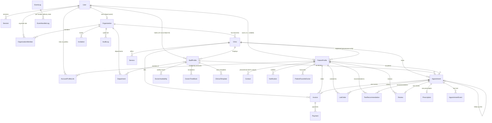

# Auriva Healthcare Operating System — Complete Knowledge Base

> Single-file bundle of all 21 Knowledge Base sections, in order. Give this file to an AI product advisor (e.g. ChatGPT) so it can act as Product Office / CPO / UX Director / Solution Architect for Auriva without reading the codebase.
> Inferred/speculative claims are tagged inline as [INFERRED] / [INFERENCE] / [SPECULATIVE].


===============================================================================

# Auriva Knowledge Base — Index

**Purpose:** this is the permanent, self-contained reference for Auriva — a Healthcare Operating System — written so that another AI (or a new human hire) can act as Product Office, Chief Product Officer, UX Director, or Solution Architect **without reading the codebase**. It assumes the reader has never seen Auriva before.

**Last updated:** 2026-07-19 (reflects PKG-1→6 frozen, Batch F in progress, Release Candidate pending go-live gates).

**Status of the underlying product:** Auriva Professional Edition is **feature-complete** for its planned scope. UX is **100% frozen** (UXS-043 Packages 1–6). Engineering health is strong (522 tests green, `tsc`/`next build` clean). The release is a **Release Candidate** — pending infrastructure go-live gates (production DB, backups, OTP/SMS provider, monitoring), not further feature work. See [17-roadmap.md](./17-roadmap.md) and [15-operations.md](./15-operations.md).

---

## How to use this knowledge base

1. **Start with [01-vision-and-strategy.md](./01-vision-and-strategy.md) and [02-product-constitution.md](./02-product-constitution.md)** — they set the non-negotiable frame every other file assumes.
2. **If you are asked "should we build X?"** — go to 01 (pillars + what Auriva is NOT), then 02 (constitution), then 18 (deferred register, to check if X was already considered and deferred on purpose).
3. **If you are asked about a specific screen or persona** — go to 03 (personas) → 04 (information architecture) → 06 (feature catalog, has the wireframe + regions + actions for every page).
4. **If you are asked about a business rule** ("can a doctor collect payment?", "what happens when an invite expires?") — go to 08-business-rules.md first; it is the exhaustive rulebook.
5. **If you are asked about data model or APIs** — 11-database-concepts.md and 12-api-concepts.md.
6. **If you are asked "what's next" or "why isn't X built"** — 17-roadmap.md and 18-deferred-features.md, in that order.
7. **Every file cross-links** to the others via relative markdown links — follow them rather than re-deriving facts.

## Authority chain (what governs what)

```
AGENTS.md (vision, six pillars, red flags — the constitution)
   │
   ▼
PRODUCT_BASELINE.md (PKG-1→6 is the FROZEN UX baseline — supreme over any other mockup)
   │
   ▼
docs/prototype/PKG-1..6-*.md + pkg-*.html (the frozen UX spec per surface, screen by screen)
   │
   ▼
docs/PRODUCT-HANDBOOK.md (condensed single reference: surfaces, demo world, glossary, component vocabulary, behaviour matrix)
   │
   ▼
docs/PKG-ALIGNMENT.md (screen-by-screen sign-off log — what shipped against each PKG row)
   │
   ▼
docs/RELEASE-CANDIDATE.md (deferred register, known limitations, go-live gates)
```

This knowledge base sits **alongside** that chain — it restates and expands it for a reader who has no repo access, but the documents above remain the primary source of truth if the two ever disagree. This KB was built by reading all of them plus the schema and core domain code on 2026-07-19.

## Section map

| # | File | Covers |
|---|---|---|
| 01 | [Vision & Strategy](./01-vision-and-strategy.md) | What Auriva is, six pillars, target customers, editions, architecture philosophy, what Auriva is NOT |
| 02 | [Product Constitution](./02-product-constitution.md) | The immutable, quotable principles governing every decision |
| 03 | [Personas](./03-personas.md) | Owner, Practice Manager, Doctor, Nurse, Reception, Technician, Patient — jobs, home routes, capabilities, demo credentials |
| 04 | [Information Architecture](./04-information-architecture.md) | Per-persona nav structure, ASCII site maps, journeys |
| 05 | [Complete Navigation](./05-complete-navigation.md) | Every route in `src/app/`, grouped by surface, with capability gates |
| 06 | [Feature Catalog](./06-feature-catalog.md) | Every page: purpose/features/actions/states + wireframe + screenshot placeholder; Feature Matrix table |
| 07 | [Workflow Library](./07-workflow-library.md) | Every end-to-end workflow, step by step, plus the 5 journeys |
| 08 | [Business Rules](./08-business-rules.md) | The exhaustive rulebook — status machines, identity, seats, isolation, money, queue aging |
| 09 | [UI Components](./09-ui-components.md) | Every shared/composite component, purpose, where used |
| 10 | [Design System](./10-design-system.md) | Tokens, typography, motion, honey/pine, dark mode, icons |
| 11 | [Database Concepts](./11-database-concepts.md) | Entities, relationships, ER diagram, nullability rules that matter to product |
| 12 | [API Concepts](./12-api-concepts.md) | The API surface by domain, conceptually |
| 13 | [Events](./13-events.md) | The Event Platform (OPS-001C) — what it is and is NOT |
| 14 | [Security](./14-security.md) | Auth, authorization, audit, isolation, rate limiting |
| 15 | [Operations](./15-operations.md) | Config, deployment, seeding, go-live gates, pilot assumptions |
| 16 | [Release Notes](./16-release-notes.md) | Dated changelog from Phase 0 through the PKG freeze |
| 17 | [Roadmap](./17-roadmap.md) | Near/mid/long term, known limitations |
| 18 | [Deferred Features](./18-deferred-features.md) | The complete Category-C deferred register |
| 19 | [Competitive Analysis](./19-competitive-analysis.md) | Auriva vs generic PMS/HIS/EMR/HRMS — positioning (labelled inference where speculative) |
| 20 | [Future Ideas](./20-future-ideas.md) | Speculative directions consistent with the six pillars — explicitly not commitments |

## Conventions used throughout this KB

- **"Deferred"** means a real product decision was made to *not* build something now — it is different from "not started." Always check 18 before assuming a gap is an oversight.
- **Screenshots:** no image capture was possible. Every key page in 06-feature-catalog.md instead carries an ASCII wireframe, a "Main regions" list, a "Key actions" list, and a literal placeholder line (`📸 Screenshot placeholder — route: …`).
- **Display language vs domain model:** Auriva deliberately uses different words for the same entity on different surfaces (e.g. `Appointment` = "visit" to a patient, "appointment" to reception, "consultation" to a doctor). This is documented, not a bug — see the glossary in [04](./04-information-architecture.md) and [08](./08-business-rules.md).
- **UNSURE markers:** where this KB had to infer something not explicitly stated in the source documents, it is flagged inline as `**[INFERRED]**` with the reasoning, so it can be verified against the live team.


===============================================================================

# 01 — Vision & Strategy

← [Index](./00-README.md) · Next: [02 Product Constitution](./02-product-constitution.md)

## What Auriva is

**Auriva is a Healthcare Operating System.** Its mission: help healthcare organizations deliver better care while running efficient, profitable practices.

That framing is deliberate and narrow. Auriva is not trying to be everything a clinic touches — it is trying to be the **operating system for the clinical and business workflows that are unique to running a healthcare practice.** Adjacent problems (payroll, generic accounting, recruitment) are explicitly left to other, already-mature software, and Auriva integrates with them rather than rebuilding them.

## What Auriva is explicitly NOT

Source: `AGENTS.md` (the permanent guardrails document every model must read before writing code).

| Not this | Why it's excluded |
|---|---|
| An HRMS | Practice Operations (pillar 2) explicitly excludes payroll/attendance/performance reviews |
| A generic ERP | Would dilute focus from healthcare-specific workflows |
| A hospital management system trying to do everything | Auriva targets independent and multi-doctor clinics, not full hospital systems |
| A payroll system | Not a healthcare workflow — better served by dedicated payroll software |
| A recruitment platform | Same reasoning |
| An accounting system | Auriva has a cash ledger (Invoice/Payment) for the clinic's own billing, but is not a bookkeeping/GST/accounting product |

**Red flags — Architecture Review required if implementation drifts toward:** HRMS features, payroll, attendance tracking, recruitment, asset management, employee performance reviews, accounting/ERP, generic CRM. Any of these must **stop implementation immediately** and raise a warning before continuing — this is a standing instruction to every AI model working on this codebase.

## The Six Product Pillars

Every feature must strengthen at least one of these. If a proposed feature doesn't, it should be challenged before implementation — this is not a formality, it is how Auriva stays a healthcare product rather than accreting generic SaaS features.

| # | Pillar | Examples (from AGENTS.md) | What's actually built (cross-reference) |
|---|---|---|---|
| 1 | **Clinical Excellence** | Appointments, Queue, Consultation, EMR, Prescriptions, Clinical Timeline, Follow-up | Consult Workbench, prescription editor, clinical safety strip, patient Records timeline — see [06](./06-feature-catalog.md) |
| 2 | **Practice Operations** | Doctor Availability, Clinic Operational Calendar, Room Scheduling, Appointment Capacity, Operational Alerts | Doctor Availability + time blocks, reception Calendar, awareness strip — explicitly **excludes** payroll/attendance/performance reviews |
| 3 | **Financial Operations** | Billing, Payments, Insurance, Revenue, Packages, Invoices, Settlement | Invoice/Payment lifecycle, Desk (Collect & close), Command Center revenue tiles. Insurance is deferred (see [18](./18-deferred-features.md)) |
| 4 | **Patient Engagement** | Patient Portal, Online Booking, Digital Forms, Teleconsultation, Communication, Feedback | `/patient` mobile-first app (Home/Book/Records/Family/You), public booking (`/book`, `/find-care`), Reviews. Teleconsultation is a future idea (see [20](./20-future-ideas.md)), not built |
| 5 | **Organization Intelligence** | Command Center, Reports, Analytics, Operational KPIs, Doctor Productivity, Clinic Performance | Owner Command Center (Practice Health → Needs attention → Quick actions → At-a-glance → On the floor → Activity) |
| 6 | **Platform Foundation** | Identity, Authorization, Event Platform, Audit, APIs, Integration Framework, Notifications | Six-role RBAC, capability model, Event Platform (OPS-001C — publish/retry/DLQ, **not** user notifications), Audit trail, session/workspace model |

## Target customers

- **Primary:** independent clinics and small multi-doctor practices, **India-first** (phone-first login, ₹ currency, `Asia/Kolkata` timezone default, UPI as a first-class payment method, health_id format tuned for India).
- **Growth path:** solo practice → small team → multi-clinic group, all on the **same product**, with complexity revealed only as a team forms (no forced migration — see the "solo → cockpit" auto-transition in [08](./08-business-rules.md)).
- The canonical demo world (`Sunrise Health Network`, Pune) models a **multi-specialty, multi-doctor, single-clinic-today** organization — six doctors across specialties, three receptionists, a nurse, a technician, an owner, and a practice manager. See [03-personas.md](./03-personas.md) for full credentials.

## Supported practice types

- **Solo practice** — a single owner-doctor who is also the front desk. Runs everything from one consolidated `/clinic` surface (see PKG-2).
- **Multi-doctor / multi-specialty clinic** — the demo world's shape: six doctors (Cardiologist, General Physician, Dermatologist, Pediatrician, Orthopedician, Gynecologist) on one clinic, with dedicated reception, nursing, and diagnostics staff.
- **Multi-clinic group (Organization → many Clinics)** — the `Organization` entity supports multiple `Clinic` branches with departments; a staff member can in principle hold multiple `StaffProfile` memberships (one per clinic) since the Batch B schema relaxation (1:1 → 1:N). Multi-clinic **patient** experience (a patient seeing their history across clinics in one place) remains out of scope for this release.
- Demo data references dental, physiotherapy, and general/multi-specialty practice types across different design-reference documents (the *prototype* casting used SmileCare Dental / HSR Family Clinic / Sunrise Physio as three branches of one org); the **implemented** demo world is the India-centric multi-specialty single clinic described above — see the Product Handbook §3 for the canonical/implemented distinction.

## Editions

| Edition | Status |
|---|---|
| **Auriva Professional Edition** | The **approved and implemented** scope for this release. Everything in this KB describes Professional Edition unless stated otherwise. |
| Solo | Not a separate edition/SKU — a **plan** (`Organization.plan = "solo"`) with a 2-seat cap (1 doctor + 1 receptionist beyond the free owner) that shares the same codebase and the same consolidated `/clinic` surface. See [08](./08-business-rules.md) seat model. |
| Enterprise | Modelled in the plan enum (`Plan = "enterprise"`) as unbounded seats, but **not a real tier this release** — UI-only "Coming soon." |

## Architecture philosophy

Four structural ideas run through the whole platform and explain almost every design decision elsewhere in this KB:

1. **Surfaces are workflow containers, gated by CAPABILITIES, not roles.** `/doctor`, `/staff`, `/admin`, `/clinic`, `/patient` are not "one screen per role" — they are shared containers that different roles can share when their capabilities overlap. A Nurse opens `/doctor` alongside the Doctor; a Technician opens `/staff` alongside Reception — the surface is the same, but the **C2 permission model** (not the surface) decides what each role may actually do there. See `resolveSurfacePath()` in [08-business-rules.md](./08-business-rules.md).
2. **One credential → many workspaces.** A single `User` account can hold multiple `StaffProfile` memberships (one per clinic). Login resolves to a *Workspace Selector* when there are 2+ memberships, and to the right surface automatically when there is only one. Switching workspaces re-scopes all content — this is the APS-044/045 Identity & Workspace platform.
3. **The status machine is the connective tissue.** A single `Appointment.status` state machine (`scheduled → checked_in → waiting → doctor_ready → in_consultation → completed`, plus `skipped`/`no_show`/`cancelled`) is what patient, reception, and doctor surfaces all read and write. Every hand-off between personas is a status transition with exactly one visible owner at a time (see the Workflow Ownership Continuity audit in [07](./07-workflow-library.md)).
4. **Two tones, by design.** Staff surfaces say *"Let's work"* (efficient, **pine** primary color, desktop left-rail nav). The patient surface says *"You're being taken care of"* (reassuring, **honey** primary color, mobile-first bottom-tab nav). This is the brand's core emotional differentiator — documented explicitly as a rule never to "fix" or unify (see [10-design-system.md](./10-design-system.md)).

## Product vision (synthesis)

Auriva's bet is that most healthcare practice software fails by trying to be a generic ERP with a clinical veneer, or a pure EMR with no operational muscle. Auriva instead builds **one coherent system where the appointment lifecycle is the spine** — booking, queueing, consulting, billing, and patient record-keeping are all views onto the same underlying facts, not separate modules bolted together. The six pillars are the boundary of that ambition: clinical work, the practice's own operations, its money, its patients' experience, its own self-awareness (analytics), and the platform plumbing that makes all of the above trustworthy and extensible.

## What Auriva intentionally does NOT do (recap, exhaustive)

- No payroll, attendance tracking, or HR performance reviews (pillar 2 boundary).
- No general ledger / GST accounting — only the clinic's own cash ledger (Invoice/Payment) for services rendered.
- No recruitment or staffing marketplace.
- No asset management (equipment inventory, maintenance schedules).
- No generic CRM (marketing campaigns, lead scoring, generic pipelines) — patient engagement stays healthcare-specific (booking, records, communication about care).
- No insurance claims processing (deferred, Category C — see [18](./18-deferred-features.md)).
- No AI clinical decision support in this release (the "Suggested protocol" one-tap fill was explicitly deferred as a future clinical-intelligence release, given regulatory risk).
- No hospital-scale features (bed management, OT scheduling, pharmacy dispensing) — out of scope for the independent/multi-doctor clinic target.


===============================================================================

# 02 — Product Constitution

← [01 Vision & Strategy](./01-vision-and-strategy.md) · [Index](./00-README.md) · Next: [03 Personas](./03-personas.md)

These are Auriva's immutable, quotable principles. Every one is drawn verbatim or near-verbatim from `AGENTS.md`, `PRODUCT_BASELINE.md`, `docs/PRODUCT-HANDBOOK.md`, and the frozen UXS-043 prototype packages. Treat each as a rule a new screen or feature must satisfy before shipping — not aspirational language.

## The numbered principles

1. **Reuse existing architecture.** Never invent a parallel mechanism for something that already has one (a second empty-state pattern, a second session model, a second event bus). Extend what exists.

2. **Centralized authorization — no `role === "..."` literals outside `src/domain/authorization.ts`.** Every role/permission/capability check in the codebase must go through that one module, so when the access model changes, it changes in exactly one file.

3. **No invented business rules.** Do not add lifecycle states, permission checks, or workflow branches beyond what the frozen specs (PKG-1→6, APS-044/045, the C2 permission matrix) actually define. When a PKG screen implies a new rule, that is Category C (see principle 8) — stop and ask.

4. **No fake UI.** Never render data, counts, or affordances that aren't backed by a real capability or a real record. An honest "Soon" badge (see the admin nav's disabled Clinics/Plan items) is correct; a fabricated number or a clickable button that does nothing is not.

5. **Challenge assumptions against the six pillars before implementing.** Every requested feature is evaluated: does it solve a real healthcare workflow? Would a clinic owner pay for it? Does it strengthen a pillar? Could another mature SaaS product already do it better? Does it add unnecessary complexity? Could integration replace building it? (Full checklist in [01](./01-vision-and-strategy.md).)

6. **"Every screen answers one question."** This is the master UX heuristic behind all six PKG packages: Login → "who are you?"; Today (Doctor) → "who's next, and what do they need?"; Front desk board → "what's the room doing?"; each Patient tab → one of five explicit questions. A screen that tries to answer two questions at once is a design smell.

7. **Reassurance-first patient, efficiency-first staff.** The patient app deliberately reads warmer and calmer ("You're free today," "You're all caught up") than the staff surfaces, which read efficient and information-dense. This is not inconsistency — it is the brand's deliberate emotional contrast, formalized as **Intentional Variances** (see below) that must never be "corrected" toward uniformity.

8. **Classify every difference from a frozen PKG screen (Implementation Rule #2):**
   - **Category A — Presentation** (spacing, copy, typography, icons, navigation labels, hierarchy) → implement immediately.
   - **Category B — Existing functionality presented differently** (moved buttons, different card layout, alerts) → realign to the PKG.
   - **Category C — Entirely new functionality** (new APIs, workflows, permissions, backend logic) → **STOP and ask Product Office.** Never silently add new capability.

9. **Experience First (Implementation Rule #3), when a PKG introduces a new concept:** can it be built from existing data + workflows? → build it. Does it require new business logic? → pause and ask. Does it introduce a new workflow/lifecycle behaviour? → defer unless explicitly approved.

10. **Preserve Intent, not just pixels (Implementation Rule #4).** Alignment validates both *visual fidelity* (does it match the approved PKG?) and *experience fidelity* (does it create the same workflow emphasis — e.g. the Consult Workbench must stay minimal and consultation-first, not become a documentation-heavy form).

11. **Empty ≠ error.** An empty list is very often *good news* (clear waiting room, free day) and must say so warmly with one next action — never render "No data" or a bare table.

12. **Capabilities are absent, not greyed.** If a role cannot do something, the UI does not show a disabled button with a tooltip explaining why — the capability simply is not rendered. Where a permission wall is unavoidable (e.g. a genuinely wrong URL), `PermissionState` explains in plain language and offers a path — never a raw 403.

13. **PKG-1→6 is the single, frozen source of truth for UX.** `Experience 2.0` (`design/experience-v2/`), earlier mockups (`design/aps-*`, `design/mockups/*`), and any hifi/blueprint concept are explicitly **not** the approved product and must never be merged from, even partially.

14. **The Experience Behaviour Matrix is the contract for any new screen.** Loading, Empty, Offline, Error, Permission, Slow network, Destructive, Success, and Long-running each have one mandated treatment (see [09](./09-ui-components.md) and [06](./06-feature-catalog.md)); a new screen must satisfy every relevant row before shipping.

15. **Every implementation task begins with "Which PKG screen am I implementing?" and ends with "Does this now match the approved PKG?"** — Implementation Rule #1, the engineering contract. No task starts without naming its screen; none is done until verified against it.

16. **Do not invent, simplify, or redesign layouts.** Implement the approved design faithfully. If anything is unclear — wording, spacing, hierarchy, interaction — **stop and ask the Product Office.** Do not assume.

17. **One canonical component name → one implementation → one QA vocabulary.** (`WorkspaceSwitcher`, `Toast`, `Banner`, `InlineMessage`, `Callout`, `EmptyState`, `Skeleton`, `OfflineBanner`, `ErrorState`, `PermissionState`.) Naming drift across docs/engineering/QA was an identified defect (Phase-1 finding F8) and is now governed — see [09](./09-ui-components.md).

18. **Document intentional variances rather than "fixing" them.** Staff = pine primary / patient = honey primary. Staff = left rail / patient = bottom-tab. UI label "Owner" while the stored role is `super_admin`. These are deliberate and permanent — see the table below.

19. **Any change to the frozen baseline requires explicit Product Office approval** (`PRODUCT_BASELINE.md` Rule 6). This applies to the baseline document itself and to any of the six PKG packages once frozen.

## Intentional Variances (do not "fix")

| Variance | Rule | Why |
|---|---|---|
| Primary colour: staff = **pine** (`#0E7466`), patient = **honey** (`#E8A24C`) | Never unify | Efficiency vs warmth — the brand's core emotional contrast |
| Navigation: staff = left **rail**, patient = **bottom-tab** | Never unify | Desktop-first operator vs mobile-first consumer |
| Role label: UI says **"Owner"**, DB stores `super_admin` | Display label only | `super_admin` is a historical/technical name meaning "owns a customer Organization" — never surfaced to users |
| Two header conventions: compact tool bars vs content-page heroes | Both valid, used contextually | Documented convention (Experience Consistency Matrix), not a defect |

## Governance workflow for adding any new screen (from the Product Handbook §9)

1. Which PKG does it belong to? Reference the frozen prototype before building.
2. Reuse the vocabulary in [09-ui-components.md](./09-ui-components.md) — never hand-roll empty/error/loading/permission blocks.
3. Satisfy the Experience Behaviour Matrix ([06](./06-feature-catalog.md)) for every state the screen can be in.
4. Use the display language from the glossary ([04](./04-information-architecture.md)); build against the domain model ([11](./11-database-concepts.md)).
5. Honour the Intentional Variances table above.
6. New functionality (Category C) — stop and get Product Office direction; log deferrals in `docs/RELEASE-CANDIDATE.md` (and cross-reference [18](./18-deferred-features.md) here).

## Act as architect *and* product guardian

`AGENTS.md` is explicit that any AI working on this codebase must act as **both an architect and a product guardian**, not only a software engineer — meaning the burden of proof is on *justifying* a new feature against the six pillars, not on finding a reason to refuse it. When in doubt, the constitution's default answer is: **stop and ask**, never assume.


===============================================================================

# 03 — Personas

← [02 Product Constitution](./02-product-constitution.md) · [Index](./00-README.md) · Next: [04 Information Architecture](./04-information-architecture.md)

Auriva recognizes **seven personas** on the frozen C2 RBAC matrix, plus one internal-only persona (Platform Admin). Every staff persona is a `StaffProfile` (= "membership") attached to a `Clinic`; every persona's access is the union of **capabilities** (which surface they may open) and **permissions** (what they may do there) — see [08-business-rules.md](./08-business-rules.md) for the full matrix. The role label shown in the UI can differ from the stored role string (`super_admin` displays as "Owner").

## Canonical demo world (implemented, source of truth for demos)

**Organization:** Sunrise Health Network · **Clinic:** Sunrise Clinic — Koregaon Park, Pune, Maharashtra · **Plan:** Professional · Seed script: `prisma/seed-demo-india.ts` (idempotent — re-run any time with `npx tsx prisma/seed-demo-india.ts`).

**Staff login:** `/login` with **phone + `password123`** (enter the 10-digit number; `+91` is assumed, e.g. type `9876500001`). **Patients log in with phone + OTP** (dev-echo — the OTP is printed back in the response since no SMS provider is wired yet; see [14-security.md](./14-security.md)).

| Person | Role (stored) | Phone | Lands on | Specialty / notes |
|---|---|---|---|---|
| Rajesh Sharma | `super_admin` (displays "Owner") | 9876500001 | `/admin` | Legal owner, runs the practice, not a clinician |
| Priya Nair | `practice_manager` | 9876500002 | `/admin` | Operational (not legal) owner-equivalent |
| Dr Ananya Iyer | `doctor` | 9876500003 | `/doctor` | Cardiologist |
| Dr Vikram Reddy | `doctor` | 9876500004 | `/doctor` | General Physician |
| Dr Arjun Deshmukh | `doctor` | 9876500008 | `/doctor` | Dermatologist |
| Dr Meera Krishnan | `doctor` | 9876500009 | `/doctor` | Pediatrician |
| Dr Sanjay Rao | `doctor` | 9876500010 | `/doctor` | Orthopedician |
| Dr Neha Kapoor | `doctor` | 9876500011 | `/doctor` | Gynecologist |
| Sunita Deshpande | `receptionist` | 9876500005 | `/staff` | Front desk |
| Anjali Verma | `receptionist` | 9876500012 | `/staff` | Front desk |
| Rahul Sharma | `receptionist` | 9876500013 | `/staff` | Front desk |
| Kavita Joshi | `nurse` | 9876500006 | `/doctor` | Joins doctors on the clinical surface (vitals only, no diagnosis) |
| Ramesh Gupta | `technician` | 9876500007 | `/staff` | Diagnostics worklist only (no reception/billing) |

**Patients** (phone + OTP → `/patient`): **Amit Patel** `…0101` (allergy + chronic condition + a past visit with a real prescription — the fullest demo account), Sneha Kulkarni `…0102`, Mohammed Farooq `…0103`, Lakshmi Menon `…0104`, plus Rohan Sharma, Priya Joshi, Aarav Mehta, Deepa Nair, Kiran Rao appearing live on the reception/doctor queues (walk-ins, waiting-lane aging demo, a completed-but-unpaid invoice for Kiran, a fully paid invoice for Farooq).

**Naming-collision rule (permanent):** no two *different* people share a first name within one walkthrough — this was a real defect found and fixed in the Phase-1 review (two "Rohan"s) and is now a standing rule for any future demo data.

> **Design-reference vs implemented:** the UXS-043 *prototype's* Deliverable-A casting (Sunrise Health *Group*, Bengaluru, Dr Anjali Rao, SmileCare Dental / HSR Family Clinic / Sunrise Physio) is naming used only inside the throwaway HTML prototypes to fix a demo-continuity defect found in that review. It is **not** what's running in the real app. The table above (Sunrise Health *Network*, Pune) is what the seed script actually creates and is the source of truth for real demos.

---

## Owner

- **Who they are:** the legal owner of the practice (`Organization.owner_user_id`), stored role `super_admin`, displayed as **"Owner."** May or may not also be a clinician.
- **Job to be done:** run the whole practice — see how it's doing today, manage who works there, and (in a solo practice) also do the clinical/reception work personally.
- **The one question their surface answers:** *"What is my practice doing?"* (Command Center) or, solo, *"What do I do today?"* (consolidated `/clinic`).
- **Home route:** `/admin` (team) once there's a team; `/clinic` while solo (single-member clinic).
- **Capabilities:** `reception`, `doctor_workspace`, `admin_portal` (all three by default — the Owner can do anything).
- **Permissions:** every permission in the C2 matrix, including the two **never-delegated** owner-only actions: `plan:manage` (subscription) and `team:assign_owner` (grant/revoke ownership).
- **Cannot do:** nothing is capability-restricted, but ownership-transfer/plan/deletion are gated by **legal ownership** (`Organization.owner_user_id`), not just the `super_admin` role — an *operational* owner (Practice Manager) cannot touch those even though they share the `/admin` cockpit.

## Practice Manager

- **Who they are:** an **operational** owner-equivalent — runs the practice day-to-day without holding legal ownership.
- **Job to be done:** everything the Owner does operationally — invite/manage staff, see reports, manage settings, run billing — minus the two legal-owner powers.
- **The one question:** same as Owner's Command Center — *"What is my practice doing, and what needs my attention?"*
- **Home route:** `/admin`.
- **Capabilities:** `admin_portal`.
- **Permissions:** full operations (`appointments:manage`, `patients:manage`, `billing:manage`, `payments:collect`, `schedule:manage`, `reports:org`, `team:manage`, `settings:manage`, `audit:view`) **minus** `clinical_records:edit` (view-only on clinical notes), **minus** `plan:manage`, **minus** `team:assign_owner`.
- **Cannot do:** edit clinical records, manage the subscription/plan, grant or revoke ownership.

## Doctor

- **Who they are:** a clinician seeing patients — the flagship persona of PKG-3, scored 9.7/10 in Product Office review.
- **Job to be done:** get through a full clinic day of consultations with minimal friction and maximum clinical confidence.
- **The one question:** *"Who's next, and what do they need?"* (Today) / *"Finish this visit"* (Workbench).
- **Home route:** `/doctor`.
- **Capabilities:** `doctor_workspace`.
- **Permissions:** `clinical_records:view/edit`, `consultation:write`, `vitals:write`, `diagnostics:view/order`, `schedule:view/own`, `reports:own` (own figures, not org-wide analytics), `practice_profile:own`. Does **not** get `payments:collect` or `billing:manage` by default — a solo owner-doctor gets these only via the `reception` capability *grant*, never as a base doctor default.
- **Cannot do:** see organization-wide analytics (`reports:org` is Owner/Practice-Manager only), collect payments or manage billing (unless granted `reception`), manage other clinicians' schedules, invite/suspend/archive staff.

## Nurse

- **Who they are:** a clinical assistant who joins the Doctor on the **same** `/doctor` surface (surfaces are workflow containers, not per-role apps).
- **Job to be done:** capture vitals, allergies, chief complaint, and prep notes ahead of the doctor's consultation.
- **The one question:** *"Is this patient ready for the doctor?"* **[INFERRED]** — not stated verbatim in a PKG doc; inferred from the permission set (`vitals:write` only) and the "surfaces are workflow containers" principle. Verify with Product Office if a dedicated Nurse screen/question is ever specified.
- **Home route:** `/doctor` (same container as Doctor).
- **Capabilities:** `doctor_workspace` (default, per Batch D · D2 activation).
- **Permissions:** `appointments:view`, `patients:view`, `clinical_records:view`, `vitals:write`, `diagnostics:view`, `schedule:view`.
- **Cannot do:** write diagnosis, prescriptions, or treatment plans (`consultation:write` is Doctor-only) — a hard line from the C2 matrix. A dedicated Nurse action surface (vitals capture UI) is itself **deferred** — see [18](./18-deferred-features.md).

## Reception(ist)

- **Who they are:** the front desk — the demo world has three (Sunita, Anjali, Rahul).
- **Job to be done:** keep the waiting room moving: register walk-ins, check patients in, track the queue, collect payment, close the day's cash cycle.
- **The one question:** *"What's the room doing?"*
- **Home route:** `/staff` (nav label **"Front desk"**; the surface/spec name is "Reception Workspace" — three names, one concept, see the glossary in [04](./04-information-architecture.md)).
- **Capabilities:** `reception`.
- **Permissions:** `appointments:manage/view`, `patients:manage/view`, `billing:manage`, `payments:collect`, `schedule:view`.
- **Cannot do:** anything clinical — `clinical_records:*`, `consultation:write`, `vitals:write` are explicitly withheld (the "hard line" from C2 amendment #2: reception never touches clinical notes).

## Technician

- **Who they are:** diagnostics/lab staff — the demo world's Ramesh Gupta.
- **Job to be done:** work the diagnostics/results worklist.
- **The one question:** *"What tests need results entered?"* **[INFERRED]** — reasoned from the `diagnostics` capability and `diagnostics:results:write` permission; not a verbatim PKG quote.
- **Home route:** `/staff` (same container as Reception, but a deliberately **narrower** capability).
- **Capabilities:** `diagnostics` — explicitly narrower than `reception`, so activating the Technician role can never accidentally grant front-desk authority (billing, booking, consultation).
- **Permissions:** `patients:view`, `diagnostics:view`, `diagnostics:results:write`.
- **Cannot do:** billing, booking, check-in, or any clinical write beyond entering test/lab results. Cannot diagnose. A dedicated technician results-entry UI is itself **deferred** ([18](./18-deferred-features.md)) — today the underlying `LabOrder` model supports it but the Batch D scope stopped at capability/permission wiring.

## Patient

- **Who they are:** the person receiving care — Auriva's "public face," the warmest surface in the product.
- **Job to be done:** understand what to do today, book care, understand what happened at a visit, manage family members' care, and manage their own identity/settings.
- **The five questions → five tabs:** *What do I do today?* → Home · *Can I book?* → Book · *What happened at my visit?* → Records · *Who in my family needs care?* → Family · *Who am I?* → You.
- **Home route:** `/patient`.
- **Capabilities:** `patient_workspace` (a role, not a staff capability grant — patients never hold staff capabilities).
- **Permissions:** none from the staff C2 matrix — patients operate under a completely separate authorization path (`requirePatientContext`), scoped to their own `PatientProfile`(s) via `AccountProfileLink`.
- **Cannot do:** see any staff surface at all — capability-absent, never shown, never a 403 (see [02](./02-product-constitution.md) principle 12). Cannot see clinical documentation beyond their own visit's Dx/Rx/reports.
- **Identity nuance:** one phone number can be linked to multiple `PatientProfile`s (family sharing — a parent's phone often registers a child's profile). A `PatientProfile` can also exist with **no** linked `User` account at all (reception/emergency registration creates a clinical identity without requiring a login) — see [08](./08-business-rules.md) and [11](./11-database-concepts.md).

## Platform Admin (internal, not customer-facing)

- **Who they are:** Auriva's own internal staff — gated by `User.is_platform_admin`, a flag **never** set by any customer signup/invite flow.
- **Job to be done:** author and publish Auriva's own product release notes (the Release Management platform, APS-036) — describing the *platform itself*, not any one customer's clinic.
- **The one question:** *"What are we shipping, and has everyone seen it?"*
- **Home route:** `/admin/releases` (gated separately from the customer-facing admin portal).
- **Cannot do:** this flag is deliberately separate from `super_admin` — a clinic owner, even with full `admin_portal` capability, cannot draft or publish an Auriva release.

## Cross-persona note: "surfaces are containers, not apps"

Six of the seven customer-facing personas map onto only **three** staff surfaces plus the solo-consolidated `/clinic`:

```
/admin   ← Owner, Practice Manager
/doctor  ← Doctor, Nurse
/staff   ← Receptionist, Technician
/clinic  ← solo Owner-doctor (when the clinic has exactly one member and full capabilities)
/patient ← Patient (never shares a surface with staff)
```

This is why the permission model (not the surface) is the fine-grained authority boundary — see [08-business-rules.md](./08-business-rules.md) for the full C2 matrix and [05-complete-navigation.md](./05-complete-navigation.md) for the route-level detail.


===============================================================================

# 04 — Information Architecture

← [03 Personas](./03-personas.md) · [Index](./00-README.md) · Next: [05 Complete Navigation](./05-complete-navigation.md)

This file gives the navigation structure, entry points, and permission model **per persona/surface**, plus an ASCII site map for each. For the flat, route-by-route list see [05-complete-navigation.md](./05-complete-navigation.md). For what each screen does, see [06-feature-catalog.md](./06-feature-catalog.md).

## The Global Product Glossary (three layers)

Before the per-surface maps: Auriva deliberately uses **three separate vocabularies** for the same underlying concepts. Mixing them causes real confusion, so they are kept explicitly apart (UXS-043 Phase 2, Deliverable B).

| Internal domain model (engineering) | Display language (per surface) | Notes |
|---|---|---|
| `Appointment` | Patient: **"visit"** · Reception: **"appointment"** · Doctor: **"consultation"** | Same DB row; three human words by design |
| `StaffProfile` (= membership) | **"team member"**, **"membership"** | One person may hold several (multi-clinic) |
| `Organization` | **"practice"** / **"health group"** | owner-facing |
| `Clinic` | **"clinic"** / **"location"** / **"branch"** | |
| Reception surface | **"Front desk"** (nav label) / "Reception Workspace" (spec name) | one surface |
| `super_admin` role | **"Owner"** | display label only |
| `Invoice` + `Payment` | **"bill"** (patient) · **"collect"** / **"Desk"** (reception) | |
| `PatientProfile` | **"records"** / **"health vault"** (patient) · **"patient"** (staff) | |

Engineering builds against the **domain model** (left column); the UI always shows the **display language** (middle column); component/prop names follow yet a third, engineering-only vocabulary (see [09-ui-components.md](./09-ui-components.md)). Never mix the three.

---

## Owner / Practice Manager — `/admin` (multi-member clinic) or `/clinic` (solo)

**Purpose:** run the practice — see how it's doing, manage the team, configure the clinic.

**Permission model:** requires `admin_portal` capability (Owner or Practice Manager); gated at the layout level. Legal-owner-only actions (plan, ownership transfer) additionally require `Organization.owner_user_id` match, checked via `requireLegalOwnerContext`.

```
/admin  (Owner · Practice Manager — admin_portal capability)
│
├── Command            → /admin/command-center     "How is my practice doing?"
│     Practice Health → Needs attention → Quick actions → At-a-glance → On the floor → Recent activity
├── Team                → /admin                     "Who's here, what can they do?"
│     Team roster (role/status chips) → Invite / Suspend / Reactivate / Archive
├── Clinics             → (soon — no route yet, shown disabled in nav)
├── Plan                → (soon — no route yet, shown disabled in nav)
└── Settings            → /admin/settings            Organization-level configuration
      also reachable, not in the primary 4-item nav:
      /admin/departments  → Departments (org structure)
      /admin/events       → Event Platform admin view (publish/retry/DLQ visibility)
      /admin/setup        → Setup checklist (guided onboarding)
      /admin/releases     → Release Management (platform-admin gated separately)
```

**Solo variant — `/clinic` (single-member clinic, full capability set):**
```
/clinic  (solo owner-doctor — isSoloClinic && reception+doctor_workspace+admin_portal)
│
├── Dashboard    "What needs me today?"
├── Today        "What do I do next?"
├── Calendar     "When am I free?"
├── Treatments   "What do I offer?"   (Service catalog)
├── Payments     "What have I collected?"
└── Settings ▾ — Practice · Team · Plan
```
The solo owner-doctor runs clinical, reception, and admin work from **one consolidated surface** — no separate `/doctor`/`/staff`/`/admin` tabs. The moment a second staff member joins, `resolveSurfacePath()` stops returning `/clinic` for the owner and routes them to the `/admin` cockpit instead — a **first-hire transition**, not a migration.

**Journeys:**
- *Solo owner's day:* `/clinic` Dashboard → Today (call in patients, since the owner is also the doctor) → Payments (collect) → Settings (adjust hours).
- *Growing owner's day:* first hire accepted → auto-lands on `/admin` Command Center → invites more staff from Team → reviews Command Center daily.
- *Practice Manager's day:* `/admin` Command Center (operational read) → Team (manage lifecycle) → Settings — never touches Plan/ownership (not shown, capability-absent).

---

## Doctor — `/doctor`

**Purpose:** get through a full day of consultations with minimal friction.

**Permission model:** requires `doctor_workspace` capability (Doctor or Nurse); C2 permissions further distinguish what each may do once inside (Nurse: vitals only; Doctor: full clinical write).

```
/doctor  (Doctor · Nurse — doctor_workspace capability)
│
├── Today       → /doctor            "Who's next, and what do they need?" (Mission Control)
├── Workbench   → /doctor/workbench  "Finish this visit" (Queue · Consult · Context, 3-column)
├── Schedule    → /doctor/schedule   Calendar + Availability (week view)
├── Patients    → /doctor/patients   4-column table: Patient / Last visit / Visits / Last Dx
├── Practice    → /doctor/practice   Locations · Fees · Services · Online · Verification
└── Profile     → /doctor/profile    Professional identity + live public preview
```

**Journey (the frictionless loop):** Today (see waiting list) → select/Call in next patient → Workbench (pre-filled chief complaint → template → diagnosis chips → prescription) → **Sign & complete** → auto-advances to the next waiting patient. See [07-workflow-library.md](./07-workflow-library.md) for the full step-by-step.

---

## Reception — `/staff`

**Purpose:** keep the waiting room moving and close the day's cash cycle.

**Permission model:** requires `reception` (Receptionist) or `diagnostics` (Technician) capability — the latter is deliberately narrower (no billing/booking/consultation).

```
/staff  (Receptionist — reception · Technician — diagnostics, narrower)
│
├── Front desk  → /staff/queue     "What's the room doing?" — 3-lane board (Waiting · In consultation · Done·to collect)
├── Calendar    → /staff/calendar  Read-only ClinicCalendar, all doctors, book via existing flow
├── Desk        → /staff/billing   "Collect & close" — cash cycle, checkout modal
├── Lab Orders  → /staff/lab       Diagnostics/results worklist (Technician's home when narrower capability)
│
also reachable (not primary nav):
├── /staff (root)     → redirects to /staff/queue (front-desk board is the landing)
├── /staff/dashboard  → legacy Reception Dashboard (kept reachable, no longer the landing)
├── /staff/walkin     → Walk-in registration flow (also reachable as a modal from the board)
└── /staff/patients/[id] → a single patient's record from reception's point of view
```

**Journey (the cash cycle):** Register walk-in *or* scheduled patient arrives → Check in → **Waiting** lane → Send in → **In consultation** lane → doctor completes → **Done · to collect** lane → Checkout modal (itemised invoice, UPI/Cash/Card) → Collect → receipt.

---

## Patient — `/patient`

**Purpose:** understand today, book care, review what happened, manage family, manage self. Mobile-first, phone-framed on desktop.

**Permission model:** `patient_workspace` role; scoped to the session's `active_healthcare_profile_id`, never a client-supplied id.

```
/patient  (Patient — patient_workspace)
│
├── Home     → /patient            "What do I need to do today?"
├── Book     → /patient/book       "Can I book my doctor?"
├── Records  → /patient/records    "What happened during my visit?" (timeline, grouped by visit)
├── Family   → /patient/family     "Who in my family needs attention?" (switch profile)
└── You      → /patient/you        "Who am I?" (identity, payments, notifications, settings)
      reachable from You:
      /patient/profile   → profile detail + edit (health summary)
      /patient/settings  → notifications / language / security sub-screen
      /patient/doctors/[id] → a doctor's public profile (reached from Book's search)

Legacy/superseded routes (kept as redirects, not real screens):
  /patient/care      → redirects to /patient (folded into Home + Records)
  /patient/find-care → redirects to /patient/book (superseded by the Book tab)
```

**Journey:** Home (see next visit or "you're free today") → Book (search doctor → profile+slots → confirm → "You're booked ✓") → (visit happens, staff-side) → Records (visit appears in the timeline with Dx/Rx/invoice) → Family (switch to a dependent's profile if needed) → You (manage identity/settings).

---

## Cross-surface: Identity & Foundation (PKG-1)

Not a persona-specific surface — the shared entry point every staff persona passes through.

```
/login  →  (1 membership) auto-opens the surface
        →  (2+ memberships) /workspace  Workspace Selector  →  chosen surface
        →  (must_change_password = true) /change-password  →  blocks all workspaces until resolved

Inside any staff shell:  WorkspaceSwitcher chip `[mark] Clinic · Role ▾` (top bar)
  → click ▾ → selector overlay → switch → content re-scopes, isolation felt (no other workspace's data visible)
```

Patients use a **separate** login path entirely (phone + OTP, no workspace concept — a patient's "workspace" is just their set of linked `PatientProfile`s, switched via Family, not via `WorkspaceSwitcher`).

## Cross-surface: Marketing / Public (unauthenticated)

```
/  (homepage)
├── /platform        Product overview
├── /solutions       Industries/solutions overview
├── /pricing         Plans (Solo/Professional/Enterprise messaging)
├── /about, /customers, /contact-sales, /security, /compliance, /trust
├── /industries
├── /book-demo, /get-started
├── /find-care → /book/[doctorId]   Public doctor directory + public booking (no login required)
├── /register-org                   Start a new practice (Owner org creation)
├── /start                          "Start your practice" entry
└── /login                          Staff sign-in (with a footer path to patient OTP sign-in / patient sign-up)
```

See [05-complete-navigation.md](./05-complete-navigation.md) for the exhaustive route table including every marketing page and API route grouping.

## Permission model summary (cross-reference)

| Surface | Capability required | Roles that can reach it |
|---|---|---|
| `/admin` | `admin_portal` | Owner, Practice Manager |
| `/clinic` | `reception` + `doctor_workspace` + `admin_portal`, AND solo clinic | Solo owner-doctor only |
| `/doctor` | `doctor_workspace` | Doctor, Nurse |
| `/staff` | `reception` or `diagnostics` | Receptionist, Technician |
| `/patient` | (role) `patient_workspace` | Patient |
| `/admin/releases` | `is_platform_admin` flag (separate from role) | Auriva internal staff only |

Full capability/permission tables are in [08-business-rules.md](./08-business-rules.md).


===============================================================================

# 05 — Complete Navigation

← [04 Information Architecture](./04-information-architecture.md) · [Index](./00-README.md) · Next: [06 Feature Catalog](./06-feature-catalog.md)

Every route under `src/app/` as of the PKG-1→6 freeze, grouped by surface. "Gate" = the capability/role/flag that must be true to reach the route (see [08-business-rules.md](./08-business-rules.md) for the full authorization model). Routes not in a persona's primary nav are marked *(secondary)*.

## Marketing / Public (unauthenticated, route group `(marketing)`)

| Route | Nav label | Gate |
|---|---|---|
| `/` | Home | none |
| `/platform` | Products | none |
| `/solutions` | Solutions | none |
| `/industries` | Industries | none |
| `/pricing` | Pricing | none |
| `/about` | Company | none |
| `/customers` | Customers | none |
| `/contact-sales` | Contact sales | none |
| `/security` | Security | none |
| `/compliance` | Compliance | none |
| `/trust` | Trust | none |
| `/book-demo` | Book a demo | none |
| `/get-started` | Get started | none |

Marketing header nav groups: **Products** (dropdown), **Solutions** (dropdown), **For Patients** (dropdown → all point to `/login`: Find a doctor, Book an appointment, Records & prescriptions, Family health), **Pricing**, **Company** (dropdown → About, Security, Customers, Contact sales). Header CTAs: **Sign in** → `/login`; primary CTA → `/start`.

## Identity & Foundation (PKG-1)

| Route | Purpose | Gate |
|---|---|---|
| `/login` | Two-panel staff sign-in (+ footer paths to patient OTP / patient sign-up / "Start your practice") | none (public) |
| `/change-password` | Mandatory password change | authenticated session with `must_change_password = true` |
| `/workspace` | Workspace Selector (shown only for 2+ memberships) | authenticated staff session |
| `/register-org` | Owner creates a new Organization | none (public entry, becomes the new org's owner) |
| `/start` | "Start your practice" marketing→signup bridge | none |
| `/join/[token]` | Accept a staff invitation | valid, unexpired `Invitation.token` |

**WorkspaceSwitcher behaviour:** rendered as a chip `[mark] Clinic · Role ▾` in every staff shell's top bar. Single-membership accounts see a **static label**, no dropdown affordance (nothing to switch to). 2+ memberships: clicking ▾ opens the selector overlay; picking a workspace calls `POST /api/workspace/switch`, which re-scopes `Session.active_membership_id` server-side and reloads the content region — the isolation guarantee is *felt* (content changes wholesale), not just stated.

## Owner / Practice Manager — `/admin` and `/clinic`

| Route | Nav label | Gate |
|---|---|---|
| `/admin` | Team ("Your people") | `admin_portal` capability |
| `/admin/command-center` | Command | `admin_portal` capability |
| `/admin/departments` | *(secondary — reachable, not in primary 4-item nav)* | `admin_portal` capability |
| `/admin/settings` | Settings | `admin_portal` capability |
| `/admin/setup` | *(secondary)* Setup checklist | `admin_portal` capability |
| `/admin/events` | *(secondary)* Event Platform admin view | `admin_portal` capability |
| `/admin/releases` | *(secondary, internal)* Release Management | `is_platform_admin` flag — separate gate from `admin_portal` |
| `/clinic` | Dashboard / Today / Calendar / Treatments / Payments / Settings (Practice·Team·Plan) | solo clinic AND `reception`+`doctor_workspace`+`admin_portal` all present |

Admin primary nav is deliberately a **clean four-item list**: Command · Team · Clinics (shown, disabled "Soon") · Plan (shown, disabled "Soon") — per PKG-2. Clinics/Plan are honestly labelled unbuilt rather than hidden or faked.

## Doctor — `/doctor`

| Route | Nav label | Gate |
|---|---|---|
| `/doctor` | Today | `doctor_workspace` capability |
| `/doctor/workbench` | Workbench | `doctor_workspace` capability |
| `/doctor/schedule` | Schedule | `doctor_workspace` capability |
| `/doctor/patients` | Patients | `doctor_workspace` capability |
| `/doctor/practice` | Practice | `doctor_workspace` capability |
| `/doctor/profile` | Profile | `doctor_workspace` capability |

Nurse shares this exact nav (same surface, same routes) but her C2 permissions restrict what she can do once inside (vitals only, no consultation write).

## Reception — `/staff`

| Route | Nav label | Gate |
|---|---|---|
| `/staff` | *(redirects to `/staff/queue`)* | `reception` or `diagnostics` capability |
| `/staff/queue` | Front desk | `reception` capability (Technician sees a narrower/no board depending on grant) |
| `/staff/calendar` | Calendar | `reception` capability |
| `/staff/billing` | Desk | `reception` capability |
| `/staff/lab` | Lab Orders | `reception` or `diagnostics` capability |
| `/staff/dashboard` | *(secondary/legacy)* Reception Dashboard | `reception` capability |
| `/staff/walkin` | *(secondary)* Walk-in registration (also a modal from the board) | `reception` capability |
| `/staff/patients/[id]` | *(secondary)* A patient's record, reception view | `reception` capability |

## Patient — `/patient`

| Route | Nav label | Gate |
|---|---|---|
| `/patient` | Home | `patient_workspace` role + active healthcare profile |
| `/patient/book` | Book | same |
| `/patient/records` | Records | same |
| `/patient/family` | Family | same |
| `/patient/you` | You | same |
| `/patient/profile` | *(secondary, reached from You)* | same |
| `/patient/settings` | *(secondary, reached from You)* | same |
| `/patient/doctors/[id]` | *(secondary, reached from Book search)* | same |
| `/patient/care` | *(legacy — redirects to `/patient`)* | — |
| `/patient/find-care` | *(legacy — redirects to `/patient/book`)* | — |

## Public booking (no login)

| Route | Purpose |
|---|---|
| `/book/[doctorId]` | Public booking page for a specific doctor (works even unauthenticated; respects `Clinic.accepting_bookings`) |

## Print surfaces (server-rendered, browser-native print)

| Route | Purpose |
|---|---|
| `/print/prescription/[id]` | Printable prescription |
| `/print/invoice/[id]` | Printable invoice/receipt |
| `/print/visit-summary/[id]` | Printable visit summary |

## API routes, grouped by domain (conceptual — see [12-api-concepts.md](./12-api-concepts.md) for effects)

| Domain | Routes (representative) |
|---|---|
| Auth | `/api/auth/login`, `/api/auth/logout`, `/api/auth/otp/send`, `/api/auth/otp/verify`, `/api/auth/password/change`, `/api/auth/switch-profile` |
| Workspace | `/api/workspace/switch`, `/api/workspaces` |
| Appointments | `/api/appointments`, `/api/appointments/[id]`, `/api/appointments/[id]/review` |
| Reception | `/api/reception/queue`, `/api/reception/checkin`, `/api/reception/status`, `/api/reception/walkin`, `/api/reception/dashboard` |
| Clinic (solo) | `/api/clinic/book`, `/api/clinic/booking-status`, `/api/clinic/booking-shared`, `/api/clinic/consultation`, `/api/clinic/dashboard`, `/api/clinic/overview`, `/api/clinic/payment`, `/api/clinic/payments`, `/api/clinic/plan`, `/api/clinic/plan/upgrade-request`, `/api/clinic/profile`, `/api/clinic/schedule`, `/api/clinic/team`, `/api/clinic/team/[staffId]`, `/api/clinic/templates`, `/api/clinic/templates/[id]`, `/api/clinic/today`, `/api/clinic/uploads` |
| Billing | `/api/billing/invoices`, `/api/billing/invoices/[id]` |
| Organizations | `/api/organizations`, `/api/organizations/[id]`, `/api/organizations/[id]/activation`, `/api/organizations/[id]/clinics`, `/api/organizations/[id]/command-center`, `/api/organizations/[id]/departments`, `/api/organizations/[id]/events`, `/api/organizations/[id]/invitations`, `/api/organizations/[id]/ownership`, `/api/organizations/[id]/staff` |
| Clinics (directory) | `/api/clinics`, `/api/clinics/[id]`, `/api/clinics/directory` |
| Doctors | `/api/doctors`, `/api/doctors/[id]`, `/api/doctors/[id]/availability`, `/api/doctors/[id]/reviews`, `/api/doctors/[id]/slots`, `/api/doctors/[id]/time-blocks`, `/api/doctors/next-slots` |
| Invitations | `/api/invitations`, `/api/invitations/[token]`, `/api/invitations/[token]/accept` |
| Lab orders | `/api/lab-orders`, `/api/lab-orders/[id]` |
| Onboarding | `/api/onboarding/quick-setup` |
| Patients | `/api/patients`, `/api/patients/[id]`, `/api/patients/[id]/invoices`, `/api/patients/[id]/lab-orders`, `/api/patients/[id]/notifications`, `/api/patients/[id]/onboarding`, `/api/patients/[id]/timeline`, `/api/patients/family-members`, `/api/patients/favorites`, `/api/patients/favorites/doctors`, `/api/patients/sessions`, `/api/patients/sessions/[id]` |
| Patient (self) | `/api/patient/recommendations`, `/api/patient/recommendations/[id]`, `/api/patient/uploads` |
| Public | `/api/public/bookings`, `/api/public/doctors`, `/api/public/doctors/[id]` |
| Services | `/api/services`, `/api/services/[id]` |
| Releases / Sprints (platform-admin) | `/api/releases`, `/api/releases/[id]`, `/api/releases/[id]/status`, `/api/releases/[id]/view`, `/api/releases/unread-count`, `/api/sprints`, `/api/sprints/[number]` |
| Demo | `/api/demo/enter`, `/api/demo/reset` |
| Health | `/api/health`, `/api/ready` |
| Files | `/api/files/[key]` |
| Admin | `/api/admin/plan` |

## Route summary by surface (counts)

| Surface | Page routes | Notes |
|---|---|---|
| Marketing | 13 | fully public |
| Identity | 6 | login/change-password/workspace/register-org/start/join |
| Owner (`/admin` + `/clinic`) | 7 | 6 admin + 1 consolidated solo surface |
| Doctor | 6 | Today/Workbench/Schedule/Patients/Practice/Profile |
| Reception | 8 | incl. legacy dashboard + walkin + patient-detail |
| Patient | 10 | incl. 2 legacy redirects |
| Public booking | 1 | `/book/[doctorId]` |
| Print | 3 | prescription/invoice/visit-summary |


===============================================================================

# 06 — Feature Catalog

← [05 Complete Navigation](./05-complete-navigation.md) · [Index](./00-README.md) · Next: [07 Workflow Library](./07-workflow-library.md)

Every key page, in the format: Purpose · Features · Actions · Tables/Cards/Dialogs/Drawers · Search/Filters · Empty/Loading/Error/Success/Permission states · Dependencies · ASCII wireframe · Main regions · Key actions · screenshot placeholder. States not called out explicitly follow the platform-wide [Experience Behaviour Matrix](./09-ui-components.md) by default.

---

## PKG-1 — Identity & Foundation

### Login — `/login`

- **Purpose:** single credentialed entry to the professional world; separates staff sign-in from patient OTP sign-in.
- **Features:** intelligent email/phone field (auto-detects format: RFC-ish email check vs India 10-digit phone `[6-9]\d{9}`, optional `+91`); password field with show/hide; "Remember me" (OFF by default, reworded for shared-computer safety); inline "Forgot password?".
- **Actions:** Continue/Sign in (disabled until valid, Enter submits only when valid) → on success routes to `/workspace` (2+ memberships) or straight into the resolved surface (1 membership).
- **Dialogs:** none (Forgot/Reset are separate focused-card screens, not modals).
- **Empty/Loading/Error:** loading = spinner in the button; error = inline callout in the form (not a toast) for wrong credentials, shake animation.
- **Success:** redirect (no success screen needed — landing on the resolved surface *is* the success state).
- **Permissions:** public route.
- **Dependencies:** `POST /api/auth/login`, `resolveSurfacePath()`, `WorkspaceSwitcher`/`/workspace` for 2+ memberships.
- **Wireframe:**
```
┌───────────────────────────┬───────────────────────────┐
│  WELCOME                  │   (brand/trust panel)      │
│  Sign in to work          │   flat #0B4A41, honey glow │
│  [ you@clinic.in / phone ]│   ECG/pulse glyph mark      │
│  [ password           👁 ]│   "Your clinic and your     │
│              Forgot pw?   │    care, in one calm place."│
│  [      Continue        ] │   Free · 2 min · UPI · Yours│
│  ── Patient? OTP sign-in ─│                             │
│  Team members are added   │                             │
│  by their practice.       │                             │
└───────────────────────────┴───────────────────────────┘
```
- **Main regions:** left form column, right brand/trust panel (collapses <880px).
- **Key actions:** Continue/Sign in; Forgot password; Sign in with OTP (patient); Create a patient account; Start your practice.
> 📸 Screenshot placeholder — route: `/login`

### Mandatory Password Change — `/change-password`

- **Purpose:** a provisioned (managed) staff account must set its own password before any workspace is usable.
- **Features:** names the actual clinic ("Your practice, *Sunrise Clinic*, created this account"); new + confirm password fields with inline match validation.
- **Actions:** Set password & continue → clears `must_change_password`, proceeds to `/workspace` or the resolved surface.
- **Empty/Loading/Error:** button-busy state on submit; inline error on mismatch/weak password.
- **Permissions:** requires an authenticated session with `must_change_password = true`; blocks everything else until resolved (enforced server-side in `requireStaffContext`, not just the UI).
- **Dependencies:** `POST /api/auth/password/change`.
- **Wireframe:**
```
┌────────────────────────────────────┐
│ (i) Your practice created this      │
│     account. Set your own password. │
│ [ new password                    ] │
│ [ confirm password                ] │
│ [ Set password & continue         ] │
└────────────────────────────────────┘
```
- **Main regions:** single centered focused card.
- **Key actions:** Set password & continue.
> 📸 Screenshot placeholder — route: `/change-password`

### Workspace Selector — `/workspace`

- **Purpose:** choose the active membership when an account holds 2+.
- **Features:** one card per membership (clinic name + role + "Last used" badge on the pre-selected one); keyboard-navigable.
- **Actions:** Open → (click or Enter) sets `active_membership_id`, redirects into that workspace's resolved surface.
- **Empty:** never empty for a staff account that reaches this screen (it only renders for 2+ memberships).
- **Permissions:** authenticated staff session only; single-membership accounts never see this screen (auto-routed instead).
- **Dependencies:** `GET /api/workspaces`, `resolveActiveMembership`.
- **Wireframe:**
```
 Choose your workspace
 ┌──────────────────────┐  ┌──────────────────────┐
 │ ● Sunrise Clinic     │  │ ○ Metro Hospital      │
 │   Doctor   [Last used]│  │   Doctor              │
 │            Open →     │  │            Open →      │
 └──────────────────────┘  └──────────────────────┘
```
- **Main regions:** grid of workspace cards.
- **Key actions:** Open (per card).
> 📸 Screenshot placeholder — route: `/workspace`

### Staff Shell + WorkspaceSwitcher (all staff surfaces)

- **Purpose:** persistent chrome so "which clinic am I in" is always obvious.
- **Features:** `WorkspaceSwitcher` chip `[mark] Clinic · Role ▾` in the top bar (static label if single membership); left nav rail; avatar menu (Profile, Log out).
- **Actions:** click ▾ → selector overlay → switch → content region re-renders decisively, chip updates.
- **Dependencies:** `POST /api/workspace/switch`.
> 📸 Screenshot placeholder — route: any `/doctor`, `/staff`, `/admin` page (shared shell)

---

## PKG-2 — Owner (`/admin`, `/clinic`)

### Solo "Today" — `/clinic` (Dashboard/Today views)

- **Purpose:** the solo owner-doctor's entire day in one consolidated, calm place.
- **Features:** date + "Today" header + calm subtitle; solo banner explaining the consolidated surface; guided-checklist "ready steps" (share booking page, etc.); an invite-card ("Growing? Add your first teammate.").
- **Actions:** Call in / manage today's queue (doctor-side), Register patient, Collect payment, adjust hours.
- **Empty:** "No appointments today" style reassurance + a next action.
- **Dependencies:** `/api/clinic/today`, `/api/clinic/dashboard`, `/api/clinic/overview`.
- **Wireframe:**
```
┌ Sunrise Clinic · Today ───────────────────────────────┐
│ Dashboard | Today | Calendar | Treatments | Payments   │
│ Good morning — here's your day.        [solo banner]   │
│ [ready checklist: share page · set hours · add photo]  │
│ Growing? Add your first teammate. [Invite]              │
└──────────────────────────────────────────────────────────┘
```
- **Main regions:** top nav row, hero/greeting, guided checklist, invite card.
- **Key actions:** navigate tabs; Invite; complete checklist items.
> 📸 Screenshot placeholder — route: `/clinic`

### Command Center — `/admin/command-center`

- **Purpose:** the owner's one-glance "how are we doing?"
- **Features (information hierarchy, top to bottom):** Practice Health (calm plain-language summary, e.g. "steady today… three things need a quick look") → **Needs attention** (elevated, honey-bordered card, per-item action buttons: Issue now / Review / Resend) → Quick actions (Invite team member · Add doctor · Register patient · Open reception · Settings) → Practice at a glance (stat tiles: appointments today, in queue, doctors on floor, collected today) → On the floor now (per-doctor occupancy bar + availability chip + last-active) → Recent activity feed.
- **Tables/Cards:** stat-tile cards; "On the floor now" doctor cards with occupancy bars (turn honey ≥75% load); activity feed rows (actor + relative time).
- **Empty:** `EmptyState` per section (e.g. "No team yet — invite your first member").
- **Loading:** skeletons matching tile/card shapes.
- **Dependencies:** `/api/organizations/[id]/command-center`.
- **Wireframe:**
```
┌ Command Center ─────────────────────────────────────────┐
│ Good afternoon, Dr. Rao — practice is steady today.      │
│ ┌ Needs attention (honey border) ───────────────────┐    │
│ │ 3 invoices to issue [Issue now]  2 labs pending    │    │
│ └────────────────────────────────────────────────────┘   │
│ [Invite] [Add doctor] [Register patient] [Reception] [⚙]  │
│ ┌Appts 42┐┌Queue 5┐┌Floor 4/6┐┌Collected ₹38,400┐        │
│ On the floor now: Dr Rao ▓▓▓░ 9/11 · Dr Shah in consult   │
│ Recent activity: payment collected · consult completed…  │
└────────────────────────────────────────────────────────────┘
```
- **Main regions:** health summary, needs-attention, quick actions row, at-a-glance tiles, on-the-floor list, activity feed.
- **Key actions:** Issue now / Review / Resend (per attention item); the five quick actions.
> 📸 Screenshot placeholder — route: `/admin/command-center`

### Team ("Your people") — `/admin`

- **Purpose:** manage who's here and what they can do.
- **Features:** roster table (avatar initials, name, role chip, status chip: Active/Invited/Suspended/Archived, specialty·clinic, today's workload with occupancy bar, availability chip, last-active).
- **Table columns:** Member · Role · Status · Workload · Availability · Last active · row actions (⋯).
- **Row actions (⋯ menu):** Resend (Invited) · Suspend/Reactivate · Archive.
- **Dialogs:** Invite (email/phone + clinic + role, 6 options) · Suspend (confirm, explains "loses access; keeps history; frees 1 seat") · Archive (confirm + mandatory reassignment of open items to another team member; explains "history stays").
- **Empty:** "No team yet — invite your first member."
- **Dependencies:** `/api/organizations/[id]/staff`, `/api/organizations/[id]/invitations`.
- **Wireframe:**
```
┌ Team ─────────────────────────────────── [Invite staff] ┐
│ (AR) Dr Anjali Rao   Owner       Active                  │
│ (VS) Dr Vikram Shah  Doctor      Active         ⋯        │
│ (MN) Meera Nair      Reception   Active         ⋯        │
│ (SK) Suresh Kumar    Nurse       Invited        Resend   │
│ (RT) Ravi Tandon     Technician  Suspended  Reactivate   │
└────────────────────────────────────────────────────────────┘
```
- **Main regions:** header + Invite CTA, roster table.
- **Key actions:** Invite staff; row ⋯ menu (Suspend/Archive/Resend/Reactivate).
> 📸 Screenshot placeholder — route: `/admin`

### Settings, Departments, Setup, Events, Releases — `/admin/settings`, `/admin/departments`, `/admin/setup`, `/admin/events`, `/admin/releases`

- **Purpose (Settings):** organization-level configuration (name, contact, timezone, clinic operational settings).
- **Purpose (Departments):** org structure — group staff org-wide or per-branch.
- **Purpose (Setup):** guided onboarding checklist.
- **Purpose (Events):** visibility into the Event Platform (publish/retry/DLQ) for this organization — operational transparency, not a notifications inbox (see [13-events.md](./13-events.md)).
- **Purpose (Releases):** Auriva's own product release notes authoring — gated by `is_platform_admin`, entirely separate from customer-facing `admin_portal`.
> 📸 Screenshot placeholder — routes: `/admin/settings`, `/admin/departments`, `/admin/setup`, `/admin/events`, `/admin/releases`

---

## PKG-3 — Doctor (`/doctor`) — flagship, frozen 9.7/10

### Today (Mission Control) — `/doctor`

- **Purpose:** everything in three seconds; call in the next patient.
- **Features:** greeting + date + clinic name; metrics row (patients today · waiting · completed); "N min behind" running-late indicator; NEXT patient chip with one-tap **Call in**; quick actions (Start consultation · Open schedule · Pause booking); Waiting list grouped, with a **Skipped** sub-lane showing a recall (↺) affordance.
- **Empty:** "No appointments today. Start by opening your calendar."
- **Dependencies:** `GET /api/appointments` (doctor-scoped), `PATCH /api/appointments/[id]` (status transitions).
- **Wireframe:**
```
┌ Doctor Workspace ─ Today ──────────────────────── (search)(bell) ┐
│ Good morning, Dr. Iyer · Thu Jul 16 · Sunrise · 9–20 [12 min behind]│
│ 26 patients · 4 waiting · 9 completed        NEXT: Amit [Call in]  │
│ Quick: [Start consultation][Open schedule][Pause booking]         │
│ ┌ Waiting · 4 ────────────┐                                       │
│ │ #12 Sneha · #13 Priya…  │                                       │
│ │ Skipped · 1  #9 Deepa ↺ │                                       │
│ └─────────────────────────┘                                       │
└───────────────────────────────────────────────────────────────────┘
```
- **Main regions:** daybar (greeting/date/clinic/behind-indicator), metrics, next-patient/quick-actions, waiting list.
- **Key actions:** Call in; Start consultation; Open schedule; Pause booking; select a patient row.
> 📸 Screenshot placeholder — route: `/doctor`

### Consult Workbench — `/doctor/workbench`

- **Purpose:** complete a consultation with the fewest clicks and greatest clinical confidence — "conducting a consultation, not filling a form."
- **Features:** 3-column layout (Queue rail · Consult center · Context rail); persistent **progress stepper** (Patient ready → Consultation → Prescription → Complete); **persistent clinical safety strip** (allergy/pregnancy/chronic-conditions/critical-vitals — rose for critical, honey for conditions, calm "No critical alerts" when clear); **Suggested protocol card** — wait, this is **deferred**, see note below; time awareness (Started · live elapsed · Waited Nm); **Up-next preview** card in the context rail; one-click templates for notes; diagnosis quick-add chips; prescription rows + template.
- **IMPORTANT — deferred sub-feature:** the "Suggested protocol" one-tap AI fill (notes+Dx+Rx from chief complaint) shown in the PKG-3 prototype is **Category-C deferred** (clinical decision-support + regulatory risk) — **not built**. The clinical-safety strip that *is* built is a factual, read-only summary of existing structured data (allergies/chronic conditions/recorded abnormal vitals) only, never a suggestion engine.
- **Actions:** Insert template; Apply diagnosis chip; Save draft; Print prescription; **Sign & complete** (sticky, in-pane, never a dialog — auto-advances to the next waiting patient and loads their context).
- **Empty:** "No more patients" state when the queue clears.
- **Dependencies:** `PATCH /api/appointments/[id]` (writes chief_complaint/notes/diagnosis/prescription/vitals + transitions to `completed`), `/api/clinic/templates`.
- **Wireframe:**
```
┌ QUEUE (left) ─┐┌ CONSULT (center) ───────────────┐┌ CONTEXT (right) ─┐
│ ● In consult  ││ Amit Patel · 41M · B+ · #1 · 6m  ││ ⚠ Allergy: Penicillin│
│   Amit Patel  ││ Chief complaint (pre-filled)     ││ Chronic: HTN, T2DM   │
│ ● Waiting · 3 ││ Clinical notes  [Insert template]││ Last visit timeline  │
│   Sneha       ││ Diagnosis  [chips + quick-add]   ││ Up next — prepare:   │
│   Priya       ││ Prescription [rows + template]   ││  Sneha · fever·2days │
│ ● Skipped ·1  │├──────────────────────────────────┤│                     │
│   Deepa [↺]   ││ Draft saved · [Save][Print][Sign & complete]│           │
└───────────────┘└──────────────────────────────────┘└─────────────────────┘
```
- **Main regions:** queue rail, consult pane (stepper + safety strip + form + sticky footer), context panel.
- **Key actions:** Call in (from queue rail); Insert template; Apply Dx chip; Save draft; Print prescription; Sign & complete.
> 📸 Screenshot placeholder — route: `/doctor/workbench`

### Patients — `/doctor/patients`

- **Purpose:** doctors remember cases, not names.
- **Table columns:** Patient / Last visit / Visits / Last Dx (4-column).
- **Deferred:** Favourites / High-Risk / Follow-up-Due **faceted tabs** shown in the PKG prototype are Category-C deferred (new persistence/classification) — an honest placeholder reads "Advanced patient filters will be available in a future release."
> 📸 Screenshot placeholder — route: `/doctor/patients`

### Schedule — `/doctor/schedule`

- **Purpose:** calendar + availability in one.
- **Features:** week-view grid, clinic-coloured blocks; a **"Requests"** tab shown in the prototype is Category-C deferred (new workflow).
> 📸 Screenshot placeholder — route: `/doctor/schedule`

### Practice — `/doctor/practice`

- **Purpose:** where I work, what I charge.
- **Sub-nav:** Locations · Fees · Services · Online · Verification.
> 📸 Screenshot placeholder — route: `/doctor/practice`

### Profile — `/doctor/profile`

- **Purpose:** professional identity + a live public preview (what patients see on Find Care).
> 📸 Screenshot placeholder — route: `/doctor/profile`

---

## PKG-4 — Reception (`/staff`) — frozen 9.8/10

### Front desk board ("Today's flow") — `/staff/queue`

- **Purpose:** the front desk's home — keep the room moving; answers "what's the room doing?"
- **Features:** hero (eyebrow "Front desk · live" + h1 + sub); **operational awareness strip** (patients waiting · longest current wait · doctor(s) approximately N min behind, rounded — calm, informational, no notify/capacity actions); doctor strip (per-doctor status: in consult/late/free + wait count); **3-lane board**: Waiting · In consultation · Done · to collect.
- **Queue aging (visual only, no alerts):** waiting cards age **≥20m honey/yellow, ≥30m orange, ≥45m red** — so reception naturally prioritises without a system nag.
- **Cards:** each lane card shows patient initials/name, wait time, and the one action for that stage (Send in / Mark done / **Collect ₹amount**).
- **Actions:** Register walk-in (primary CTA); Send in; Mark done; Collect.
- **Empty:** "Waiting room is clear. You're all caught up." + Register walk-in CTA.
- **Dependencies:** `/api/reception/queue`, `/api/reception/checkin`, `/api/reception/status`, `/api/reception/walkin`.
- **Wireframe:**
```
┌ Sunrise Clinic · Front desk · live ───────── [Register walk-in] ┐
│ 4 waiting · longest wait 35m · Dr Reddy ~15m behind              │
│ [Dr Iyer · in consult · 3 wait] [Dr Reddy · late · 2] [Dr Rao·free]│
│ ┌ Waiting 4 ────┐ ┌ In consultation 2 ┐ ┌ Done · to collect 1 ┐  │
│ │ Sneha 35m 🟠  │ │ Amit               │ │ Kiran  [Collect ₹600]│  │
│ │ [Send in]     │ │ [Mark done]        │ │                     │  │
│ └───────────────┘ └───────────────────┘ └─────────────────────┘  │
└────────────────────────────────────────────────────────────────────┘
```
- **Main regions:** hero, awareness strip, doctor strip, 3-lane board.
- **Key actions:** Register walk-in; Send in; Mark done; Collect.
> 📸 Screenshot placeholder — route: `/staff/queue`

### Calendar — `/staff/calendar`

- **Purpose:** book a slot into a doctor's day, from reception.
- **Features:** reuses `ClinicCalendar` (all doctors) in `readOnly` mode (hides doctor-only "Block time" editing); books via the existing booking flow, not a new engine.
> 📸 Screenshot placeholder — route: `/staff/calendar`

### Desk ("Collect & close") — `/staff/billing`

- **Purpose:** visits ready to bill — money surfaced, never buried.
- **Features:** "Cash desk" framing; list of completed, unbilled visits with **amount on every Collect button**; Checkout modal.
- **Dialogs — Checkout modal:** itemised invoice → total → payment method chips (UPI/Cash/Card) → Collect ₹amount → receipt.
- **Empty:** "Nothing to collect today."
- **Dependencies:** `/api/billing/invoices`, `/api/clinic/payment(s)`.
- **Wireframe:**
```
┌ Collect · Amit Patel ─────────────┐
│ Consultation           ₹600        │
│ Total                  ₹600        │
│ [ UPI ] [ Cash ] [ Card ]          │
│ [        Collect ₹600           ]  │
└─────────────────────────────────────┘
```
- **Main regions:** to-collect list, checkout modal.
- **Key actions:** Collect ₹amount; choose payment method.
> 📸 Screenshot placeholder — route: `/staff/billing`

### Walk-in modal — `/staff` (from board)

- **Purpose:** register an arrival in seconds (under 20 seconds by design).
- **Fields:** Name · Phone · Age/Sex · Reason · Doctor.
- **Action:** Add to queue.
> 📸 Screenshot placeholder — route: `/staff/walkin` (modal)

### Lab Orders — `/staff/lab`

- **Purpose:** diagnostics/results worklist (Technician's primary home when granted the narrower `diagnostics` capability).
> 📸 Screenshot placeholder — route: `/staff/lab`

---

## PKG-5 — Patient (`/patient`) — frozen 9.7/10

### Home (Today) — `/patient`

- **Purpose:** "What do I need to do today?"
- **Features:** warm greeting ("Good morning, Amit"); Next Visit hero card (dark, calm — clinic name, doctor, time, "bring reports"/"payment done" reminders, Directions/Reschedule); compact **Today Summary** (appointment · medicine · payment); "For you today" list (medicine reminders, lab report ready); Quick actions (Book → Records → Family → Payments, in that order).
- **Reassurance-first copy:** "You're free today" (not "No appointment"); "You're all caught up" (not "18 records"); "Nothing to pay right now" (not "₹0 due").
- **Empty:** "You're free today. Enjoy your day." + Book CTA.
- **Dependencies:** `/api/patients/[id]/timeline`, `/api/appointments` (patient-scoped).
> 📸 Screenshot placeholder — route: `/patient`

### Book — `/patient/book`

- **Purpose:** "Can I book my doctor?"
- **Features:** doctor search + "care team" (favourited/previously-seen doctors first); doctor profile with slots; confirm → **"You're booked ✓"** full-screen success moment.
- **Empty:** "Nothing booked yet."
- **Dependencies:** `/api/doctors`, `/api/doctors/[id]/slots`, `/api/public/bookings` or `/api/clinic/book`.
> 📸 Screenshot placeholder — route: `/patient/book`

### Records — `/patient/records`

- **Purpose:** "What happened during my visit?" — a **visit timeline**, not an EMR list.
- **Features:** grouped by visit; each entry shows a one-line outcome/diagnosis; opening a visit shows Dx/Rx/reports/invoice.
- **Empty:** "Your first visit will appear here."
> 📸 Screenshot placeholder — route: `/patient/records`

### Family — `/patient/family`

- **Purpose:** "Who in my family needs attention?"
- **Features:** one-tap profile switch (greeting changes to the switched-to person); per-member **next-care status** (e.g. "Vaccination due next month"); Add family member.
- **Dependencies:** `AccountProfileLink`, `/api/patients/family-members`, `POST /api/auth/switch-profile`.
> 📸 Screenshot placeholder — route: `/patient/family`

### You — `/patient/you`

- **Purpose:** "Who am I?"
- **Features:** identity card (name, health_id, phone); account rows: Personal · Insurance (informational only — no claims processing) · Payments · Notifications · Settings · Sign out.
- **Noted but not applied (awaiting Product Office call):** surfacing an Emergency Contact field on this screen.
> 📸 Screenshot placeholder — route: `/patient/you`

---

## PKG-6 — Resilience (cross-cutting, not a page)

See [09-ui-components.md](./09-ui-components.md) for the full component reference (`EmptyState`, `ErrorState`, `PermissionState`, `SuccessState`, `LoadingState`/`Skeleton`, `OfflineBanner`) and the Experience Behaviour Matrix these implement.

---

## Feature Matrix

| Feature | Module | Persona | Implemented | Hidden | Future | Notes |
|---|---|---|---|---|---|---|
| Two-panel login w/ smart phone/email detection | Identity | All staff | ✅ | | | Frozen PKG-1 |
| Workspace Selector | Identity | Multi-membership staff | ✅ | | | Auto-skipped for single membership |
| Mandatory password change | Identity | Provisioned staff | ✅ | | | Server-enforced, not just UI |
| Self-service password reset | Identity | All staff | | | ✅ | Deferred (SEC-4); assisted reset via Team Mgmt retained |
| Solo consolidated surface | Owner | Solo owner-doctor | ✅ | | | `/clinic` |
| First-hire auto-transition | Owner | Solo owner | ✅ | | | No migration, `resolveSurfacePath` flips automatically |
| Grow Transition celebration screen | Owner | Solo owner | | | ✅ | Deferred — lifecycle/first-run logic |
| Command Center | Owner | Owner, Practice Manager | ✅ | | | Needs-attention + quick actions + at-a-glance + floor + activity |
| "Needs attention" View/Resolve/Dismiss actions | Owner | Owner, Practice Manager | | | ✅ | Deferred; today read-only per-item action buttons only |
| Team roster + lifecycle (invite/suspend/archive) | Owner | Owner, Practice Manager | ✅ | | | Active → Suspended → Archived |
| Clinics tab | Owner | Owner | | ✅ "Soon" | ✅ | Honest disabled nav item |
| Plan tab (multi-clinic) | Owner | Owner | | ✅ "Soon" | ✅ | Honest disabled nav item |
| Doctor Today (Mission Control) | Doctor | Doctor, Nurse | ✅ | | | |
| Consult Workbench 3-column | Doctor | Doctor | ✅ | | | Frozen, 9.7/10 |
| Clinical safety strip (factual) | Doctor | Doctor | ✅ | | | Allergy/pregnancy/chronic/critical-vitals, read-only |
| "Suggested protocol" AI one-tap fill | Doctor | Doctor | | | ✅ | Deferred — clinical decision-support + regulatory risk |
| Patient Favourites/High-Risk/Follow-up-Due facets | Doctor | Doctor | | | ✅ | Deferred — new persistence/classification |
| Schedule "Requests" tab | Doctor | Doctor | | | ✅ | Deferred |
| Front desk 3-lane board + queue aging | Reception | Receptionist | ✅ | | | Visual-only aging thresholds |
| Reception Calendar | Reception | Receptionist | ✅ | | | Read-only `ClinicCalendar` reuse |
| Walk-in registration | Reception | Receptionist | ✅ | | | |
| Checkout/collect (UPI/Cash/Card) | Reception | Receptionist | ✅ | | | Closes the pre-RC cash-cycle gap |
| Notify workflow / capacity thresholds | Reception | Receptionist | | | ✅ | Deferred — new operational feature |
| Lab Orders / diagnostics worklist | Reception | Technician | ✅ | | | Backend model supports fuller UI; results-entry UI itself minimal |
| Patient Home/Book/Records/Family/You | Patient | Patient | ✅ | | | Frozen 9.7/10 |
| "After the Visit" post-checkout moment | Patient | Patient | | | ✅ | Deferred future backlog item |
| Emergency Contact surfaced in You | Patient | Patient | | | ✅ | Noted, not applied — awaiting PO call |
| Resilience states (Empty/Loading/Error/Permission/Success/Offline) | Platform | All | ✅ | | | Adopted across all 5 workspaces |
| Multi-instance rate limiting | Platform | — | | | ✅ | Currently in-memory/single-instance |
| Insurance | Financial | Patient/Owner | | | ✅ | Deferred — see [18](./18-deferred-features.md) |
| Medication-adherence tracking | Clinical | Patient | | | ✅ | Deferred |
| Capacity/room alerts | Practice Ops | Reception | | | ✅ | Deferred |
| Online payments (patient-initiated) | Financial | Patient | | | ✅ | Deferred |
| Teleconsultation | Patient Engagement | Patient/Doctor | | | ✅ | Future idea, not committed — see [20](./20-future-ideas.md) |

For the full deferred-item rationale table, see [18-deferred-features.md](./18-deferred-features.md).


===============================================================================

# 07 — Workflow Library

← [06 Feature Catalog](./06-feature-catalog.md) · [Index](./00-README.md) · Next: [08 Business Rules](./08-business-rules.md)

Every complete workflow, step by step, followed by the five canonical end-to-end journeys (Owner, Reception, Doctor, Patient, Administrator) as validated in the UXS-043 Phase 1 whole-of-product review.

## Login (+ multi-profile "Who's signing in?" / Workspace Selector)

1. Staff enters phone or email + password at `/login`. Field auto-detects format (India 10-digit phone vs email) and validates inline.
2. `POST /api/auth/login` verifies the scrypt-hashed password and `is_active`.
3. Session created (`Session` row, hashed token cookie, 12-hour TTL — "a work shift").
4. If `must_change_password` is true → forced to `/change-password` first; nothing else is reachable (enforced server-side, not just routing).
5. `resolveActiveMembership` counts the account's `StaffProfile` memberships:
   - **1 membership:** auto-opens directly into the resolved surface (`resolveSurfacePath`).
   - **2+ memberships:** routes to `/workspace`, the Selector, pre-selecting `User.last_workspace_id`.
6. Picking a workspace sets `Session.active_membership_id` and lands on that membership's resolved surface.

Patients use a parallel but separate flow: phone + OTP (`/api/auth/otp/send` → `/api/auth/otp/verify`), landing on `/patient` with `active_healthcare_profile_id` set to their primary linked profile. If the account is linked to multiple `PatientProfile`s (family sharing), the **Family** tab — not a login-time selector — is where they switch which profile they're acting as (`POST /api/auth/switch-profile`).

## Workspace / Clinic switching

1. Staff clicks the `WorkspaceSwitcher` chip `[mark] Clinic · Role ▾` in the shell top bar (single-membership accounts see a static label with no dropdown — nothing to switch to).
2. The selector overlay lists every membership.
3. Picking one calls `POST /api/workspace/switch`, which validates the caller actually holds that membership (never trusts a client-supplied id blindly), updates `Session.active_membership_id`.
4. The content region reloads wholesale — every list, count, and permission re-scopes to the new clinic. This decisive re-render **is** the isolation guarantee, felt rather than merely stated (APS-044 §13a).

## Invite staff

1. Owner/Practice Manager opens Team → Invite staff.
2. Fills phone (or email, legacy path) + full name + clinic + role (one of the six).
3. `Invitation` row created with a 72-hour expiry window, `status = "pending"`.
4. Invitee receives the invite link (WhatsApp/copy-link per the phone-first design — no email dependency for the primary path).
5. Invitee opens `/join/[token]`, and accepting creates `User` + `StaffProfile` + `OrganizationMember` in **one transaction** — this is a managed-provisioning account: `must_change_password = true`, no password set by the invitee at invite time.
6. First login forces the mandatory password change (see Login workflow above).
7. Seat availability is checked before the invite is even sent (`checkSeatAvailability` — pending unexpired invites count toward the plan's seat cap, so the cap can't be bypassed by spamming invites).

## Book appointment — patient self-service

1. Patient opens Book → searches/browses doctors (their "care team" — favourited/previously-seen doctors surfaced first).
2. Selects a doctor → sees profile + available slots (`GET /api/doctors/[id]/slots`, computed from `DoctorAvailability` + `DoctorTimeBlock` minus already-booked slots).
3. Confirms a slot → `Appointment` created with `status = "scheduled"`.
4. Full-screen **"You're booked ✓"** success moment (not just a toast — booking/checkout are the two flows PKG-6 elevates to a full success screen).
5. Respects `Clinic.accepting_bookings`; if false, the public booking action is disabled but clinic details/phone/hours stay visible ("call us" fallback) — this only applies to the **public/self-service** channel, never to reception's phone-in booking.

## Book appointment — reception (phone-in / walk-in scheduling)

1. Reception uses `/staff/calendar` (read-only `ClinicCalendar`, all doctors) to find a free slot for a caller.
2. Books via the same underlying appointment-creation path patient self-service uses — reception is deliberately **unaffected** by `accepting_bookings` being off (the "please call the clinic" fallback only makes sense if the desk can still book).

## Walk-in registration

1. Reception clicks **Register walk-in** from the front-desk board.
2. Minimal form: Name · Phone · Age/Sex · Reason · Doctor — designed to complete in under 20 seconds.
3. `POST /api/reception/walkin` creates (or resolves an existing) `PatientProfile` **with or without** a linked `User` account (reception/emergency registration does not require the patient to have logged in or ever will — Healthcare Profile is the clinical identity, Auriva Account is optional).
4. Appointment created with `walk_in = true`, `status` lands directly in the Waiting lane.

## Check-in → Send in → consultation

1. A scheduled patient arrives; reception checks them in (`checked_in_at` timestamp set) — status moves to `checked_in` or directly to `waiting`.
2. Reception clicks **Send in** when the doctor is ready — status moves to `in_consultation`, `started_at` set. (`doctor_ready` is an intermediate status some flows pass through.)
3. The patient now appears simultaneously in the doctor's Workbench queue rail ("In consultation") and the reception board's "In consultation" lane — this is a documented **soft** two-view situation, not a two-owner risk, because the *active* owner is always unambiguous (whichever lane shows "in consultation" — see Audit A below).
4. Doctor may **Skip** (→ `skipped`, recallable only back to `waiting`, never a permanent reorder) if the patient isn't ready when called.

## Consultation & clinical documentation

1. Doctor calls in the patient from Today or the queue rail.
2. Workbench opens with the **chief complaint pre-filled** from the booking/walk-in reason — the strongest persistence signal in the product (booking reason → chief complaint, verified in the Phase-1 Information Persistence audit).
3. Doctor writes/edits: chief complaint, clinical notes (one-click SOAP templates available), diagnosis (quick-add chips + free text), vitals (`vitals_json`).
4. The persistent clinical safety strip surfaces allergy/chronic-condition/critical-vitals facts throughout — read-only, factual, never a suggestion.

## Prescription

1. From the Workbench's Prescription section, doctor adds medicine rows (name/dosage/frequency/duration) — one-click prescription templates available.
2. Optionally sets a `follow_up_date`.
3. On **Sign & complete**, the accumulated Appointment fields are persisted; a first-class `Prescription` record is created (one per visit) mirroring the same data.
4. Prescription is printable at `/print/prescription/[id]` (browser-native print, no PDF service).

## Sign & complete

1. Doctor clicks the sticky **Sign & complete** action (always in-pane, never a dialog).
2. Appointment status transitions `in_consultation → completed`; `completed_at` timestamp set.
3. If a `follow_up_date` was set, a **new appointment is auto-scheduled** from it (`follow_up_source_appointment_id` links the two — Sprint 2 capability, at most one auto-scheduled follow-up per source visit).
4. The Workbench **auto-advances** to the next waiting patient and loads their context — no dead stop in the doctor's loop.
5. This status flip is simultaneously the **ownership handoff** to reception: the same appointment now appears in the "Done · to collect" lane.

## Checkout / Collect / Payment (UPI/Cash/Card → receipt)

1. Reception opens the Desk (`/staff/billing`) or clicks **Collect** directly from the board's "Done · to collect" lane.
2. An `Invoice` is drafted/issued with itemised `items_json` (e.g. consultation fee, add-ons).
3. Checkout modal shows the itemised invoice → total → one-tap payment method (UPI/Cash/Card).
4. **Collect ₹amount** creates a `Payment` row against the invoice; invoice status transitions to `paid`.
5. A receipt is available; the visit leaves the Desk's to-collect list.
6. The patient's Records timeline reflects "Paid" — same figure, continuous through the whole chain (verified in the Information Persistence audit).

## Lab order → fulfil → result

1. Doctor orders a test from the consultation (or a `TestRecommendation` is created as a referral for the patient to self-arrange — see below).
2. `LabOrder` created with `status = "ordered"`, `tests_json`.
3. Technician (or reception, in smaller clinics) enters results → `status = "resulted"`, `result_values_json`/`result_notes` populated, `resulted_by_user_id`/`resulted_at` set.
4. Alternatively `cancelled`. Amendments after `resulted` are new facts, never edits (APS-018 E1 principle — corrections are additive, not destructive).

**Diagnostics referral variant (`TestRecommendation`):** Auriva does not run its own lab — a doctor *recommends* a test during a consult; the patient books it wherever they like, gets it done, and uploads the report themselves (`status`: pending → booked → completed → report_uploaded). This lands in the patient's Health Vault (`/patient/records` and the Health Summary), not a clinic-run lab worklist.

## Patient portal navigation (Home/Book/Records/Family/You)

See [04-information-architecture.md](./04-information-architecture.md) for the route map; the workflow is simply the five-question loop: check Home for what's due today → Book if care is needed → after the visit, Records shows the outcome → Family to act on behalf of a dependent → You to manage identity/settings.

## Team lifecycle (invite / suspend / archive)

1. **Invite** — see above.
2. **Suspend** — Owner/Practice Manager suspends an Active member: `membership_status → "suspended"`. Access is revoked immediately (checked per-request in `requireStaffContext`, not just at next login) and **the seat is freed** (frees capacity in the plan's seat cap). History (past appointments, prescriptions, invoices) is retained.
3. **Reactivate** — reverses suspension, re-consumes a seat (subject to the plan's seat cap being available again).
4. **Archive** — a harder stop than suspend: requires **reassigning** the member's open items (e.g. upcoming appointments) to another team member as part of the same action (membership-service reconciliation, "atomic reconciliation-gated archive"). History is preserved permanently; the relationship is considered ended, not paused.

---

## The Five End-to-End Journeys (validated in UXS-043 Phase 1)

### Journey 1 — Owner
`Clinic setup → Team (invite/suspend/archive) → Command Center (daily read) → Settings → Governance.` Continuity: ✅ — solo → first-hire transition → cockpit is a clean growth story with no forced migration; roles match the frozen six exactly.

### Journey 2 — Reception
`Morning setup → Queue → Walk-in → Check-in → Consultation flow (hand-off) → Checkout → Close day.` Continuity: ✅ — the board's 3 lanes plus walk-in plus checkout form a complete, one-action-per-stage cash cycle.

### Journey 3 — Doctor
`Today's schedule → Consultation → Documentation → Prescription → Complete visit.` Continuity: ✅ — Mission Control → Workbench (stepper) → Sign & complete auto-advances; excellent internal flow.

### Journey 4 — Patient (New patient)
`Landing → Book → Reception check-in → Consultation → Checkout → Records → Follow-up.` Continuity: ✅ across the whole arc; state transitions (booked → checked-in → waiting → in-consult → completed → collected) all align; no dead ends found anywhere (booking confirm → "Back to Home"; checkout done → "Done"; empty consult → "Back to Today").

### Journey 5 — Administrator (Practice Manager operating day-to-day)
Same shape as Journey 1 minus the two legal-owner-only powers (plan/subscription, ownership transfer) — Command Center and Team management, full operational authority, clinical records view-only.

### Cross-journey audits (from the Phase 1 review — worth restating here as workflow law)

**Audit A — Workflow Ownership Continuity.** Every hand-off in the appointment lifecycle has exactly **one visible owner** at a time:

| Stage | Owner | The hand-off |
|---|---|---|
| Booking | Patient (self) or Reception (phone-in) | booking source is explicit |
| Check-in → queue | Reception | walk-ins land in a lane immediately, never limbo |
| In consultation | Doctor | patient sits in both the doctor's queue and the reception board, but the *active* owner is unambiguous — whichever lane shows "in consultation" |
| Sign & complete | Doctor → Reception | the status flip **is** the handoff |
| Payment | Reception | Desk/Collect |
| Records | Patient | owns their own vault view |

**Verdict:** no orphaned or double-owned tasks found anywhere in the lifecycle.

**Audit B — Information Persistence.** Patient identity, chief complaint, diagnosis/prescription, amount, and allergy/condition facts all survive every hop unchanged — the booking-reason → chief-complaint pre-fill and the amount → invoice → "Paid" chain are the clearest proof points.

**Audit C — Trust Continuity (patient emotional arc).** `Landing → Book → Confirmation → (staff-only middle, patient never sees it) → Checkout (reflected warmly on Home) → Records.` Trust holds or rises at every step the patient actually experiences — the operational "coldness" of staff surfaces is deliberately confined to staff, never shown to the patient. This is called out as Auriva's core differentiator.

For the full continuity map diagram and quantitative scores, see the source document `docs/prototype/UXS-043-phase1-e2e-review.md`.


===============================================================================

# 08 — Business Rules

← [07 Workflow Library](./07-workflow-library.md) · [Index](./00-README.md) · Next: [09 UI Components](./09-ui-components.md)

The exhaustive rulebook. One subsection per rule area. Source: `src/domain/*.ts` (the single-choke-point pattern — every rule below is enforced in exactly one module, never duplicated per caller).

## 1. Appointment lifecycle (the connective tissue of the whole product)

**Statuses:** `scheduled → checked_in → waiting → doctor_ready → in_consultation → completed`, with `skipped`, `no_show`, and `cancelled` as side branches.

**Legal transition table** (`src/domain/appointment-status.ts`, enforced once in `appointment-service.transitionStatus()` — both the doctor console and the reception queue route through the same function):

| From | May move to |
|---|---|
| `scheduled` | `checked_in`, `waiting`, `in_consultation`, `cancelled`, `no_show` |
| `checked_in` | `waiting`, `in_consultation`, `cancelled`, `no_show` |
| `waiting` | `doctor_ready`, `in_consultation`, `skipped`, `cancelled`, `no_show` |
| `doctor_ready` | `in_consultation`, `skipped`, `cancelled`, `no_show` |
| `skipped` | `waiting`, `in_consultation` (recallable only back into the active queue, never a permanent reorder) |
| `in_consultation` | `completed` (terminal, one-way) |
| `completed` | *(terminal — no further transitions)* |
| `no_show` | *(terminal)* |
| `cancelled` | *(terminal)* |

**Who owns each stage** (see [07-workflow-library.md](./07-workflow-library.md) Audit A for the full table): Patient/Reception own booking; Reception owns check-in→queue; Doctor owns in-consultation; the **Sign & complete status flip is the ownership transfer** from Doctor to Reception (the "Done · to collect" lane is literally the reception inbox for that flip).

**Timestamp side effects** (`timestampPatchFor`): moving into `checked_in`/`waiting` sets `checked_in_at` (once only); into `in_consultation` sets `started_at` (once only); into `completed` sets `completed_at` (once only). Idempotent — re-entering a status never overwrites an already-set timestamp.

**Display language varies by persona, same row:** patient sees "visit," reception sees "appointment," doctor sees "consultation" — see the glossary in [04](./04-information-architecture.md).

## 2. Reception board — 3-lane mapping + wait-aging thresholds

The front-desk board (`/staff/queue`) maps the 8-state machine onto **3 visual lanes**:

| Lane | Statuses shown |
|---|---|
| Waiting | `waiting`, `doctor_ready`, `skipped` (shown with a recall affordance) |
| In consultation | `in_consultation` |
| Done · to collect | `completed` (until its invoice is paid) |

**Queue display order** (`QUEUE_ORDER`, most urgent first): `doctor_ready, in_consultation, waiting, skipped, checked_in, scheduled, completed, no_show, cancelled`.

**Wait-aging thresholds (visual only, no alerts, no auto-actions):** a waiting card ages **≥20 minutes → honey/yellow**, **≥30 minutes → orange**, **≥45 minutes → red**. This is a "front desk naturally prioritises" signal, deliberately *not* a notification or an escalation workflow — Front Desk Intelligence (auto-balancing, wait prediction, SMS-while-waiting, no-show prediction) is an explicit future-epic deferral, not MVP.

## 3. Patient lifecycle & identity

- **Healthcare Profile vs Auriva Account are different things.** A `PatientProfile` (the clinical identity — "Healthcare Profile") can exist **with no `User` account at all** — reception/emergency registration creates a full clinical record without requiring the patient to ever log in. `PatientProfile.user_id` is nullable and `onDelete: SetNull`.
- **One phone → many profiles = family sharing.** `Contact.value` (the phone number) is deliberately **NOT unique** — the same number can appear on many `Contact` rows for different profiles (e.g. a parent's phone registers a child's profile too). Uniqueness belongs only to `User.phone_number` (the login identity), never to a Contact.
- **`health_id` (format `AUR-XXXXXX`) is the stable, shareable key** — immutable, unique, never a phone number or Aadhaar. Generated from a 32-character ambiguity-free alphabet (excludes 0/O, 1/I — read aloud at reception counters often enough that this matters).
- **AccountProfileLink is the many-to-many join** between an Auriva Account and the Healthcare Profiles it can act as (self + dependents). A profile is "claimed" by at most one Account in practice (enforced at the service layer, not a DB constraint — a future identity-transfer feature needs to move a claim between accounts without a hard constraint fighting it).
- **Verification ladder:** `verification_level` starts `"unverified"`, becomes `"phone_verified"` once OTP-confirmed against a specific Contact (`Contact.verified_at`); the ladder is designed to continue further in a later phase.
- **Registration provenance, not an access grant:** `PatientProfile.registered_by_clinic_id` records which org registered the profile — it does not grant that org standing access; access is via `AccountProfileLink`/session scoping, not registration history.

## 4. Invoice lifecycle

**Statuses:** `draft → issued → paid`, with `void` reachable from either `draft` or `issued`. `paid` and `void` are terminal.

| From | May move to |
|---|---|
| `draft` | `issued`, `void` |
| `issued` | `paid`, `void` |
| `paid` | *(terminal)* |
| `void` | *(terminal)* |

**Correction rule:** a correction after issue is a **new invoice + void of the old one**, never an in-place edit — the same additive-facts principle as clinical amendments (APS-018 E1).

**Payment methods:** `cash`, `upi`, `card` — one-tap chips at checkout. Amounts are integer INR throughout (matches `consultation_fee`/`Invoice.total`/`Payment.amount`).

## 5. Doctor availability

- `DoctorAvailability` is a **recurring weekly grid** only (day_of_week 0–6, start_time, end_time) — deliberately does not model holidays/leave as a separate override table; that would need a second date-specific model and stays an honest "coming soon" rather than being faked.
- `DoctorTimeBlock` (Personal Time Blocking) is the **date-specific** exception layer — a one-off lunch, school pickup, or leave day. `getBookableSlots` removes any slot overlapping a block. This is deliberately kept separate from the weekly recurrence so neither model has to encode the other's shape.
- Optional **recurring within-day break** (`break_start`/`break_end`, e.g. lunch) and an optional **per-day patient cap** (`max_patients`) on `DoctorAvailability` — both nullable/additive; a day with neither behaves exactly as before.

## 6. Role switching / workspace switching / clinic switching + isolation

- **One credential → many workspaces.** `StaffProfile` was relaxed from a 1:1 to a 1:N relationship with `User` (Batch B) so one identity can hold a membership per clinic.
- **§13a Isolation Rule (APS-044):** suspending/archiving/scoping is always **per-membership** — a member suspended in one clinic is completely unaffected in another. Every staff-scoped query resolves through the caller's **active membership**, never a client-supplied clinic id (for profile-holding staff; only a `super_admin` may address a specific clinic id, and only among clinics they actually own).
- **Session-scoped, not client-trusted:** `active_membership_id` (staff) and `active_healthcare_profile_id` (patient) live on the `Session` row server-side; a client can never simply assert "I am acting as X" — every switch is validated against what the caller actually holds before the session is updated.
- **Switching re-scopes wholesale:** the entire content region reloads on switch; this decisive re-render is treated as the felt proof of isolation, not just a legal footnote.

## 7. Permission inheritance (capabilities vs permissions — the two-layer model)

Auriva deliberately splits authorization into **two layers**:

1. **Capabilities** (`WORKSPACE_CAPABILITIES`: `reception`, `doctor_workspace`, `admin_portal`, `patient_workspace`, `diagnostics`) decide **which surface** a member may open at all.
2. **Permissions** (the C2 matrix, 20 action-level permissions) decide **what they may do** once inside — because two roles can share a surface (Owner + Practice Manager both open `/admin`; Doctor + Nurse both open `/doctor`) yet carry different authority.

**`admin_portal` gates Owner + Practice Manager only.** A capability can be **granted beyond role defaults** via `StaffProfile.capabilities` (a JSON array) — this is how a solo practitioner (a `doctor` role, granted `reception`) runs the whole front desk alone without a role change or a parallel "solo mode." Effective capabilities = role defaults ∪ grants; an ungranted account behaves exactly as its role default, so nothing changes until a grant is explicitly added.

**Guiding principle #7 of the C2 matrix: "visibility should exceed authority."** Where a role touches a domain at all, it far more often gets a `view` permission than a matching write verb (e.g. Practice Manager gets `clinical_records:view` but never `clinical_records:edit`; Nurse gets `clinical_records:view` + `vitals:write` but never `consultation:write`).

**Full permission matrix (C2, frozen 2026-07-18):**

| Permission | Owner | Practice Mgr | Doctor | Receptionist | Nurse | Technician |
|---|:--:|:--:|:--:|:--:|:--:|:--:|
| `appointments:manage` | ✅ | ✅ | | ✅ | | |
| `appointments:view` | ✅ | ✅ | ✅ | ✅ | ✅ | |
| `patients:manage` | ✅ | ✅ | | ✅ | | |
| `patients:view` | ✅ | ✅ | ✅ | ✅ | ✅ | ✅ |
| `clinical_records:view` | ✅ | ✅ (view only) | ✅ | | ✅ | |
| `clinical_records:edit` | ✅ | | ✅ | | | |
| `consultation:write` | ✅ | | ✅ | | | |
| `vitals:write` | ✅ | | ✅ | | ✅ | |
| `diagnostics:view` | ✅ | ✅ | ✅ | | ✅ | ✅ |
| `diagnostics:order` | ✅ | | ✅ | | | |
| `diagnostics:results:write` | ✅ | | | | | ✅ |
| `billing:manage` | ✅ | ✅ | | ✅ | | |
| `payments:collect` | ✅ | ✅ | (only via `reception` grant) | ✅ | | |
| `schedule:view` | ✅ | ✅ | ✅ | ✅ | ✅ | |
| `schedule:own` | ✅ | | ✅ | | | |
| `schedule:manage` | ✅ | ✅ | | | | |
| `reports:own` | ✅ | ✅ | ✅ | | | |
| `reports:org` | ✅ | ✅ | | | | |
| `team:manage` | ✅ | ✅ | | | | |
| `team:assign_owner` | ✅ **(never delegated)** | | | | | |
| `plan:manage` | ✅ **(never delegated)** | | | | | |
| `settings:manage` | ✅ | ✅ | | | | |
| `practice_profile:own` | ✅ | ✅ | ✅ | | | |
| `audit:view` | ✅ | ✅ | | | | |

`team:assign_owner` and `plan:manage` are the **two never-delegated owner-only powers** — even a Practice Manager who otherwise shares every operational capability with the Owner cannot touch them, because they are additionally gated by **legal ownership** (`Organization.owner_user_id`), a data fact resolved per request, not a role check.

## 8. Legal vs operational ownership

- **Legal owner:** `Organization.owner_user_id` — resolved first in `requireOrganizationContext`; carries `isLegalOwner: true`.
- **Operational owner/manager:** resolved via the caller's own active `StaffProfile` membership when they are not the legal owner; carries `isLegalOwner: false`.
- **`requireLegalOwnerContext`** is the stricter gate used only for plan/subscription, ownership transfer, and organization deletion — an operational owner (even a Practice Manager with every other capability) is refused here.
- **Last-owner block [INFERRED — principle stated in user memory/frozen RBAC matrix, not re-derived from code in this pass]:** the frozen C2 matrix design includes a rule that an organization can never be left with zero owners (a transfer or demotion that would remove the last legal/operational owner is blocked). Verify the exact enforcement point in `src/services/` if this needs to be cited precisely.

## 9. Booking rules

- **No double-booking:** `getBookableSlots` computes available slots from `DoctorAvailability` minus already-booked `Appointment`s in that slot minus any overlapping `DoctorTimeBlock`, minus anything inside a recurring break window. `Clinic.allow_double_booking` (default `false`) is the explicit override switch if a clinic ever wants to allow it.
- **Public booking respects `Clinic.accepting_bookings`** (clinic-wide switch, default `true`): when `false`, the public self-service "choose a time" action is disabled and the public booking endpoint refuses, but clinic details/phone/hours remain visible with a "call us" fallback. **Reception's phone-in booking is deliberately unaffected** — the fallback message only works if the desk can still book.
- **Per-clinic operational config** (all nullable = "no policy set, behave as before"): `default_slot_duration_minutes`, `buffer_minutes` (per-clinic; a `Service` can override with its own `buffer_minutes`), `max_appointments_per_doctor_per_day`, `allow_walk_ins` (default `true`), `cancellation_window_hours`.

## 10. Cancellation

- Reachable from `scheduled`, `checked_in`, or `waiting` → `cancelled` (terminal).
- `Clinic.cancellation_window_hours` (nullable = no restriction) governs how close to the appointment time a cancellation may still occur — **[INFERRED enforcement point]**: the constraint is declared on `Clinic`; the exact service-layer check was not re-read in this pass — verify in `src/services/appointment-service.ts` if precise wording is needed for a spec.

## 11. Checkout & payments (recap of the money rules)

- An invoice must be `issued` (or created directly issued) before payment; `Payment` rows accumulate against an `Invoice`; the invoice moves to `paid` once collected in full (the checkout modal's UI treats a single Collect action as covering the full total — no partial-payment UI was found in the reviewed screens).
- `received_by_user_id` on `Payment` records which staff member actually took the money (audit trail).
- Amounts are always integer INR — never fractional currency — matching every other money field in the schema.

## 12. Lab & diagnostics

- **`LabOrder`** (clinic-run): `ordered → resulted | cancelled`. `resulted` is terminal — amendments are new facts, never edits.
- **`TestRecommendation`** (patient-driven referral, "Auriva does not run the lab"): `pending → booked → completed → report_uploaded`. The patient controls progression; the doctor only creates the initial recommendation (snapshotted `test_code`/`test_name`/`prep_instructions` from `src/domain/diagnostics-catalog.ts` so a later catalog change never rewrites history).

## 13. Notifications

- **In-app only.** `Notification` rows are generated from the Event Platform (see [13-events.md](./13-events.md)) as a **patient-facing projection**, idempotent via `source_event_id` (unique) so at-least-once event redelivery never double-notifies.
- Types: `appointment_booked`, `appointment_rescheduled`, `appointment_cancelled`, `invoice_issued`, `lab_result_ready`.
- **No SMS/email delivery exists** — this is a known, documented limitation for the RC, not an oversight (see [15-operations.md](./15-operations.md) and [17-roadmap.md](./17-roadmap.md)).

## 14. Seat model (subscription)

| Plan | Owner cost | Max doctors | Max receptionists | Max non-owner seats |
|---|---|---|---|---|
| **Solo** | Free, never counts | 1 | 1 | 2 (the "2/2" cap) |
| **Professional** | Free | 5 | 14 | 14 (bounded by total, not independently) |
| **Enterprise** | Free | ∞ | ∞ | ∞ (not a real tier this release — UI "Coming soon") |

- A **"doctor"** for seat-counting purposes = any `StaffProfile` with a `specialty`; a **"receptionist"** = any `StaffProfile` without one (the same heuristic `doctor-resolution.ts` already used elsewhere).
- **Pending, unexpired invitations count toward usage** — the cap cannot be bypassed by sending many invites against a small remaining seat count.
- **Suspended/archived members do not count** — freeing a seat is a genuine, real outcome of suspending someone (this is precisely why Suspend is distinct from Archive: Suspend is reversible and immediately frees capacity; Archive additionally requires reassigning open work).
- Seat ceilings are **plan-wide constants**, never stored per-organization (no custom/negotiated seat limits in this release's scope).

## 15. Last-owner block, ownership transfer

Ownership transfer and the last-owner guard are part of the frozen Batch D · D3 (Ownership & Operational Authority) design: exactly one legal owner exists per organization at a time; the two never-delegated powers (`plan:manage`, `team:assign_owner`) exist specifically so that transferring or granting ownership is a deliberate, singular, auditable act rather than something that falls out of the general permission-grant mechanism. **[INFERRED]** — the precise runtime guard against removing the very last owner was described in prior team memory as frozen policy; verify the exact service-layer implementation (`src/services/organization-service.ts` or similar) before quoting exact error copy.

## 16. "Surfaces are workflow containers" — the resolver

`resolveSurfacePath(capabilities, isSoloClinic)` is the single, pure function that decides which surface a login/switch lands on:

```
solo (single-member clinic AND reception + doctor_workspace + admin_portal all held) → /clinic
has admin_portal                                                                      → /admin
has doctor_workspace                                                                   → /doctor
has reception OR diagnostics                                                            → /staff
none of the above                                                                       → null (no staff surface)
```

Because this function is pure and keys only off capabilities, "growing into a team" falls out for free: a solo owner-doctor resolves to `/clinic` exactly while their clinic has one member, and to `/admin` the instant a second member joins (no explicit migration code needed).

## 17. Configuration/plan preset (archetype)

`Organization.archetype` (nullable) — one of `independent_clinic | multi_specialty | hospital | diagnostic_center | pharmacy_chain | day_care` — is purely a **config-path selector at signup**, not a tier or a fork. Every module stays activatable for every org regardless of archetype; an org can reconfigure afterward. The demo org uses `multi_specialty`.


===============================================================================

# 09 — UI Components

← [08 Business Rules](./08-business-rules.md) · [Index](./00-README.md) · Next: [10 Design System](./10-design-system.md)

Auriva's rule: **one canonical component name → one implementation → one QA vocabulary.** This table is that vocabulary (Deliverable C of the UXS-043 Phase 2 consistency audit). Build each once; reuse everywhere; never hand-roll a second empty/error/loading/permission block.

## The Resilience State System — `src/components/ui/states.tsx`

The keystone deliverable of PKG-6. Replaces what had been ~20 hand-rolled "empty" blocks and ~47 ad-hoc loading spinners with one shared vocabulary.

| Component | Purpose | Behaviour |
|---|---|---|
| `EmptyState` | Nothing here yet | Neutral, dashed border, muted icon chip (default `Inbox`), title + optional description + optional action. **Empty ≠ error** — often good news, said warmly ("Waiting room is clear. You're all caught up.") |
| `ErrorState` | Something failed — **3 tiers** | `tier="recoverable"` (default, calm, **Retry**) · `tier="action"` (amber, an action failed, **Try again**) · `tier="critical"` (red, **Contact support**). Every tier: icon + plain-language cause + one recovery action — never a stack trace or an error code |
| `PermissionState` | Signed in, but this area isn't in the caller's role | Calm, non-alarming; explains in plain language + names a path ("Ask your practice owner if you need it") — never a bare 403 |
| `SuccessState` | A completed action worth a full-page moment | Used for booking confirmation and checkout — not for every small win (those are `Toast`) |
| `LoadingState` | A centred spinner for the loading *moment* itself (bootstrapping/indeterminate cases) | Content-shaped loading always prefers `Skeleton` instead — `LoadingState`'s spinner is reserved for cases with no known final shape |

**Shared visual grammar (`StateShell`):** dashed rounded-xl card (empty) or solid/tinted card (error/permission/success), a size-12 muted icon chip, `text-sm font-medium` title, `text-xs text-muted-foreground` description — this consistent shape is *why* adoption across five workspaces was a clean swap, not a redesign.

## Other shared `components/ui/*` primitives

| Component | File | Purpose / where used |
|---|---|---|
| `Skeleton` | `ui/skeleton.tsx` | Content-shaped loading placeholders that mirror the final layout (card/row/lane/hero/timeline) — never spinner-only for content regions. Shimmer respects `prefers-reduced-motion` (static tint when reduced) |
| `OfflineBanner` | `ui/offline-banner.tsx` | Mounted globally in the root layout. Non-blocking banner: "You're offline. We'll sync automatically when you're back online." Reads stay visible from last sync; writes queue locally |
| `Toaster` / `Toast` | `ui/sonner.tsx` (via `sonner`) | Transient confirmation, auto-dismiss ~2.5s. The default for most small wins (saved, sent, collected) |
| `Dialog` | `ui/dialog.tsx` | Blocking decisions / destructive confirmation (Suspend, Archive, Checkout, Walk-in) |
| `Sheet` | `ui/sheet.tsx` | Slide-in drawer pattern (e.g. appointment detail drawer) |
| `DropdownMenu` | `ui/dropdown-menu.tsx` | Row actions (⋯ menu on Team roster rows) |
| `Select` | `ui/select.tsx` | Structured single-choice pickers (role, doctor filter, payment method) |
| `Badge` | `ui/badge.tsx` | Status chips (role chips, membership status, appointment status dot+label) |
| `Button` | `ui/button.tsx` | Primary/secondary/destructive hierarchy; staff = pine primary, patient = honey primary (see [10](./10-design-system.md)) |
| `Avatar` | `ui/avatar.tsx` | Initials-based avatars throughout (staff roster, patient headers) |
| `Table` | `ui/table.tsx` | Structured lists (Team roster, Doctor's Patients table) |
| `Command` | `ui/command.tsx` | ⌘K command palette (staff, via `admin/command-palette.tsx`) |
| `Input` / `Textarea` / `Label` | `ui/input.tsx`, `ui/textarea.tsx`, `ui/label.tsx` | Form primitives |
| `ScrollArea` | `ui/scroll-area.tsx` | Contained scroll for wide content (tables/boards/calendars) — the page body itself never scrolls sideways |
| `Separator`, `Tooltip` | `ui/separator.tsx`, `ui/tooltip.tsx` | Layout/affordance primitives |

## Notification pattern taxonomy (when to use which)

| Pattern | Use for | Duration |
|---|---|---|
| **Toast** | Transient confirmation (saved, sent, collected) | auto-dismiss ~2.5s |
| **Banner** | Persistent context (offline, plan expiring) | until resolved |
| **Inline / `InlineMessage`** | Field/section validation & recoverable errors | until fixed |
| **Modal** | Blocking decisions / destructive confirmation | until actioned |
| **`Callout`** | Contextual guidance/instruction inside a card | persistent, non-dismissive |

## `WorkspaceSwitcher` — `src/components/shared/workspace-switcher.tsx`

- **Where it lives:** the top bar of every staff shell (doctor, staff, admin/workspace).
- **Behaviour:** renders `[mark] Clinic · Role ▾` on **every** staff surface. A single-membership account gets a **static label** (no dropdown affordance — there is nothing to switch to). 2+ memberships: clicking opens the Selector overlay (same component family as `/workspace`); picking a workspace triggers `POST /api/workspace/switch`, then a decisive content reload.
- **This was a real Phase-1 finding (F2):** the chip existed in three different visual formats across P1/P2/P3 and was **entirely absent** from Reception (P4) — standardized as part of the Phase 2 consistency audit and added to the reception topbar.

## `WorkspaceSelector` — `src/components/workspace/workspace-selector.tsx`

Backs both the `/workspace` full-page selector (post-login, 2+ memberships) and the switcher's dropdown overlay (mid-session switch) — one implementation, two entry points.

## Surface-specific composites

| Component | Surface | Purpose |
|---|---|---|
| `QueueBoard` / `QueueColumn` / `QueueCard` (`staff/queue-board.tsx`, `queue-column.tsx`, `queue-card.tsx`) | Reception | The 3-lane front-desk board — lanes, per-card wait-aging colour, per-stage action button |
| `ConsultWorkbench` (`doctor/consult-workbench.tsx`) | Doctor | The 3-column consultation surface — stepper, safety strip, form, sticky Sign & complete footer |
| `QueueSidebar` (`doctor/queue-sidebar.tsx`) | Doctor | The left queue rail inside the Workbench |
| `ContextPanel` (`doctor/context-panel.tsx`) | Doctor | The right context rail — allergy/condition alerts, last-visit timeline, up-next preview |
| `MissionControlBar` (`doctor/mission-control-bar.tsx`) | Doctor | The Today daybar — greeting, date, clinic, "N min behind," next-patient chip |
| `PrescriptionEditor` (`doctor/prescription-editor.tsx`) | Doctor | Medicine rows + template application |
| `ActionCenter` (`doctor/action-center.tsx`) | Doctor | Quick actions row on Today |
| `AnalyticsStrip` (`doctor/analytics-strip.tsx`) | Doctor | Metrics row (patients/waiting/completed) |
| `ReceptionCalendar` (`staff/reception-calendar.tsx`) | Reception | Wraps `ClinicCalendar` in read-only mode for the front desk |
| `BillingBoard` (`staff/billing-board.tsx`) | Reception | The Desk's to-collect list + checkout entry point |
| `WalkinModal` (`staff/walkin-modal.tsx`) | Reception | The walk-in registration dialog |
| `SummaryCards` (`staff/summary-cards.tsx`) | Reception | Awareness-strip style stat cards |
| `LabWorklist` (`staff/lab-worklist.tsx`) | Reception/Technician | Diagnostics/results worklist |
| `PatientTimeline` (`staff/patient-timeline.tsx`) | Reception | A patient's visit history, reception view |
| `GlobalSearch` (`staff/global-search.tsx`) | Reception | Cross-record search |
| `CommandCenter` (`admin/command-center.tsx`) | Owner | The full Command Center layout |
| `StaffTable` (`admin/staff-table.tsx`) | Owner | The Team roster table |
| `InviteDialog` (`admin/invite-dialog.tsx`) | Owner | The 6-role invite modal |
| `ActivityPanel` (`admin/activity-panel.tsx`) | Owner | Recent-activity feed on Command Center |
| `EventHub` (`admin/event-hub.tsx`) | Owner | Event Platform visibility view |
| `SetupChecklist` (`admin/setup-checklist.tsx`) | Owner | Guided onboarding checklist |
| `CommandPalette` (`admin/command-palette.tsx`) | Owner | ⌘K quick-navigation |
| `PatientShell` (`patient/patient-shell.tsx`) | Patient | The bottom-tab mobile shell + centered phone frame on desktop |
| `HealthVault` (`patient/health-vault.tsx`) | Patient | Recommended-tests + prep + status + report upload |
| `HealthSummaryDialog` (`patient/health-summary-dialog.tsx`) | Patient | Allergies/chronic-conditions/emergency-contact editor |
| `NotificationCenter` (`patient/notification-center.tsx`) | Patient | In-app notification list |
| `AppointmentDrawer` (`shared/appointment-drawer.tsx`) | Cross-surface | Appointment detail slide-in, reused wherever an appointment needs a closer look |
| `TimelineCard` (`shared/timeline-card.tsx`) | Cross-surface | The visit-timeline entry, used by both patient Records and staff patient-detail views |
| `PrintButton` (`shared/print-button.tsx`) | Cross-surface | Triggers the browser-native `/print/*` routes |
| `WhatsNew` (`shared/whats-new.tsx`) | Cross-surface | The Release Management bell/unread-count UI |
| `ClinicCalendar` (`clinic/clinic-calendar.tsx`) | Solo + Reception | The single calendar implementation reused read-only by Reception and read-write by the solo owner-doctor |
| `ConsultationWorkbench` (`clinic/consultation-workbench.tsx`) | Solo | The solo-surface's consult flow (parallel to the Doctor Workbench, tuned for the consolidated `/clinic` context) |
| `TeamPanel` / `TeamRoster` (`clinic/team-panel.tsx`, `team-roster.tsx`) | Solo | The solo surface's simplified team view |
| `PracticeSetup` (`clinic/practice-setup.tsx`) | Solo/Doctor | Clinic profile editor (logo, cover, about, facilities, gallery, documents, social) |
| `DiagnosticsSelector` (`clinic/diagnostics-selector.tsx`) | Solo/Doctor | The recommend-a-test picker feeding `TestRecommendation` |
| `ConsultTemplates` (`clinic/consult-templates.tsx`) | Solo/Doctor | SOAP template management (`ClinicalTemplate`) |
| `PlanScreen` (`clinic/plan-screen.tsx`) | Solo | Seat usage + upgrade-request UI |
| `AvailabilitySettings` / `TimeOffSettings` (`clinic/availability-settings.tsx`, `time-off-settings.tsx`) | Solo/Doctor | `DoctorAvailability` + `DoctorTimeBlock` editors |

## Marketing components

| Component | Purpose |
|---|---|
| `SiteHeader` / `SiteFooter` (`marketing/site-header.tsx`, `site-footer.tsx`) | Public nav/footer, dropdown mega-menus (Products/Solutions/For Patients/Company) |
| `PageHero` / `Container` (`marketing/page-hero.tsx`, `container.tsx`) | Shared marketing page layout primitives |

## Experience Behaviour Matrix (the contract every component above must satisfy)

| Situation | Rule (all surfaces) |
|---|---|
| Loading | Skeletons matching final layout — never spinner-only; perceived-instant < 400ms |
| Empty | Always a reason + one next action; never "No data" |
| Offline | Non-blocking banner + auto-sync; reads stay from last sync; never a blocking wall |
| Error | Icon + plain cause + recovery action; never a raw/technical message |
| Permission | Explain + offer a path; capabilities absent, not greyed; never a 403 wall |
| Slow network | Micro-state feedback ("Saving…" → "Saved"); optimistic where reversible |
| Destructive | Modal + explicit consequence, separated from the primary action |
| Success | Confirmation + optional next action; toast for most, a full screen only for booking/checkout |
| Long-running | Show progress · run in background · notify on completion · never freeze the UI |

Any new screen must satisfy every relevant row of this matrix before it ships — this is Principle 14 of [02-product-constitution.md](./02-product-constitution.md).


===============================================================================

# 10 — Design System

← [09 UI Components](./09-ui-components.md) · [Index](./00-README.md) · Next: [11 Database Concepts](./11-database-concepts.md)

Source of truth: `src/app/globals.css` ("Auriva Design System v1.0"), which is the **same token set the PKG-1→6 prototypes were built from** — implement against these tokens; never introduce a parallel set (`PRODUCT_BASELINE.md` rule).

## Typography

- **Body/UI font:** `font-sans` → Inter (`--font-inter`).
- **Heading font:** `font-heading` → `ui-rounded, "SF Pro Rounded", "Nunito", var(--font-sans)` — a deliberately **rounded** heading face, distinct from body text, giving headings a warmer, less clinical feel consistent with the brand.
- **Mono:** `--font-mono` → Geist Mono (used sparingly — reference numbers, health_id, etc.).

## Radius scale

Base `--radius: 0.85rem`, derived: `sm = 0.6×`, `md = 0.8×`, `lg = 1×`, `xl = 1.4×`, `2xl = 1.8×`, `3xl = 2.2×`, `4xl = 2.6×`. Consistently rounded — cards, buttons, inputs, dialogs all read as one soft, warm geometric language, never sharp/corporate rectangles.

## Color tokens — full list (light / dark)

| Token | Light | Dark | Use |
|---|---|---|---|
| `--background` | `#FBF8F4` (warm cream) | `#14100D` | page background |
| `--foreground` | `#241F1A` | `#F5EFE7` | body text |
| `--card` | `#FFFFFF` | `#201A15` | card surfaces |
| `--card-foreground` | `#241F1A` | `#F5EFE7` | text on cards |
| `--popover` / `--popover-foreground` | `#FFFFFF` / `#241F1A` | `#201A15` / `#F5EFE7` | dropdowns/dialogs |
| `--primary` | `#0E7466` (**pine**) | `#3BAF9E` | staff primary actions |
| `--primary-foreground` | `#FFFFFF` | `#08201C` | text on primary |
| `--secondary` | `#F4EEE6` | `#2A231D` | secondary surfaces |
| `--muted` / `--muted-foreground` | `#F4EEE6` / `#8C8477` | `#2A231D` / `#B3A99C` | de-emphasized content |
| `--accent` / `--accent-foreground` | `#E4EFEC` / `#083F37` | `#0E5A4F` / `#CFE3DC` | highlighted/hover surfaces |
| `--honey` | `#E8A24C` (**honey**) | `#E8A24C` (unchanged) | patient primary, highlights, provider money |
| `--honey-soft` | `#F7E4C6` | `#3B2E18` | honey background tint |
| `--honey-deep` | `#7A4E12` | `#F3D9A8` | honey text/deep accent |
| `--honey-tint` | `#FBF0DF` | `#241C10` | lightest honey wash |
| `--destructive` | `#C9584E` | `#E06A5E` | destructive actions |
| `--warning` | `#C77D24` | `#E8A24C` | warning semantics (queue aging "orange" tier, etc.) |
| `--success` | `#3F9D5A` | `#4FB06A` | success semantics ("Collected ✓," paid) |
| `--info` | `#2A7DA3` | `#57A9CE` | informational semantics |
| `--border` | `#ECE3D6` | `rgba(255,255,255,0.1)` | borders |
| `--input` | `#E2D7C7` | `rgba(255,255,255,0.15)` | input borders |
| `--ring` | `#0E7466` | `#3BAF9E` | focus ring |
| `--chart-1..5` | pine/honey/destructive/deep-teal/muted | teal/honey/rose/light-teal/muted | data-viz series (future) |
| `--sidebar*` | mirrors card/primary/accent/border/ring in the pine family | mirrors dark equivalents | staff rail nav chrome |

**Semantic status colors are constant across light and dark** — `--warning`, `--success`, `--destructive`, `--info` deliberately do not shift hue at night, because a red or amber that reads differently after dark is treated as a **clinical-safety risk**, not a theming nicety.

## The Honey accent and Pine primary — the brand's core contrast

- **Pine** (`--primary`, `#0E7466` light / `#3BAF9E` dark) is the **staff** primary — efficiency, "Let's work."
- **Honey** (`--honey`, `#E8A24C`, unchanged between themes) is the **patient** primary — warmth, "You're being taken care of."
- This is documented as an **Intentional Variance** (see [02](./02-product-constitution.md)) — never unify the two palettes. Honey also does double duty as the universal "money/highlight" accent even on staff surfaces (e.g. role chips, occupancy-bar-at-≥75%-load, queue-aging tiers), while pine stays the staff *action* colour.
- Clinical safety colors (e.g. an allergy alert = rose/destructive-family) are held constant across light/dark for the same clinical-safety reason as the semantic tokens above.

## Spacing, cards, buttons, forms — conventions (not enumerated as separate tokens)

- Cards: white/`--card` surface, `--border` outline, generous rounded corners (`--radius`), dashed border specifically reserved for `EmptyState`.
- Buttons: primary (filled, pine or honey depending on surface), secondary/outline, destructive (uses `--destructive`), icon-only (always carries `aria-label`).
- Forms: labelled inputs, inline validation messaging (never toast-only for field errors), `--input` border tone distinct from `--border`.
- Dialogs: centered modal, backdrop fade (~180ms), focus-trapped, Escape to cancel.
- Navigation: staff **left rail** (desktop-first operator), patient **bottom-tab bar** (mobile-first consumer) — see Intentional Variances.

## Two header conventions (deliberate, not a defect)

Documented in the Experience Consistency Matrix: **compact sticky tool-bar titles** (`text-sm`, dense tool surfaces like the Doctor Workbench or Reception board) vs **content-page heroes** (`text-lg/xl`, e.g. Command Center's "Practice Health" greeting, Patient Home's "Good morning"). Both are valid, used contextually, and explicitly not something to unify.

## Motion principles

| Motion | Duration | Notes |
|---|---|---|
| Page/view transition | ≈200ms | gentle rise + fade, `cubic-bezier(.2,.8,.2,1)` |
| Card hover | ≈120ms | subtle lift; pointer only |
| Modal open | ≈180ms | pop + backdrop fade |
| Toast | ≈250ms | slide-in, auto-dismiss ~2.5s |
| Skeleton shimmer | ≈1.2s loop | the *only* continuous animation in the system |
| **Reduced motion** | **0ms** | **no movement — instant state changes** |

`prefers-reduced-motion: reduce` is honoured **globally** in `globals.css` (`@layer base`): every animation/transition duration collapses to `0.01ms` and iteration count to 1 platform-wide — not an opt-in per component, a baseline guarantee.

## Dark mode — "not an inversion"

Verified checklist (PKG-6 §9), all ✅ across every package:
- Contrast ≥ 4.5:1 (text), ≥ 3:1 (UI) in both themes.
- Semantic status colours constant light/dark (clinical-safety reasoning above).
- Queue aging (yellow/orange/red) legible on dark.
- Hero/night-gradient sections hold (already dark-anchored, e.g. the login brand panel's flat `#0B4A41`).
- Disabled buttons read as disabled via opacity, never colour alone.
- Toasts, focus rings, and chips are all re-tuned via tokens, never hard-coded hex values.
- (Future) charts/sparklines are specified to use tokened series (`--chart-1..5`), not ad-hoc colours.

## Icons

**Lucide** (`lucide-react`) throughout — confirmed via every component import reviewed (`Activity`, `Building2`, `Users`, `Stethoscope`, `ClipboardList`, `CalendarDays`, `ReceiptText`, `FlaskConical`, `Home`, `FileText`, `AlertTriangle`, `CheckCircle2`, `Inbox`, `Loader2`, `RefreshCw`, `ShieldAlert`, etc.). No second icon library is used anywhere in the reviewed component set.

## Accessibility baseline (WCAG 2.1 AA target)

- Every action keyboard-reachable; logical tab order; Enter confirms, Escape cancels; ⌘K command palette on staff surfaces.
- Visible focus ring: 2.5px, `--ring`/pine-family colour, never removed.
- Touch targets ≥ 44×44px for primary controls.
- Icon-only buttons always carry `aria-label`; live regions (`aria-live`) for toasts and queue updates.
- Status is never conveyed by colour alone — always paired with an icon and/or a text label (this is why every `STATUS_META` entry in `src/shared/queue.ts` carries both a `label` and a `dot`/`badge` colour, never colour alone).

## The state system (recap, full detail in [09-ui-components.md](./09-ui-components.md))

`EmptyState`, `ErrorState` (3 tiers), `PermissionState`, `SuccessState`, `LoadingState`, `Skeleton`, `OfflineBanner` — one shared implementation each, adopted platform-wide, replacing what had been ~20 hand-rolled empty blocks and ~47 ad-hoc spinners before Batch E.

## Responsive rules

| Breakpoint | Navigation | Cards | Tables / Board |
|---|---|---|---|
| Phone (<640) | Patient bottom-tab; staff rail collapses to top/hidden | 1-col stack | Board lanes stack; tables → list rows |
| Tablet (640–1024) | Rail → top tabs; two-pane → list→detail | 2-col | Board 1–2 lanes visible; tables scroll in their own container |
| Laptop (1024–1440) | Full rail + content (+ context rail where applicable) | 3–4 col | Full board/table |
| Desktop (>1440) | Rail + content; extra width can host density/context | capped max-width | Full; line length never stretches |

**Rule:** wide content (tables, board, calendar, timeline) scrolls **inside its own container** — the page body itself never scrolls sideways.

## Densest screens flagged for manual review

Doctor Workbench, Reception Queue, and Owner Dashboard are explicitly flagged 🟡 in the Experience Consistency Matrix for a manual responsive spot-check at tablet width — not a defect, a noted follow-up item for the beta acceptance pass.


===============================================================================

# 11 — Database Concepts

← [10 Design System](./10-design-system.md) · [Index](./00-README.md) · Next: [12 API Concepts](./12-api-concepts.md)

High-level entities and relationships — a product view of `prisma/schema.prisma` (PostgreSQL), not a migration-by-migration history. Money is always integer INR. Most JSON-blob columns (`vitals_json`, `items_json`, etc.) are deliberate free-text/semi-structured choices for MVP, documented in-schema as "a future clinical-data-model decision, not MVP."

## Entity overview

| Entity | What it represents |
|---|---|
| `User` | An Auriva **Account** — one login identity (`phone_number` unique). Role string: `patient`, `super_admin`, `doctor`, `receptionist`, `practice_manager`, `nurse`, `technician` |
| `Organization` | The real parent tenant — a "practice"/"health group." Owns Clinics, Members, Invitations, Departments, Audit Logs |
| `OrganizationMember` | A lightweight org-level role join (`owner`/`doctor`/`receptionist` today) — distinct from `StaffProfile`, which is the clinic-scoped membership record |
| `Clinic` | A physical branch/location. Carries operational config (hours, booking policy, fees), marketplace/profile fields (logo, gallery, geo) |
| `Department` | Groups staff org-wide or per-branch; no separate permission model |
| `StaffProfile` | **= "membership."** One person's employment record at one clinic — role-adjacent fields (specialty, fees), lifecycle (`membership_status`: active/suspended/archived), and `capabilities` grants |
| `DoctorAvailability` | A doctor's recurring weekly hours grid |
| `DoctorTimeBlock` | A date-specific exception (block) to that grid |
| `PatientProfile` | The **Healthcare Profile** — a patient's clinical identity. Can exist without any `User` account |
| `Contact` | A phone/email value on a `PatientProfile` — deliberately **not unique** (family phone sharing) |
| `AccountProfileLink` | Many-to-many: which `PatientProfile`s a `User` (Account) may act as |
| `Appointment` | The spine — a booked/queued/completed visit, carrying both operational (status/queue) and clinical (chief_complaint/diagnosis/prescription fields, being migrated out to `Prescription`) data |
| `Prescription` | First-class prescription record, one per visit, extracted from `Appointment`'s legacy JSON columns |
| `Invoice` + `Payment` | The cash ledger — draft/issued/paid/void invoice, one-to-many payments |
| `LabOrder` | Clinic-run lab order — ordered/resulted/cancelled |
| `TestRecommendation` | Patient-driven diagnostics referral — pending/booked/completed/report_uploaded |
| `ClinicalTemplate` | Reusable SOAP note templates, owned by a doctor within a clinic |
| `Service` | A named offering (duration + price) — the solo practice's core "Treatments" object |
| `Review` | Patient → doctor review, optionally tied to a specific completed appointment (`@unique` — at most one review per appointment) |
| `PatientFavoriteDoctor` | A patient's starred doctors |
| `Notification` | In-app, patient-facing projection of Event Platform events |
| `AuditLog` | Organization-scoped audit trail (admin/org-level actions) |
| `AppointmentEvent` | Appointment-scoped fact trail (check-in, status changes) — the historical seed of the platform-wide audit concept |
| `EventLog` / `EventHandlerLog` | The Event Platform's durable log + per-handler delivery/retry/DLQ state (see [13-events.md](./13-events.md)) |
| `Invitation` | A pending/accepted/revoked/expired staff invite (72h window) |
| `Session` | Server-side session — carries `active_membership_id` (staff) and `active_healthcare_profile_id` (patient) |
| `OtpChallenge` | A hashed, expiring, single-use patient OTP code |
| `Release` / `ReleaseHighlight` / `ReleaseView` / `Sprint` | Auriva's own platform release-notes system (APS-036) — deliberately NOT organization-scoped; gated by `is_platform_admin`, not the customer `super_admin` role |

## ER Diagram



## Nullability / cascade rules that matter to product

| Rule | Why it matters |
|---|---|
| `PatientProfile.user_id` nullable, `onDelete: SetNull` | A Healthcare Profile can exist and keep its full clinical history even if its linked Account is ever removed — the clinical record is not tied to login existence |
| `Contact.value` is **NOT unique** | This is what makes family-phone-sharing representable at all — one number, many profiles |
| `PatientProfile.health_id` **is unique** | The one immutable, shareable, phone-independent identifier — safe to print, say aloud, or hand to another clinic |
| `AccountProfileLink` uniqueness is `(account_user_id, healthcare_profile_id)`, not a DB-level "one active claimant" constraint | A profile's "claim" by an account is enforced at the service layer on purpose — a future identity-transfer feature needs to move a claim between accounts without a hard constraint fighting it |
| `StaffProfile.user_id` — was `@unique` (1:1), now indexed only (1:N) | Batch B's keystone migration: relaxed so one identity can hold a membership per clinic. No code path creates a second profile for an existing user *yet* — accept/provision both mint a new user — so the single-profile invariant still holds today even though the schema allows more |
| `OrganizationMember` `@@unique([organization_id, user_id])` + a separate `@@index([user_id])` | The composite unique can't serve a "my memberships" lookup by user alone — the extra index exists specifically for the Workspace Selector's "list all my memberships" query |
| `Invoice.appointment_id` is `@unique` (nullable) | At most one invoice per appointment; `onDelete: SetNull` if the appointment is ever removed, so the invoice survives as a standalone financial record |
| `Appointment.follow_up_source_appointment_id` is `@unique` | At most one auto-scheduled follow-up per source visit — matches the rule that `transitionStatus()` only ever reaches `completed` once |
| `Review.appointment_id` is `@unique` (nullable) | At most one review per appointment; older seed rows predate the field and simply have no appointment link |
| `Notification.source_event_id` is `@unique` | Makes notification generation idempotent under the Event Platform's at-least-once delivery — a redelivered event just hits the constraint rather than double-notifying |
| `AuditLog.organization_id` is **NOT NULL** | A real, unrelaxed constraint — self-registered, phone-only patients with no registering clinic produce audit calls that are a **documented no-op** (`recordAudit` skips rather than fabricating a tenant) |
| `Release`/`Sprint` are **not** organization-scoped | They describe the Auriva platform itself, not any customer's clinic — deliberately excluded from the tenant model and from the customer-facing event bus (which requires an `organization_id` on every event) |
| `Department.clinic_id` nullable | `null` = an org-wide department spanning every branch |
| Most per-clinic operational fields (`timezone`, `working_days`, `opens_at`, …) are nullable scalars | `null` = "no policy set, behave as before this feature shipped" — additive by construction, not a settings-table redesign |

## JSON-blob columns (intentional, not an anti-pattern here)

| Column | Shape | Why JSON, not rows |
|---|---|---|
| `Appointment.vitals_json` | `{ bp, pulse, temp, spo2, weight }` | Structured vitals taxonomy is a future clinical-data-model decision |
| `Appointment.prescription_medicines_json` / `Prescription.medicines_json` | `[{ name, dosage, frequency, duration }]` | Same reasoning; a full drug-interaction/dosage-catalog model is out of MVP scope |
| `Invoice.items_json` | `[{ description, qty, unit_price, amount }]` | Line items don't need independent relational identity for MVP reporting |
| `LabOrder.tests_json` / `result_values_json` | `[{ name }]` / `[{ test, value, unit, reference }]` | Same reasoning as vitals |
| `Clinic.facilities_json`/`gallery_json`/`documents_json`/`social_json` | Small descriptive blobs | Presentation content, not transactional data |
| `Release.aps_items`/`sprint_numbers`/`feature_flags` | Loosely-tagged reference lists | Explicitly **not** the same anti-pattern as the transactional blobs above — these carry no aggregation need and have no entity of their own elsewhere in the schema |

The schema comments are explicit that Prescription/Invoice/LabOrder JSON blobs are a **conscious MVP trade-off**, distinguished from a genuine "JSON instead of relational rows" anti-pattern — worth knowing when advising on a future clinical-data-model investment.

See also: [08-business-rules.md](./08-business-rules.md) for the lifecycle/status rules layered on top of this schema, and [14-security.md](./14-security.md) for how sessions/tenancy isolation are enforced against it.


===============================================================================

# 12 — API Concepts

← [11 Database Concepts](./11-database-concepts.md) · [Index](./00-README.md) · Next: [13 Events](./13-events.md)

Conceptual request → effect per domain — not a wire-format reference. Every route lives under `src/app/api/`; the full route list is in [05-complete-navigation.md](./05-complete-navigation.md). Every non-public route is guarded by one of a small number of centralized authorization helpers in `src/api/session.ts` (see [14-security.md](./14-security.md) for the mechanics).

## Auth / session

| Endpoint | Effect |
|---|---|
| `POST /api/auth/login` | Verifies scrypt-hashed password + `is_active`; creates a `Session`; resolves surface via `resolveSurfacePath` (or routes to `/workspace` for 2+ memberships) |
| `POST /api/auth/logout` | Destroys the current `Session` row + clears the cookie |
| `POST /api/auth/otp/send` | Issues a fresh, hashed, expiring, single-use `OtpChallenge` for a patient phone; echoes the code back only in non-production **and** only when no real SMS provider is configured |
| `POST /api/auth/otp/verify` | Validates the OTP (attempt-capped, single-use), creates a patient `Session` scoped to the resolved `PatientProfile` |
| `POST /api/auth/password/change` | Clears `must_change_password`, sets the new password hash |
| `POST /api/auth/switch-profile` | Changes which linked `PatientProfile` the session is "acting as" (family sharing) — never trusts a client-supplied profile id without checking `AccountProfileLink` first |

## Workspace

| Endpoint | Effect |
|---|---|
| `GET /api/workspaces` | Lists the caller's memberships for the Workspace Selector |
| `POST /api/workspace/switch` | Validates the caller actually holds the requested membership, updates `Session.active_membership_id` |

## Appointments (the shared, three-actor endpoint)

| Endpoint | Effect / capability check |
|---|---|
| `GET /api/appointments` | Scoped three ways by caller type: patient → own `activeHealthcareProfileId` only; doctor → own active-membership id only; reception/`super_admin` → their clinic. A client-supplied filter that doesn't match the caller's own scope is **rejected (403)**, not silently narrowed, for the patient/doctor branches |
| `PATCH /api/appointments/[id]` | Status transitions (`transitionStatus`, single choke point shared with the reception endpoints) + clinical field writes (chief complaint, notes, vitals, diagnosis, prescription) |
| `POST /api/appointments/[id]/review` | Patient submits a review for a completed appointment (at most one, enforced by `Review.appointment_id @unique`) |

## Reception queue/status/dashboard

| Endpoint | Effect |
|---|---|
| `GET /api/reception/queue` | The 3-lane board's data, scoped to the caller's active-membership clinic |
| `POST /api/reception/checkin` | Marks a scheduled arrival checked in (`checked_in_at` set) |
| `PATCH /api/reception/status` | Reception-side status transitions (Send in, Mark done) — same `transitionStatus` table as the doctor console |
| `POST /api/reception/walkin` | Creates/resolves a `PatientProfile` (with or without a `User`) + a walk-in `Appointment` directly into the queue |
| `GET /api/reception/dashboard` | Legacy dashboard data (still reachable at `/staff/dashboard`) |

## Organizations / staff / invitations

| Endpoint | Effect / capability check |
|---|---|
| `GET/POST /api/organizations`, `/api/organizations/[id]` | Org CRUD — resolved via `requireOrganizationContext` (legal-owner path tried first, then operational-membership path) |
| `GET /api/organizations/[id]/command-center` | Aggregates the Command Center tiles (appointments today, in queue, doctors on floor, collected today, needs-attention items) |
| `GET/POST /api/organizations/[id]/staff` | Team roster + lifecycle actions (suspend/reactivate/archive) — gated by `team:manage`; ownership grant (`team:assign_owner`) is a **separate**, stricter check |
| `GET/POST /api/organizations/[id]/invitations` | Create/list invites; seat availability (`checkSeatAvailability`) is checked before an invite is created, not just at accept time |
| `POST /api/organizations/[id]/ownership` | Legal ownership transfer — gated by `requireLegalOwnerContext`, refuses even an operational owner/Practice Manager |
| `GET/POST /api/organizations/[id]/departments` | Department CRUD |
| `GET /api/organizations/[id]/activation` | Module/feature activation state for the org |
| `GET /api/organizations/[id]/events` | Event Platform visibility for this org (publish/retry/DLQ state) — see [13-events.md](./13-events.md) |
| `GET/POST /api/invitations`, `/api/invitations/[token]`, `/api/invitations/[token]/accept` | The invite-accept transaction: creates `User` + `StaffProfile` + `OrganizationMember` atomically |

## Billing / invoices / payments

| Endpoint | Effect |
|---|---|
| `GET/POST /api/billing/invoices`, `/api/billing/invoices/[id]` | Invoice lifecycle (`draft → issued → paid`, or `void`); a correction is a new invoice + void, never an in-place edit |
| `/api/clinic/payment`, `/api/clinic/payments` | Solo-surface payment collection (parallel path to reception's checkout, same underlying `Invoice`/`Payment` model) |

## Lab orders

| Endpoint | Effect |
|---|---|
| `GET/POST /api/lab-orders`, `/api/lab-orders/[id]` | `ordered → resulted/cancelled`; `resulted` is terminal — amendments are new facts |

## Patients / profiles / timeline / invoices / notifications

| Endpoint | Effect |
|---|---|
| `GET/POST /api/patients`, `/api/patients/[id]` | Patient profile CRUD (staff-facing) |
| `GET /api/patients/[id]/timeline` | The visit-timeline data backing both the patient's own Records view and staff patient-detail views |
| `GET /api/patients/[id]/invoices`, `/api/patients/[id]/lab-orders` | Per-patient financial/diagnostic history |
| `GET /api/patients/[id]/notifications` | In-app notification list |
| `POST /api/patients/[id]/onboarding` | Onboarding-completion flag |
| `GET /api/patients/family-members` | Resolves the account's linked profiles (Family tab) |
| `GET/POST /api/patients/favorites`, `/api/patients/favorites/doctors` | Starred doctors |
| `GET/POST /api/patients/sessions`, `/api/patients/sessions/[id]` | Session list/revoke — backs "Sign-in & security" in patient Settings |

## Patient recommendations / uploads (self-service diagnostics)

| Endpoint | Effect |
|---|---|
| `GET/POST /api/patient/recommendations`, `/api/patient/recommendations/[id]` | The patient's own view of `TestRecommendation`s — status progression is patient-driven (booked/completed/report_uploaded) |
| `POST /api/patient/uploads` | Report upload via `StorageService` — the API only stores an opaque URL |

## Clinic schedule (solo surface)

| Endpoint | Effect |
|---|---|
| `/api/clinic/schedule`, `/api/clinic/today`, `/api/clinic/overview`, `/api/clinic/dashboard` | The solo consolidated surface's read models — same underlying `Appointment`/`Invoice` data as `/admin`/`/doctor`/`/staff`, just aggregated differently for the one-person view |
| `/api/clinic/book`, `/api/clinic/booking-status`, `/api/clinic/booking-shared` | Solo booking + the public booking-page share/copy-link tracking (`Clinic.booking_shared_at`) |
| `/api/clinic/consultation` | Solo consultation write path (parallel to `/api/appointments/[id]` for the consolidated surface) |
| `/api/clinic/profile`, `/api/clinic/team`, `/api/clinic/team/[staffId]` | Practice profile + the solo surface's simplified team management |
| `/api/clinic/templates`, `/api/clinic/templates/[id]` | `ClinicalTemplate` CRUD |
| `/api/clinic/plan`, `/api/clinic/plan/upgrade-request` | Seat/plan visibility + an upgrade request (no self-service plan change/payment flow — Category C, deferred) |
| `/api/clinic/uploads` | Practice-profile asset uploads (logo/cover/gallery/documents) |

## Doctors / availability (marketplace + scheduling)

| Endpoint | Effect |
|---|---|
| `GET /api/doctors`, `/api/doctors/[id]` | Doctor directory + profile (used by both staff-side listings and the public Find Care directory) |
| `GET /api/doctors/[id]/availability`, `/api/doctors/[id]/time-blocks` | `DoctorAvailability` + `DoctorTimeBlock` CRUD |
| `GET /api/doctors/[id]/slots`, `/api/doctors/next-slots` | Computed bookable slots (availability minus bookings minus blocks minus breaks, respecting `allow_double_booking`/caps) |
| `GET /api/doctors/[id]/reviews` | Aggregated review data (a clinic's own rating is derived from its doctors' reviews, not a second parallel clinic-review model) |

## Public (no login required)

| Endpoint | Effect |
|---|---|
| `GET /api/public/doctors`, `/api/public/doctors/[id]` | Public Find Care directory |
| `POST /api/public/bookings` | Public self-service booking — respects `Clinic.accepting_bookings`; refuses when the clinic has paused online bookings (reception's own booking path is unaffected) |

## Clinics / services / onboarding

| Endpoint | Effect |
|---|---|
| `GET /api/clinics`, `/api/clinics/[id]`, `/api/clinics/directory` | Clinic CRUD + public directory listing |
| `GET/POST /api/services`, `/api/services/[id]` | The "Treatments & Services" catalog |
| `POST /api/onboarding/quick-setup` | New-org/new-clinic guided setup |

## Releases / Sprints (platform-admin only)

| Endpoint | Effect |
|---|---|
| `/api/releases`, `/api/releases/[id]`, `/api/releases/[id]/status`, `/api/releases/[id]/view`, `/api/releases/unread-count` | Auriva's own release-notes authoring/publishing pipeline — gated by `requirePlatformAdminContext` (`User.is_platform_admin`), a flag **never** granted by any customer signup/invite flow, and deliberately separate from `super_admin` |
| `/api/sprints`, `/api/sprints/[number]` | Sprint tagging/reference data feeding release notes |

## Demo / health

| Endpoint | Effect |
|---|---|
| `POST /api/demo/enter` | Rate-limited entry into the sandbox "SmileCare Physiotherapy" demo org (Demo Mode, `is_demo = true`) — the demo owner account carries **no password**, reachable only through this endpoint, never normal credential login |
| `POST /api/demo/reset` | Wipes and reseeds volatile content **only** for `is_demo = true` organizations — a real customer org is never touched |
| `GET /api/health`, `/api/ready` | Liveness/readiness — the monitoring targets named in the Go-Live gates ([15-operations.md](./15-operations.md)) |

## Files

| Endpoint | Effect |
|---|---|
| `GET /api/files/[key]` | Serves an opaque `StorageService`-issued object (local storage today, object storage later — the API contract doesn't change either way) |

## The capability-check pattern (applies to almost every endpoint above)

Every staff-facing route calls one of:

- **`requireStaffContext(authorize, requestedClinicId?)`** — resolves the caller's active membership, checks `mustChangePassword`/`membershipStatus`, computes effective capabilities, and authorizes against either a legacy role predicate or a `Capability` string.
- **`requireAppointmentAccess({ patientId?, doctorId?, clinicId? })`** — the three-actor appointment-scoping rule described above.
- **`requireOrganizationContext(authorize, requestedOrganizationId?)`** / **`requireLegalOwnerContext(requestedOrganizationId?)`** — organization-level resolution, legal-owner-first then operational-membership fallback.
- **`requirePatientContext()`** — patient session + active healthcare profile.
- **`requirePlatformAdminContext()`** — the internal-only Release Management gate.

See [14-security.md](./14-security.md) for the full mechanics of each.


===============================================================================

# 13 — Events

← [12 API Concepts](./12-api-concepts.md) · [Index](./00-README.md) · Next: [14 Security](./14-security.md)

## What the Event Platform is

**OPS-001C — Shared Event Platform** is a Sprint-3 platform-foundation deliverable, ✅ **Complete**. It provides: publish, retry, dead-letter-queue (DLQ), and replay, plus audit hooks. It generalizes an instinct that already existed in the codebase — `AppointmentEvent`, an append-only fact trail on appointments — into a platform-wide mechanism.

**Data model:**
- `EventLog` — the durable record of a published fact (`event_type`, `organization_id`, `actor_id`, `entity_id`, `correlation_id`, `payload_json`, timestamps).
- `EventHandlerLog` — per-subscriber delivery state (`status`: PENDING/PROCESSING/COMPLETED/FAILED/DEAD_LETTER, `retry_count`, `last_error`, `last_attempt_at`), unique per `(event_log_id, handler_name)`.

**Architectural rationale (from the fuller APS-018 design document, `docs/event-architecture.md`):** Auriva's modules should publish **facts** ("AppointmentBooked") to a shared backbone rather than calling each other directly — a publisher should never need to know or care who subscribes. This is what lets a clinic without Billing activated simply mean "billing events have no subscriber," rather than needing conditional wiring per module combination. The rule of thumb: **the actor's own transaction is synchronous (a command); everyone else finds out by event.** Authorization checks, slot availability, payment confirmation, and prescription signing all remain synchronous commands — only the resulting *facts* are published as events.

**What's actually wired today:** `staff.provisioned` (managed-provisioning notification path) is confirmed wired through this bus. The platform-wide event catalog described in `docs/event-architecture.md` (identity/organization/workforce, patient, scheduling, clinical, financial domains, etc.) is the **architectural design** for where this generalizes — not a claim that every one of those ~30+ catalog events has a live publisher/subscriber in the shipped Professional Edition today. Treat the full catalog document as the platform's intended shape, and this KB's "what's built" framing (Delivery Dashboard: "publish/retry/DLQ exists; `staff.provisioned` wired") as the currently-verified subset.

## What the Event Platform is explicitly NOT

This is the single most important thing to get right about this system, because the name invites confusion:

> **The Event Platform is event *publishing* infrastructure — retry, DLQ, replay, and audit hooks for facts moving between backend modules. It is NOT a user-facing notification system.**

There is **no** SMS delivery, **no** email delivery, and **no** push-notification delivery anywhere in the shipped product. The in-app `Notification` model (patient-facing, see [11-database-concepts.md](./11-database-concepts.md)) is a **projection** built from Event Platform events — but the Notification/Announcement/Preferences *platform* that a reader might reasonably infer from "Auriva has an Event Platform" **does not exist**. This was explicitly corrected in `AGENTS.md`:

> **Corrected 2026-07-08:** earlier drafts mislabeled OPS-001 as a "Notification Platform" that was never built — see APS-032. The notification/announcement/preferences platform does **not** exist.

## What actually delivers a notification to a human today

| Channel | Exists? |
|---|---|
| In-app notification list (`Notification` rows, patient-facing) | ✅ Yes — `GET /api/patients/[id]/notifications`, `patient/notification-center.tsx` |
| SMS | ❌ No provider wired for general notifications (a separate SMS path exists narrowly for patient OTP delivery once a provider is configured — see [14-security.md](./14-security.md) — but that is authentication, not a notification system) |
| Email | ❌ No |
| Push | ❌ No |
| WhatsApp | Used only as a **delivery mechanism for staff invite links** (copy-link/WhatsApp share, per ADR-003) — not a notification channel for ongoing app events |

This is called out explicitly as a **Known Limitation** in `docs/RELEASE-CANDIDATE.md`: *"Notifications are in-app only (no SMS/email delivery)."*

## Priority and audit classes (from the fuller architectural design)

| Priority | Meaning |
|---|---|
| P0 | Clinical-safety (delivery + acknowledgement monitored, seconds) |
| P1 | Operational-realtime (live boards, seconds) |
| P2 | Standard business (minutes) |
| P3 | Analytical/batch (hours acceptable) |

| Audit class | Meaning |
|---|---|
| A2 | Full, immutable, register-feeding — all clinical/financial/access facts |
| A1 | Standard operational trail |
| A0 | Telemetry — aggregatable, prunable |

## Governance rules (from `docs/event-architecture.md`, for context)

- **Naming convention:** `<domain>.<entity>.<fact>` — lowercase, dot-separated, past-tense fact, schema-versioned on the wire (e.g. `scheduling.appointment.booked.v1`).
- **The publishing domain is the only legal publisher of its own events** — no cross-domain event forgery.
- **At-least-once delivery + idempotent consumers is law** — this is precisely why `Notification.source_event_id` is unique (see [11](./11-database-concepts.md)): a redelivered event must be a safe no-op, not a duplicate notification.
- **Events carry what happened, never "do this."** Commands stay synchronous, direct calls.

## Practical implications for anyone extending Auriva

1. If asked to "add a notification channel" (SMS/email/push), recognize this as new infrastructure — not a flip of an existing switch. It needs an actual provider integration (see the SMS/OTP provider gap in [15-operations.md](./15-operations.md) and [17-roadmap.md](./17-roadmap.md)).
2. If asked "does Auriva have an event bus," the accurate answer is: yes, for internal fact-publishing with retry/DLQ/replay/audit — not for outbound human notifications.
3. Any new module that needs to react to another module's action should be designed as an event subscriber, consistent with the "dependencies point downward, upward communication is by events" architectural rule — never a new direct service-to-service call.


===============================================================================

# 14 — Security

← [13 Events](./13-events.md) · [Index](./00-README.md) · Next: [15 Operations](./15-operations.md)

Product-level view of authentication, authorization, audit, isolation, and their known limitations. See [08-business-rules.md](./08-business-rules.md) for the permission matrix itself and [11-database-concepts.md](./11-database-concepts.md) for the schema this is built on.

## Authentication

| Persona | Mechanism |
|---|---|
| Staff (all six roles) | **Phone (or email) + password.** Password hashed with **scrypt** (`scrypt$<salt>$<hash>` format, `src/lib/password.ts`). `User.password_hash` is null for patient accounts — patients never authenticate this way. |
| Patient | **Phone + OTP.** A fresh, cryptographically random code per request, stored **only** as a scrypt hash in `OtpChallenge` (never plaintext), short expiry, per-challenge attempt cap, single-use consumption. |
| Provisioned staff (managed provisioning) | First login is gated by `must_change_password = true` — enforced **server-side** in `requireStaffContext` (not merely a UI redirect), so a provisioned account cannot use any workspace API until it sets its own password. `password_set_at` records the rotation for audit. |
| Dev/non-production OTP echo | `shouldEchoOtp()` returns true only when `NODE_ENV !== "production"` **and** no real SMS provider is configured — this is explicitly forbidden in production (echoing a live OTP there would defeat the entire point of a per-request secret). |

**Session mechanics:** a `Session` row is created per login; the cookie holds a random 32-byte token, and only its **SHA-256 hash** is stored (`token_hash`, unique) — the raw token never touches the database. Cookie: `httpOnly`, `sameSite: lax`, `secure` in production, 12-hour TTL ("a work shift"). Sessions carry `active_membership_id` (staff, which workspace) and `active_healthcare_profile_id` (patient, which family profile) — both resolved and mutated only server-side, never trusted from client input directly (every switch validates the caller actually holds the target membership/profile first).

## Authorization

**Centralized in `src/domain/authorization.ts`** — the codebase's stated rule is that no `role === "..."` comparison may appear anywhere else, so the entire access model can change in one file.

**Two-layer model:**
1. **Capabilities** (`reception`, `doctor_workspace`, `admin_portal`, `patient_workspace`, `diagnostics`) gate **which surface** (`/admin`, `/doctor`, `/staff`, `/clinic`, `/patient`) a member may open — resolved by the pure function `resolveSurfacePath(capabilities, isSoloClinic)`.
2. **Permissions** (the 20-item C2 matrix) gate **which actions** a role may take once inside a surface — see the full table in [08-business-rules.md](./08-business-rules.md).

**Six staff roles + patient + internal platform-admin:** `super_admin` (displays "Owner"), `practice_manager`, `doctor`, `receptionist`, `nurse`, `technician`, plus `patient` and the separate `is_platform_admin` boolean flag (never customer-settable).

**Membership Isolation Rule (APS-044 §13a):** every access decision for profile-holding staff resolves through their **active membership**, never a client-supplied clinic id. A `super_admin` may address a specific clinic id only among clinics they actually own (`Clinic.super_admin_id` match). This is what makes suspension/status/capability scoping **strictly per-clinic** — a member suspended at one clinic is completely unaffected at another where they also hold a membership.

**Legal vs operational ownership:** `Organization.owner_user_id` is the single legal owner; `requireOrganizationContext` tries the legal-owner path first, then falls back to resolving an operational membership (Practice Manager or an operational owner) — carrying `isLegalOwner: false`. The two never-delegated actions (`plan:manage`, `team:assign_owner`) are additionally gated by `requireLegalOwnerContext`, which refuses anyone who isn't the actual legal owner even if they hold every other capability.

**Platform Admin is a separate axis entirely.** `User.is_platform_admin` gates Auriva's own Release Management authoring (`requirePlatformAdminContext`) — deliberately not modeled as `requireOrganizationContext`/`requireStaffContext`, since a platform release has no single owning customer organization. No customer-facing signup/invite flow can ever set this flag.

## Session-scoping guard rails (a recap worth stating as a security property)

- `requireAppointmentAccess` rejects (403) a patient or doctor whose **requested** filter doesn't match their own scope — it does not silently narrow the request, which would risk masking a bug as a smaller-than-expected result set.
- `requireStaffContext` additionally checks, on every request (not just at login): `mustChangePassword` (blocks everything until resolved) and `membershipStatus !== "active"` (a suspended/archived membership is denied **even with a still-live session cookie** — access is revoked in real time, not merely at next login).

## Audit logging

- **`AuditLog`** — organization-scoped (`organization_id` is a real NOT NULL schema constraint), captures org/admin-level actions: clinic created, staff invited/activated/deactivated, organization updated, department created, etc.
- **`recordAudit()`** (`src/lib/audit.ts`) is a thin wrapper, deliberately **not** routed through the Event Platform (no retry/fan-out semantics are needed for "someone signed in"). An audit-write failure never fails the user-facing action it describes (logged, not propagated) — a login must still succeed even if the audit row can't be written.
- **Known, documented coverage gap:** a self-registered, phone-only patient with no registering clinic has no resolvable organization for audit purposes — `recordAudit` is a **documented no-op** in that case, not a bug to be silently patched by fabricating a tenant.
- `AppointmentEvent` is the appointment-scoped complement — an append-only fact trail (`created`/`checked_in`/`status_changed`/`walk_in_registered`/`cancelled`) that long predates the general audit log and was its conceptual seed.

## Tenant isolation

- Every staff-scoped query resolves through the caller's **active membership's clinic**, never a client-supplied clinic id (except `super_admin`, validated against clinics they actually own).
- Switching workspaces re-scopes the **entire content region** — this decisive reload is treated as the felt proof of isolation, not just a backend guarantee (APS-044 §13a; also documented in the UX layer, see [02](./02-product-constitution.md) and [09](./09-ui-components.md)).
- Patient isolation: a patient session is scoped to `active_healthcare_profile_id`; a patient can only ever see profiles they hold via `AccountProfileLink`, switched only server-side after a service-layer check.

## Rate limiting

**Known limitation, explicitly documented, not hidden:** rate limiting is currently **in-memory and single-instance**. This is correct for a single server instance but must be revisited before horizontal scale (multiple app instances would each keep their own independent counters, effectively multiplying the real limit). Listed in both the Deferred Capability Register and the RC's Known Limitations. Demo-entry (`/api/demo/enter`) and OTP send/verify are the endpoints where this matters most (brute-force / abuse surfaces).

## Password hashing

- **Staff passwords:** scrypt, salted, format `scrypt$<salt>$<hash>` (`src/lib/password.ts`) — the same scheme used for OTP-code hashing (`OtpChallenge.code_hash`), so there is exactly one hashing convention in the codebase, not two.
- **Session tokens:** SHA-256 of a 32-byte random value; only the hash is persisted.
- **No plaintext secret is ever stored** — not passwords, not OTP codes, not session tokens.

## Threat-model callouts worth remembering

| Concern | Mitigation | Status |
|---|---|---|
| Cross-tenant data leakage once a person holds multiple memberships | Membership-scoped resolution (Batch B) + an isolation CI test gate | Isolation tests exist; a **formal CI gate** was a Batch F line item — verify current status in `docs/DELIVERY-DASHBOARD.md` before quoting as fully closed |
| `StaffProfile` 1:1→1:N migration breaking existing call sites | Compiler-enforced conversion via a dedicated "membership seam" + a regression suite | ✅ Complete (Batch B) |
| Reconnecting `/doctor`/`/staff` re-exposing stale/unguarded auth after the identity-platform rework | Guards re-verified before any flag flip | Addressed in Batch C |
| Patient OTP has no real delivery provider | Blocks a genuine patient-facing pilot; owner-driven managed provisioning needs no SMS provider, so staff onboarding is unaffected | Open — an ops/vendor task, see [15](./15-operations.md) |
| Production database + backups not yet provisioned | Ops prerequisite, tracked as a Go-Live Gate | Open |

For the full go-live gate checklist and known-limitations register, see [15-operations.md](./15-operations.md) and [17-roadmap.md](./17-roadmap.md).


===============================================================================

# 15 — Operations

← [14 Security](./14-security.md) · [Index](./00-README.md) · Next: [16 Release Notes](./16-release-notes.md)

## Environment & configuration

- **Database:** PostgreSQL via Prisma (`DATABASE_URL`, required in every environment including local dev/test — validated at startup with a fail-fast error, not a cryptic first-query crash). Migrated from a hardcoded SQLite file in Release 1.2 Batch 4 (ADR-0006) specifically so dev/staging/production can point at different instances via env only, never a code change.
- **Config validation** (`src/lib/config.ts`, `collectConfigErrors` / `validateStartupConfig`): checks `NODE_ENV` is one of `development|production|test`, `DATABASE_URL` is set, SMS provider config (`smsConfigErrors`), and alert-channel config (`alertConfigErrors`). Reports **every** problem found at once, not just the first — a misconfigured deployment gets one clear report instead of a fix-one-restart loop. `next start` validates provider config; `next build` does not.
- **Feature flags:** `FEATURE_MULTI_WORKSPACE` gates multi-workspace behaviour where needed (a rollback lever — see Rollback Guidance below).
- **Demo Mode:** `DEMO_MODE_ENABLED` (default **on**) controls whether the "Skip & explore" sandbox entry and the demo seed/reset endpoints are reachable at all — an operator can hard-disable it for a dedicated pilot instance. The demo owner account carries **no password** and is reachable only through the rate-limited `/api/demo/enter` endpoint, never through normal credential login, and only ever within the `is_demo = true` sandbox organization.

## Seeding / demo reset

| Script | Purpose |
|---|---|
| `prisma/seed.ts` | The main dev seed (not India-specific) |
| `prisma/seed-demo-india.ts` | **The canonical India-centric demo world** — `npx tsx prisma/seed-demo-india.ts`. Standalone and **idempotent**: owns exactly one organization ("Sunrise Health Network," Pune) and re-seeds only its own rows (matched by its demo phone prefix `+91987650…`), never touching the main dev seed or any real customer org. See [03-personas.md](./03-personas.md) for the full credential table this produces. |
| `POST /api/demo/reset` | Wipes and reseeds volatile content **only** for organizations where `Organization.is_demo = true` — the *sandbox* demo (SmileCare Physiotherapy, entered via "Skip & explore"), a different world from the India seed script above. Never touches a real customer org — `is_demo` is the only safety marker it keys off. |

**Restart the dev server after any migration** — a standing working-agreement rule (schema/client changes are not always picked up hot).

## Health & readiness

| Endpoint | Purpose |
|---|---|
| `GET /api/health` | Liveness |
| `GET /api/ready` | Readiness (DB connectivity etc.) |

Monitoring/alerting should point at both before external beta (Go-Live Gate, below). Structured JSON logs include redaction + correlation IDs; the audit trail (`Audit_Logs`) is the escalation path for a data-concern investigation.

## Deployment assumptions

- Node + Postgres runtime.
- Required env: `DATABASE_URL`; production additionally requires a real `SMS_PROVIDER` and a configured `ALERT_CHANNEL` (both fail-fast at startup in production; only format-checked in non-production).
- No destructive migrations have shipped — every migration to date is additive (e.g. Batch B's `StaffProfile.user_id` unique-constraint drop is a safe, reversible index swap; re-adding the unique constraint is a valid rollback as long as the single-profile invariant still holds, which it does today).

## Go-Live Gates (RC → external beta) — infrastructure prerequisites, not code defects

The release **cannot** move to external beta until every one of these is ✅:

- [ ] Production database provisioned + `prisma migrate deploy` run.
- [ ] Automated recurring backups configured + a **restore rehearsed** against production.
- [ ] Production OTP/SMS provider wired (`SMS_PROVIDER`) and verified end-to-end.
- [ ] Secrets/configuration validated in the production environment (the fail-fast config check passes there).
- [ ] Monitoring/alerting pointed at `/api/health` + `/api/ready`.

## Beta Acceptance Checklist (manual, browser-driven, before external beta)

Classify any issue found: **P1** (material usability) / **P2** (low-risk polish) / **P3** (enhancement).

- [ ] Tablet layout review (Doctor Workbench, Reception Queue, Owner Dashboard — the three screens already flagged 🟡 dense in the Experience Consistency Matrix)
- [ ] Keyboard-only navigation + logical tab order
- [ ] Screen-reader smoke test
- [ ] Modal focus-trap + Escape behaviour
- [ ] 200% zoom review
- [ ] Responsive visual inspection (mobile/tablet/desktop)
- [ ] Perceived-performance walkthrough (no double-loaders/layout jumps)
- [ ] `docs/SMOKE-TEST-MATRIX.md` fully green

## Rollback guidance

- **Trigger criteria:** auth failures, cross-tenant leakage, data-integrity errors, or a Go-Live gate regressing.
- **Process:** redeploy the previous release tag. Because migrations to date are additive, a rollback does not require reverse-migrating data.
- **Flag:** `FEATURE_MULTI_WORKSPACE` can be used to gate multi-workspace behaviour off if a switching-related regression appears, without a full redeploy.

## Pilot assumptions

- **Success criteria (beta):** a clinic completes a full day — provision → login → queue → consult → bill → collect — without support intervention; no P0/P1 issues; positive front-desk and clinician feedback.
- **Escalation path:** health/ready endpoints red → check config + DB connectivity; auth anomalies → structured logs by correlation ID; a data concern → the audit trail.
- **Solo-first pilot framing (working history):** the product's own internal milestone framing has repeatedly emphasized "solo full-visit workflow ready → then STOP building, run pilot" — i.e. the intended sequencing is real usage feedback before further feature investment, not indefinite feature accumulation. Treat any request to "just add one more feature before the pilot" with the same scrutiny as any other Category-C proposal (see [02-product-constitution.md](./02-product-constitution.md)).

## Engineering health snapshot (as of the PKG freeze / RC)

| Metric | Value |
|---|---|
| Test files | 60 / 522 tests green |
| `tsc --noEmit` | 0 errors |
| `next build` | clean |
| Overall product completion (Delivery Dashboard) | ~92% (feature scope), release readiness ~77% pending RC hardening + ops gates |

## Reference documents (primary sources for this file)

`docs/RELEASE-CANDIDATE.md` · `docs/production-checklist.md` · `docs/operations-runbook.md` · `docs/deployment-guide.md` · `docs/SMOKE-TEST-MATRIX.md` · `docs/EXPERIENCE-CONSISTENCY-MATRIX.md` · `docs/DELIVERY-DASHBOARD.md`. This KB file is a condensed synthesis — consult those originals for exact operational runbook steps.


===============================================================================

# 16 — Release Notes

← [15 Operations](./15-operations.md) · [Index](./00-README.md) · Next: [17 Roadmap](./17-roadmap.md)

A dated changelog synthesized from git history, `docs/DELIVERY-DASHBOARD.md`, `docs/PKG-ALIGNMENT.md`, and `docs/PRODUCT-HANDBOOK.md`. Dates below are commit-message-era labels (batch/sprint names), not calendar dates except where explicitly noted — this codebase's own docs date most milestones by batch/sprint identifier rather than by calendar day.

## Foundational product build (pre-APS-044) — ✅ Built

Before the Identity & Workspace platform work began, the "existing product" already included: clinic/doctor/reception/patient surfaces, billing, appointments, and audit — i.e. the core clinical/operational spine predates the RBAC/identity rework described below. The engineering narrative throughout this era: real follow-up appointments, reception booking/reschedule/cancel, a real "previous visits" / reachable patient timeline, billing line-items UI, browser-native print (Rx/visit-summary/invoice), patient Bills/Lab tabs, the Organization entity (multi-clinic, departments, fees), and the Event Platform (OPS-001C: publish/retry/DLQ/replay + audit hooks).

## Sprint-numbered feature work (BRD-043 Team Management, chronological)

| Sprint | Delivered |
|---|---|
| Sprint 1 (Foundation) | Schema + a P0 doctor-resolution fix |
| Sprint 2 (Invitation System) | US-201–205/503 — phone-first invites, seat cap |
| Sprint 3 (Adaptive Role-Driven Dashboard) | US-301–305 |
| Sprint 4 (Team Membership Lifecycle) | US-401–405 — atomic reconciliation-gated archive |
| Sprint 5 (Plan, Upgrade & Settings IA) | US-502/504/505/601 |

Result: BRD-043 **feature-complete**, one adaptive `/clinic` surface for all roles, ADR-004 (plan is read-only clinic-side).

## Phase 0 → Batch F (the Identity & Workspace platform build, in order)

| Phase/Batch | What shipped |
|---|---|
| **Phase 0** (APS-046 §4) | Repo cleanup + dormant additive columns (`must_change_password`, `password_set_at`, `last_workspace_id`, `active_membership_id`, the six-role union) — zero behavior change, groundwork only |
| **Batch A** | A1 mandatory password-change flow · A2 managed provisioning of staff accounts · A3 workspace session spine (active membership + switch) |
| **Batch B** | The keystone migration: relaxed `StaffProfile` 1:1 → 1:N; membership-scoped resolution across every call site |
| **Batch C** | C1 capability-driven surface resolver (`resolveSurface`) · C2 Workspace Selector + capability-driven landing · Identity Flow completion (mandatory password change wired end-to-end) |
| **Batch D** | D1 action-level permission model (frozen C2 matrix) · D2 activated `practice_manager`/`nurse`/`technician` onto their surfaces · D3 ownership & operational authority (legal vs operational) · D4 Professional Edition finalization — retired the old specialty-based role heuristic |
| 🎉 **Auriva Professional Edition** | Declared **FEATURE COMPLETE**: Identity · Workspace · RBAC · Ownership · Team Management |
| **Batch E** (Experience Polish & Consistency) | E1 shared resilience component library · E2 adoption across all five workspaces · E3 India-centric professional-edition demo seed (`seed-demo-india.ts`) |
| **Batch F** (Technical Hardening → Release Candidate Readiness) | F1 unified landing + India-first phone formatting · F3A PKG Alignment (below) · F3B-1 verification & quality audit · F3B-2 release docs |

## F3A — PKG Alignment (one package at a time, complete → review → freeze)

| Package | Result |
|---|---|
| F3A-PKG1 | Identity baseline frozen: shell rail + top-bar switcher, governance cleanup |
| F3A-PKG2 (+ revamp) | Owner experience alignment: cockpit nav + top bar + live team activity |
| F3A-PKG3 | Doctor experience alignment |
| F3A-PKG4 | Reception experience alignment |
| F3A-PKG5 | Patient experience alignment |
| F3A-PKG6 | Resilience & UX states alignment — **F3A COMPLETE**, all six packages 🔒 frozen |

**Per-package commit trail (most recent first, from `git log`):**
`feat(brd-043): Sprint 5 …` → `chore(phase-0)` → Batch A (A1/A2/A3) → Batch B → Batch C (C1/C2/M3) → Batch D (D1/D2/D3/D4) → `feat(batch-e)`: shared resilience library (E1), adoption (E2), India demo seed + close Batch E (E3) → `chore(batch-f)`: unified landing + India-first phones (F1) → F3A-PKG1..6 (freeze pass per package) → `F3B-1: Verification & quality audit` → PKG-3/4/5/6 experience rebuilds (Workbench tab honey accent + clinical-safety chips; front desk board 3 lanes + doctor-column calendar + Desk; one centered phone shell + Home/You alignment + duplicate-profile fix; reduced-motion + empty-state contract) → `refactor(brd-043): UXS-043 Phase-2 reconciliation — F2 owner switcher chip, F4 EmptyState` → `docs(brd-043): add Product Handbook`.

## UXS-043 — the frozen UX specification series

| Package | Frozen date | Score |
|---|---|---|
| PKG-1 Identity | 2026-07-14 | 9.7/10 |
| PKG-2 Owner | 2026-07-19 (per PKG-ALIGNMENT freeze log) | — |
| PKG-3 Doctor | 2026-07-14 | 9.7/10 (flagship) |
| PKG-4 Reception | 2026-07-14 | 9.8/10 |
| PKG-5 Patient | 2026-07-15 | 9.7/10 |
| PKG-6 Resilience | 2026-07-15 | 9.95/10 |

**UXS-043 Phase 1 (2026-07-15):** whole-of-product end-to-end review across five user journeys. Headline: strongly coherent, **no blockers**; the one real theme was a fractured demo world (three unrelated clinic/doctor/patient universes across the prototype packages) plus small shared-affordance/terminology reconciliations (F1–F8, see [07-workflow-library.md](./07-workflow-library.md) and the source document for the full findings register). Overall score 9.4/10 (demo-narrative-consistency was the only sub-9 category at 6.9).

**UXS-043 Phase 2 (2026-07-15):** consistency reconciliation producing four governed deliverables:
- **A — Canonical Demo World** (resolves F1): one org, clinics, doctor roster, patient set — re-skinned the prototype's P1/P3.
- **B — Global Product Glossary** (resolves F3): the three-layer vocabulary now baked into [04-information-architecture.md](./04-information-architecture.md).
- **C — Shared UI Behaviour Standard** (resolves F2/F8): the canonical component vocabulary in [09-ui-components.md](./09-ui-components.md).
- **D — UX Traceability Register** (resolves F4): interaction → component → business rule → spec reference.

**F2/F4 reconciled directly into real code** (not just the prototype) per the later commit `refactor(brd-043): UXS-043 Phase-2 reconciliation — F2 owner switcher chip, F4 EmptyState`.

## PKG-ALIGNMENT freeze log (screen-by-screen, all 🔒 as of 2026-07-19)

- **PKG-1:** Category A (password toggle, remember-me copy, trust line, footer relayout) + Category B (credential error moved to inline callout; patient-OTP action moved to footer) implemented; Category C (self-service password reset, SEC-4) confirmed **not built**, deferred.
- **PKG-2:** Solo hero (date + "Today" + solo banner), Command Center reordered to the frozen hierarchy, Team → "Your people." Category C approved-and-built: "Needs your attention" V1 (existing-data only, no new engine). Category C deferred: Grow Transition screen.
- **PKG-3:** "N min behind" indicator, honest Patients placeholder copy. Deferred: Patient facets (Favourites/High-Risk/Follow-up-Due), Schedule "Requests" tab.
- **PKG-4:** Board → "Today's flow," Desk → "Collect & close." Approved-and-built (existing-data only): the operational awareness strip. Built: reception Calendar (`/staff/calendar`, PO-approved new route, no new scheduling engine).
- **PKG-5:** Bottom nav, mobile-first hero, quick-action tiles all verified aligned. Small copy fix ("Quick access" → "Quick actions"). **No Category C** this pass.
- **PKG-6:** `OfflineBanner` mounted globally (was built but unmounted) with the PKG-6 copy; `ErrorState` given its 3-tier model. **No Category C.**

## Documentation milestone: the Product Handbook

`docs/PRODUCT-HANDBOOK.md` was published as the single governed condensed reference once PKG-1→6 were implemented and reconciled — it explicitly supersedes the scattered per-package notes for day-to-day use, anchored by `AGENTS.md`, `PRODUCT_BASELINE.md`, the prototype docs, and `docs/RELEASE-CANDIDATE.md`. This knowledge base (`docs/knowledge-base/`) extends that same chain one layer further, for a reader with no repository access at all.

## Where things stand today (recap, see [17-roadmap.md](./17-roadmap.md) for what's next)

Feature-complete for the planned Professional Edition scope; UX 100% frozen; Release Candidate status pending infrastructure go-live gates (production DB, backups, OTP/SMS provider, monitoring) — not further feature work.


===============================================================================

# 17 — Roadmap

← [16 Release Notes](./16-release-notes.md) · [Index](./00-README.md) · Next: [18 Deferred Features](./18-deferred-features.md)

This roadmap is organized around what actually gates the next milestone, not a wishlist. Auriva Professional Edition is **feature-complete**; the roadmap from here is (1) close the Release Candidate, (2) run a real pilot, (3) resume feature work only once the deferred register ([18](./18-deferred-features.md)) has been re-prioritized against pilot feedback.

## Near term — closing the Release Candidate

These are **infrastructure/ops gates**, not code defects (see [15-operations.md](./15-operations.md) for the full checklist):

1. Provision a production database + run `prisma migrate deploy`.
2. Configure automated recurring backups and **rehearse a restore** against production (not just configure — rehearse).
3. Wire a real production OTP/SMS provider (`SMS_PROVIDER`) and verify end-to-end — this is the single gate blocking a genuine patient-facing pilot, since patient login depends on OTP delivery.
4. Validate secrets/configuration in the actual production environment (the fail-fast config check must pass there, not just locally).
5. Point monitoring/alerting at `/api/health` and `/api/ready`.
6. Complete the manual Beta Acceptance Checklist (tablet layout review of the three flagged-dense screens, keyboard-only nav, screen-reader smoke test, modal focus-trap, 200% zoom, responsive inspection, perceived-performance walkthrough, full green Smoke Test Matrix).

## Near term — known limitations to communicate before pilot (not blockers, but must be disclosed)

| Limitation | Impact |
|---|---|
| Patient OTP is a dev echo (no real SMS provider yet) | Blocks any *real* external patient beta user until a provider is wired |
| Notifications are in-app only | Patients/staff will not get SMS/email/push about bookings, results, etc. |
| Rate limiting is in-memory/single-instance | Fine for a single server; must be revisited before horizontal scale |
| Reception awareness strip is informational only | No notify/capacity actions yet — by design for this release, not a bug |
| Two header conventions (compact bars vs content heroes) | Intentional and documented, but worth explaining to a new reviewer who might flag it as inconsistent |

## Mid term — the deferred Category-C register (once re-validated against pilot feedback)

The full table with rationale lives in [18-deferred-features.md](./18-deferred-features.md). Highlights, roughly ordered by how often they were raised across the PKG alignment passes:

- **Self-service password reset** (SEC-4) for staff — assisted (admin-initiated) reset exists today; full self-service (email/token flow) does not.
- **Grow Transition** screen — the celebratory first-hire lifecycle moment (functionally, the transition already *happens* automatically via `resolveSurfacePath`; only the celebratory UI moment is deferred).
- **"Needs your attention" View/Resolve/Dismiss actions** on the Command Center — today it's a read + per-item action-button surface; per-item state management (resolved/dismissed) is not persisted.
- **Doctor Patients facets** (Favourites/High-Risk/Follow-up-Due) and **Schedule "Requests" tab** — both need new persistence/classification, not just UI.
- **Nurse/Technician dedicated action surfaces** (vitals-capture UI, results-entry UI) — the underlying permissions and data model already support these; only the dedicated screens are missing.
- **Notify workflow + capacity thresholds** on the reception board — Front Desk Intelligence (auto-balancing, wait-time prediction, SMS-while-waiting, no-show prediction, queue heat maps) is an entire deferred future epic, kept out to preserve operational simplicity.
- **Multi-instance rate limiting** — a scale-readiness item, not a feature.

## Mid term — infrastructure/scale items

- Multi-instance rate limiting (move off in-memory counters once horizontal scaling is needed).
- A formal isolation CI gate (tests exist; whether the gate is fully wired into CI should be re-verified against the latest `docs/DELIVERY-DASHBOARD.md` before quoting as closed).
- Brand-color tokenization cleanup (listed as a Platform-level deferred cleanup item in the RC register).

## Mid term — product surfaces explicitly not yet real

- **Clinics tab** and **Plan tab** in the Owner cockpit nav — both shown as honest disabled "Soon" items, not hidden and not faked. Multi-clinic *plan management* UI (as opposed to the underlying Organization→Clinic data model, which already exists) is future work.
- **Multi-clinic patient experience** — a patient seeing their history across more than one clinic in one place is out of scope for this release even though the data model (Organization owning many Clinics) supports multiple branches operationally.

## Long term — directions consistent with the six pillars but not committed

See [20-future-ideas.md](./20-future-ideas.md) for the full, explicitly-speculative list (teleconsultation, deeper Command Center analytics, a future clinical-intelligence release for AI-assisted documentation, richer patient communication). None of these are roadmap commitments — they are logged so a future Product Office conversation has a starting point, not so an AI model treats them as pre-approved.

## The standing sequencing principle

A recurring instruction across this product's own working history is: reach a genuinely usable "first successful day" for a real workflow, **then stop building and run a pilot** before resuming feature work. Applied to today's state: Professional Edition's feature scope is done and UX is frozen — the correct next move is closing the RC gates and piloting, not adding more Category-C scope. Any proposal to add a feature "before the pilot" should be evaluated with the same rigor as any other Category-C request (see [02-product-constitution.md](./02-product-constitution.md)).


===============================================================================

# 18 — Deferred Features

← [17 Roadmap](./17-roadmap.md) · [Index](./00-README.md) · Next: [19 Competitive Analysis](./19-competitive-analysis.md)

**Read this file before proposing any feature.** Every row here was a real product decision to *not* build something now — not an oversight. If a stakeholder asks "why doesn't Auriva do X," check here first; if X is listed, the answer is "considered and deliberately deferred, for this reason," not "nobody thought of it." Source: `docs/RELEASE-CANDIDATE.md` §3 (the complete Category-C register) plus the per-package deferrals logged in `docs/PKG-ALIGNMENT.md`.

## Complete Category-C Deferred Register

| Item | Why deferred | Persona / surface |
|---|---|---|
| **Self-service password reset** (SEC-4) | New workflow (email/token infrastructure); assisted (admin-initiated) reset from Team Management is retained as the interim path | Staff, all roles / PKG-1 Identity |
| **Grow Transition screen** | Lifecycle/first-run logic — the *functional* transition (solo → cockpit) already happens automatically via `resolveSurfacePath`; only the celebratory one-time UI moment is deferred | Owner / PKG-2 |
| **"Needs your attention" View/Resolve/Dismiss actions** | Per-item resolved/dismissed state isn't persisted yet — today it's a read-only-with-action-buttons surface built from existing snapshot tiles | Owner, Practice Manager / PKG-2 Command Center |
| **Patient Favourites / High-Risk / Follow-up-Due facets** | New persistence + classification logic beyond the existing 4-column table | Doctor / PKG-3 Patients |
| **Schedule "Requests" tab** | New workflow (patients requesting specific slots pending doctor approval) | Doctor / PKG-3 Schedule |
| **Consult Workbench "Suggested protocol" card** (AI one-tap fill of notes/diagnosis/prescription) | Category-C clinical decision-support — new capability **and** regulatory risk; reserved for a future clinical-intelligence release. What *is* built (the clinical-safety strip) is a factual, read-only summary of existing structured data only — never a suggestion engine | Doctor / PKG-3 Workbench |
| **Notify workflow, capacity thresholds** on the reception board | New operational feature — the awareness strip today is deliberately calm/informational only | Reception / PKG-4 |
| **Schedule editing / drag-drop / recurring / advanced planner** | New operational features beyond the existing week-view + availability model | Reception, Doctor / PKG-4/PKG-3 |
| **Front Desk Intelligence** (auto queue-balancing, wait-time prediction, patient SMS while waiting, overbooking warnings, suggested reassignment, reception KPIs, queue heat map, no-show prediction, auto room allocation) | Kept out to preserve operational simplicity — an entire future epic, not MVP | Reception / PKG-4 |
| **Seat re-check on role change** | New feature surface (re-validating seat usage mid-lifecycle when a role changes, not just at invite time) | Owner, Practice Manager / Batch D |
| **Nurse/Technician dedicated action surfaces** (vitals-capture UI, results-entry UI) | New feature surfaces — permissions (`vitals:write`, `diagnostics:results:write`) and the underlying data model already exist; only the dedicated screens are missing | Nurse, Technician / Batch D |
| **Multi-instance rate limiting** | Scale/cleanup item — currently in-memory/single-instance, correct for one server instance | Platform |
| **Brand-color tokenization** cleanup | Scale/cleanup item | Platform |
| **"After the Visit" moment** (a post-checkout "take medicine 5 days · follow-up in 7 · need help? call clinic" screen) | Future backlog — flagged as "one of the most memorable moments to add later," not built this release | Patient / PKG-5 |
| **Emergency Contact surfaced in You** | Noted during review (a safety consideration) but not included in the final five PKG-5 refinements — awaiting an explicit Product Office call | Patient / PKG-5 You |
| **Insurance** | Not a real workflow this release — no claims processing, no payer integration | Financial Operations / Patient, Owner |
| **Medication-adherence tracking** | Deferred clinical feature | Patient, Doctor |
| **Capacity/room alerts** | Deferred practice-operations feature (distinct from the calm awareness strip that *is* built) | Practice Operations |
| **Online payments** (patient-initiated, e.g. pay-before-visit or pay-from-app) | Deferred financial-operations feature — today all collection happens at the reception Desk | Patient, Financial Operations |
| **Multi-clinic patient experience** | A patient seeing history across more than one clinic in one unified view — out of scope even though the Organization→Clinic data model supports multiple branches | Patient |
| **Clinics tab / Plan tab** (Owner cockpit) | Shown honestly as disabled "Soon" nav items rather than hidden or faked | Owner |

## What "deferred" does NOT mean

- It does not mean "technically hard." Several deferred items (Nurse/Technician action surfaces, seat re-check) are described as needing only new **screens**, with the underlying data/permission model already in place.
- It does not mean "rejected forever." Several items (After the Visit, Grow Transition, teleconsultation-adjacent ideas) are explicitly framed as "future backlog" or "future epic," i.e. worth revisiting once there's a validated reason (pilot feedback, a specific customer request that clears the six-pillar test in [01](./01-vision-and-strategy.md)).
- It does not mean "nobody asked." Several were raised **during** the PKG review process itself and consciously deferred by Product Office in the same pass that approved everything else on that screen (e.g. the Emergency Contact note on PKG-5 You).

## Red-flag territory vs ordinary deferral — the distinction that matters

Everything above is an ordinary product-scoping deferral: a real, sometimes-desirable feature that didn't make this release's cut for a stated reason (new workflow, regulatory risk, scale-readiness, or simply not-yet-prioritized). This is different in kind from the **Red Flags** in [01-vision-and-strategy.md](./01-vision-and-strategy.md) (HRMS, payroll, attendance, recruitment, asset management, performance reviews, generic accounting/ERP, generic CRM) — those aren't "deferred," they are **structurally excluded** from what Auriva is trying to be at all, and drifting toward them requires an Architecture Review stop, not a deferral note.

## How to use this file in practice

When asked "should we build X":
1. Check this table. If X (or something close to it) is here, quote the exact reason it was deferred and which persona/surface it touches.
2. If X is genuinely new (not in this table and not a red flag), run it through the Feature Evaluation Checklist in [01-vision-and-strategy.md](./01-vision-and-strategy.md) before recommending it.
3. If X sounds like a red flag, stop and raise the Architecture Review warning rather than continuing (see [02-product-constitution.md](./02-product-constitution.md)).


===============================================================================

# 19 — Competitive Analysis

← [18 Deferred Features](./18-deferred-features.md) · [Index](./00-README.md) · Next: [20 Future Ideas](./20-future-ideas.md)

**Framing note:** none of the source documents this knowledge base was built from (`AGENTS.md`, `PRODUCT_BASELINE.md`, the PKG prototypes, the Product Handbook, the RC package) contain a formal competitive-analysis document naming specific competitor products. Everything below is reasoned from Auriva's own stated vision, scope boundaries, and architecture — every claim about a competitor category is therefore explicitly labelled **[INFERENCE]** and should be validated against real market research before being used in an external-facing competitive deck.

## Positioning, reasoned from the vision documents

Auriva positions itself in a specific gap between two categories of existing software:

```
                Generic, broad, shallow                    Deep, narrow, clinical-only
                        │                                            │
   Generic ERP/HRMS ────┤                                            ├──── Pure EMR / clinical charting
   (handles everything  │                                            │     (handles documentation only,
   a business needs,    │                                            │      little practice-operations
   healthcare-agnostic) │                                            │      or financial-operations muscle)
                        │                                            │
                        └──────────────── AURIVA ────────────────────┘
                           "Healthcare Operating System": clinical +
                           practice-ops + financial-ops + patient
                           engagement + org intelligence + platform,
                           bounded to what an independent/multi-doctor
                           clinic actually needs — nothing HR/payroll/
                           accounting-shaped.
```

### **[INFERENCE]** vs generic Practice Management Systems (PMS) / Hospital Information Systems (HIS)

Many incumbent PMS/HIS products (per Auriva's own internal architecture rationale in `docs/event-architecture.md`, describing "incumbent HIMS products") were observed to calcify because their modules were bought and integrated piecemeal, tightly coupled by direct calls — changing one module risked breaking another, and clinical modules ended up "bought, abandoned." Auriva's event-driven Platform Foundation pillar (see [13-events.md](./13-events.md)) is explicitly designed as a structural answer to this failure mode: publish facts, never command other modules directly, so activating/deactivating a module (e.g. a clinic without Billing) is safe by construction rather than requiring conditional wiring per combination.

### **[INFERENCE]** vs generic HRMS/ERP

Auriva's constitution (`AGENTS.md`) draws this boundary explicitly and repeatedly — it is not inference that Auriva excludes payroll/attendance/recruitment/accounting; that is a direct, stated constraint. The **inference** is the strategic reasoning behind it: a healthcare-specific product that tried to also be a competent generic HRMS would dilute engineering focus away from the workflows (queue management, consultation documentation, clinical safety alerts, the cash cycle) that are actually differentiated and hard to get right for a clinic — and would put Auriva in direct competition with mature, dedicated HRMS/payroll vendors who already do that better. The product's own Feature Evaluation Checklist ("Can another mature SaaS product already solve this better?") is precisely this competitive-scoping discipline made operational.

### **[INFERENCE]** vs generic CRM

Patient Engagement (pillar 4) is deliberately healthcare-specific — booking, records, communication about *care* — not a generic marketing/lead-scoring CRM. The differentiator Auriva bets on is depth in the healthcare relationship (a visit timeline grouped by clinical encounter, family-profile sharing tied to a real clinical identity model) rather than breadth as a general customer-relationship tool.

## What the frozen UX itself claims as differentiating (stated, not inferred)

This part is **not** inference — it is stated directly in the UXS-043 packages as the product's own claimed differentiator:

> **"The clinic manages healthcare. The patient manages life."** The patient app is not a smaller clinic tool — it deliberately reads warmer and more reassuring than the staff surfaces (honey primary, mobile-first, "You're free today" instead of "No appointment"). The Phase-1 Trust Continuity audit specifically verified that a patient's emotional experience **never drops into a cold, administrative page** at any point in the booking → visit → checkout → records arc — the operational coldness of staff surfaces (reception's board, the doctor's Workbench) is confined entirely to staff, who never show it to the patient. This is called out explicitly as *"Auriva's core differentiator"* in the Phase-1 review.

This is a genuinely distinctive design bet relative to **[INFERENCE]** most clinical software, where the patient-facing portal (if one exists at all) is often a thin, low-investment afterthought bolted onto an EMR — Auriva instead treats the patient app as "the public face of Auriva" (PKG-5's own framing) and gave it equal design rigor (9.7/10 frozen score) to the flagship Doctor Workbench (also 9.7/10).

## Structural differentiators (stated in architecture, not inferred)

1. **One credential, many workspaces** with true per-membership isolation — a genuinely harder problem than single-tenant clinic software needs to solve, aimed squarely at the multi-doctor / multi-clinic growth path without forcing a re-platform.
2. **Capability-driven surfaces, not role-hardcoded apps** — the same `/doctor` surface serves both Doctor and Nurse, the same `/staff` serves both Receptionist and Technician, differentiated by the finer-grained C2 permission model. **[INFERENCE]**: this is architecturally leaner than shipping a separate app per role, and should make it cheaper to add a seventh role later than in a codebase where each role is a hardcoded fork.
3. **The status machine as connective tissue** — a single `Appointment.status` state machine that patient, reception, and doctor surfaces all read/write, verified end-to-end to have exactly one visible owner at every stage (see the Workflow Ownership Continuity audit in [07-workflow-library.md](./07-workflow-library.md)). **[INFERENCE]**: many multi-module systems suffer exactly the "two owners or no owner" failure this was explicitly audited against — Auriva treating this as a first-class design review criterion is unusual rigor for this market segment.
4. **India-first, not India-retrofitted** — phone-first login (not email-first with phone bolted on), UPI as a first-class payment method alongside cash/card, `Asia/Kolkata` default timezone, an ambiguity-free `health_id` alphabet designed to be read aloud at a reception counter. **[INFERENCE]**: many global clinic-software products treat India as a secondary market with an email-first login retrofitted to accept phone numbers; Auriva's phone-first design suggests the reverse design order.

## Where Auriva is explicitly narrower than some competitors, by choice

- No insurance/claims processing (many hospital-scale systems have this).
- No teleconsultation yet (a stated future idea, not built — see [20](./20-future-ideas.md)).
- No AI-assisted clinical documentation (explicitly deferred as a *"future clinical-intelligence release"* pending regulatory-risk review — a deliberate caution, not a capability gap the team is unaware of).
- No hospital-scale operational features (bed management, OT scheduling, pharmacy dispensing) — out of scope for the independent/multi-doctor clinic target Auriva has chosen.

## Summary judgment (labelled as synthesis, not fact)

**[INFERENCE]**: Auriva's competitive bet is that most incumbent clinic software forces a choice between "does everything, does nothing well" (generic PMS/ERP hybrids) and "does clinical documentation well, ignores the rest" (narrow EMRs) — and that a product built pillar-first around the actual healthcare workflow (queue → consult → bill → record), with equal design investment in the patient experience as the clinical one, and an architecture that scales from solo to multi-clinic without a re-platform, is a genuinely differentiated position for the India-first independent/multi-doctor clinic segment. This is a reasonable reading of the assembled vision/architecture documents, not a verified market claim — it should be pressure-tested against real competitor products (e.g. named PMS/EMR vendors active in the same segment) before being used externally.


===============================================================================

# 20 — Future Ideas

← [19 Competitive Analysis](./19-competitive-analysis.md) · [Index](./00-README.md)

**These are ideas, not commitments.** Every item below is either explicitly named as a future direction in the source documents (marked *stated*) or a reasonable extrapolation consistent with the six product pillars (marked **[SPECULATIVE]**). None of this is an approved roadmap — anything here still needs to pass the Feature Evaluation Checklist in [01-vision-and-strategy.md](./01-vision-and-strategy.md) and, if it's genuinely new functionality, a Category-C Product Office review (see [02-product-constitution.md](./02-product-constitution.md)) before a single line of code is written.

## Pillar 1 — Clinical Excellence

- **Clinical-intelligence release for AI-assisted documentation** *(stated)* — the deferred "Suggested protocol" one-tap fill (chief complaint → auto-filled notes/diagnosis/prescription) is explicitly named as belonging to *"a future clinical-intelligence release,"* deliberately held back this release for regulatory-risk reasons, not a lack of technical readiness. Any future work here should preserve the existing pattern of factual, structured-data-only safety alerts and treat generative suggestion as an entirely separate, carefully-gated capability.
- **"After the Visit" moment** *(stated)* — a post-checkout screen ("Take medicine 5 days · follow-up in 7 · need help? call clinic") explicitly flagged as *"one of the most memorable moments to add later."*
- **Voice dictation, keyboard-first shortcuts, favourite prescriptions, specialty-specific templates, multi-monitor support, clinical macros, ambient documentation** *(stated, named as "UX-Advanced Clinical Productivity")* — an entire future epic explicitly kept out of this release's MVP to preserve the current Workbench's calm, minimal feel; named as having "a clear evolution path."
- **[SPECULATIVE]** Structured vitals/allergy/condition taxonomies (replacing today's deliberate free-text fields) — the schema comments themselves flag this as "a future clinical-data-model decision, not an MVP concern," implying it is a recognized, bounded future investment rather than an open question.

## Pillar 2 — Practice Operations

- **Front Desk Intelligence** *(stated, named as a future epic)* — auto queue-balancing, wait-time prediction, patient SMS while waiting, overbooking warnings, suggested reassignment, reception KPIs, a queue heat map, no-show prediction, auto room allocation. Kept out deliberately to preserve today's operational simplicity.
- **[SPECULATIVE]** Room/equipment scheduling as a genuine Practice Operations feature (distinct from any HRMS-adjacent "asset management," which remains a red flag) — e.g. if a clinic has multiple consultation rooms, a room-assignment layer alongside doctor scheduling could strengthen pillar 2 without drifting toward the excluded HR/asset-management territory. Would need explicit Product Office scoping to stay on the right side of that line.

## Pillar 3 — Financial Operations

- **Insurance** *(stated, deferred)* — claims processing / payer integration; a substantial scope addition that would need its own dedicated design pass given regulatory and reconciliation complexity.
- **Online / patient-initiated payments** *(stated, deferred)* — pay-before-visit or pay-from-the-app, complementing (not replacing) the reception Desk's cash cycle.
- **[SPECULATIVE]** Packages/bundled-pricing (e.g. a multi-session physiotherapy package, a maternity care bundle) — mentioned as an example under the Financial Operations pillar in `AGENTS.md` but not elaborated or scheduled anywhere in the reviewed documents; would need its own invoice-model extension (today's `Invoice.items_json` is flat line items, not multi-visit packages).

## Pillar 4 — Patient Engagement

- **Teleconsultation** *(stated as an example pillar activity in `AGENTS.md`; not built, not scheduled)* — a natural extension of the existing Appointment/consultation model, but would require real video infrastructure, a different clinical-documentation flow for a remote visit, and its own regulatory considerations; a genuinely large addition, not a small UI feature.
- **Digital forms** *(named as a pillar example in `AGENTS.md`, not elaborated elsewhere)* — pre-visit intake forms a patient fills before arriving, feeding directly into the doctor's pre-filled chief-complaint pattern that already exists for booking reasons.
- **Emergency Contact surfaced in the patient's You screen** *(stated, "noted, not applied")* — a small, already-considered addition awaiting an explicit Product Office decision, not a speculative idea.
- **[SPECULATIVE]** Deeper patient communication (e.g. a two-way message thread with the clinic) — consistent with pillar 4's "Communication" example, but would need to be carefully scoped against the "no generic CRM" boundary and the "in-app only, no SMS/email" current notification reality (see [13-events.md](./13-events.md)) before any commitment.

## Pillar 5 — Organization Intelligence

- **[SPECULATIVE]** Deeper Command Center analytics — doctor productivity trends, clinic performance over time, revenue trend charts (the design system already reserves `--chart-1..5` tokens for exactly this, currently unused for real charting). A natural extension of the existing "Practice at a glance" tiles into genuine time-series reporting.
- **[SPECULATIVE]** Cross-clinic comparison views, once the multi-clinic-group growth path (already supported structurally by Organization→Clinic) has real multi-branch customers to report on.

## Pillar 6 — Platform Foundation

- **A real outbound notification channel (SMS/email/push)** *(stated as a known limitation, not yet a committed roadmap item)* — the architectural placeholder (the `Notification` model, projected from the Event Platform) already exists; what's missing is an actual delivery provider integration. This is the single most concretely "ready to build next" item on this list, since the internal plumbing is already shaped for it.
- **Multi-instance rate limiting** *(stated, scale-readiness)* — needed before any horizontal-scaling deployment.
- **[SPECULATIVE]** A genuine notifications/preferences platform (per-user channel preferences, digest vs real-time, opt-out management) — `AGENTS.md` explicitly notes this platform "does not exist" today; building it properly (not just adding an SMS send call) would be a real Platform Foundation investment, not a quick feature.
- **[SPECULATIVE]** Extending the Event Platform's catalog (`docs/event-architecture.md` describes ~30+ cataloged events across identity/scheduling/clinical/financial domains) from its currently-verified subset toward full coverage, enabling future subscribers (analytics, third-party integrations, ABDM/NHCX-style health-data exchange) without ever touching existing publishers — this is explicitly named in the architecture document as the entire point of the event-driven design, i.e. a foundation intentionally built to make later ideas cheaper, not itself a scheduled feature.

## A closing caution for whoever reads this next

Every idea above should be re-run through the Feature Evaluation Checklist before being treated as more than a conversation starter:

1. Does this solve a real healthcare workflow?
2. Would a clinic owner pay for it?
3. Does it strengthen one of the six pillars?
4. Could another mature SaaS product already solve it better (i.e. should Auriva integrate instead of build)?
5. Does it add unnecessary complexity?
6. Could integration with an external system achieve the same outcome?

And if any of these ideas start drifting toward HRMS/payroll/attendance/recruitment/asset-management/performance-reviews/generic-accounting/generic-CRM territory, that is not a "future idea" at all — it is a Red Flag requiring an Architecture Review stop (see [01-vision-and-strategy.md](./01-vision-and-strategy.md)).
