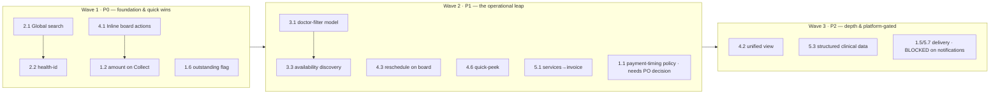

# Phase 1 — Operational Excellence

**Type:** Product Office roadmap / specification. **Planning only — no implementation.**
**Author role:** Chief Product Engineer + Healthcare Workflow Consultant.
**Input:** the five [Product Office Audit](../product-office-audit/README.md) documents.
**Governing frame:** [AGENTS.md](../../AGENTS.md), the [Product Bible](../AURIVA-PRODUCT-BIBLE.md), and the [Knowledge Base](../knowledge-base/00-README.md).

## Why "Operational Excellence" (not "Product Polish")

We are not decorating screens. We are **refining how a real clinic runs on Auriva** — removing operational friction so the room moves faster, the money doesn't leak, and staff do less work per patient. That is the Product Bible's core promise. Every epic below is measured against one question: *does this make the clinic's day easier?*

## The five epics

| Epic | Theme | Primary persona | North-star metric it moves |
|---|---|---|---|
| **1** | [Encounter-to-Cash Excellence](./epic-1-encounter-to-cash.md) | Reception | Revenue captured per visit; seconds-to-collect |
| **2** | [Universal Search](./epic-2-universal-search.md) | All | Seconds-to-find-a-patient |
| **3** | [Doctor Discovery & Scheduling](./epic-3-doctor-discovery-scheduling.md) | Patient + Reception | Booking conversion; correct doctor first time |
| **4** | [Reception Workspace 2.0](./epic-4-reception-2.0.md) | Reception | Clicks-per-patient; queue throughput |
| **5** | [Consultation & Services](./epic-5-consultation-services.md) | Doctor + Reception | Revenue per encounter; record completeness |

## Guardrails applied throughout

- **Epic 1:** UX improvements **must not change business rules** — *except* the explicitly-scoped question of **configurable payment timing**, which is raised as a Product Office decision, not assumed.
- **Epic 2:** **Leverage the existing backend before proposing new APIs.** The identity-resolution API (`/api/patients?phone=&health_id=&name=&dob=`) is already richer than any UI exposes.
- **Epic 5:** Every proposal must be **compatible with the current architecture** (the `Service` model, first-class `Prescription`/`LabOrder`, the status machine) — additive, not a rewrite.
- **Everywhere:** one question per screen; capabilities absent-not-greyed; empty ≠ error; no fabricated data.

## Priority framework

| Priority | Meaning |
|---|---|
| **P0** | Do first — high operational value, low/medium effort, or unblocks other work |
| **P1** | High value; do after P0 or once a dependency clears |
| **P2** | Valuable but deferrable; often blocked by a platform gap (e.g. notifications) |

## Cross-epic priority matrix (the recommended build order)

| ID | Improvement | Epic | Complexity | Priority |
|---|---|---|---|---|
| 2.1 | Global patient search (reuse identity-resolution API) | 2 | M | **P0** |
| 4.1 | Inline check-in / send-in / collect from the board | 4 | M | **P0** |
| 1.2 | Show amount on the "Collect" action | 1 | L | **P0** |
| 1.6 | Outstanding-balance flag at check-in | 1 | M | **P0** |
| 2.2 | Surface health-id search (backend already supports) | 2 | L | **P0** |
| 3.1 | Consistent doctor-filter model (specialty/availability/clinic) | 3 | M | **P1** |
| 3.3 | Availability-aware discovery (reuse `/doctors/next-slots`) | 3 | M | **P1** |
| 4.3 | Reschedule as a first-class board action | 4 | M | **P1** |
| 4.6 | Patient quick-peek (mini record without leaving the board) | 4 | M | **P1** |
| 5.1 | Wire the Services catalog into the consult → invoice line items | 5 | M/H | **P1** |
| 1.1 | Configurable payment-timing policy (before/after/hybrid) | 1 | M/H | **P1 (decision)** |
| 2.4 | Server-side doctor search | 2 | M | **P1** |
| 5.6 | Consultation templates (SOAP) depth | 5 | M | **P1** |
| 4.2 | Unify board + calendar (one operational view) | 4 | M/H | **P2** |
| 5.4 | Lab result display depth + vault integration | 5 | M | **P2** |
| 5.3 | Structured clinical data (off the god table) | 5 | H | **P2** |
| 1.5 / 5.7 | Receipt + follow-up delivery | 1/5 | M | **P2 (blocked)** |

## Sequencing (dependency-aware)

**Hard dependency to flag now:** anything requiring **notification delivery** (SMS receipts, appointment reminders, follow-up nudges, results-ready) is **blocked** — the notification/announcement/preferences platform does not exist ([Tech Debt TD-04](../knowledge-base/25-technical-debt-register.md)). Those items are P2 and gated, not scheduled into Wave 1/2.

## The two decisions the Product Office must make before Wave 2

1. **Payment-timing policy (1.1)** — do we support pay-before / pay-after / hybrid as a clinic setting? This is the one item that touches business rules. See Epic 1.
2. **Services-in-consult ownership (5.1)** — does the *doctor* add billable services during the consult, the *reception* at checkout, or both? This shapes Epic 5's whole design.

*Each epic file specifies every improvement with: business problem · user story · current workflow · proposed workflow · UX rationale · business impact · engineering complexity · dependencies · recommended priority · acceptance criteria.*
