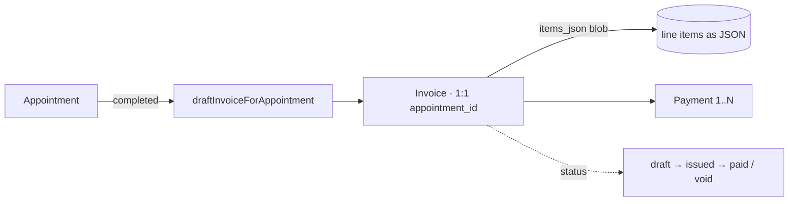
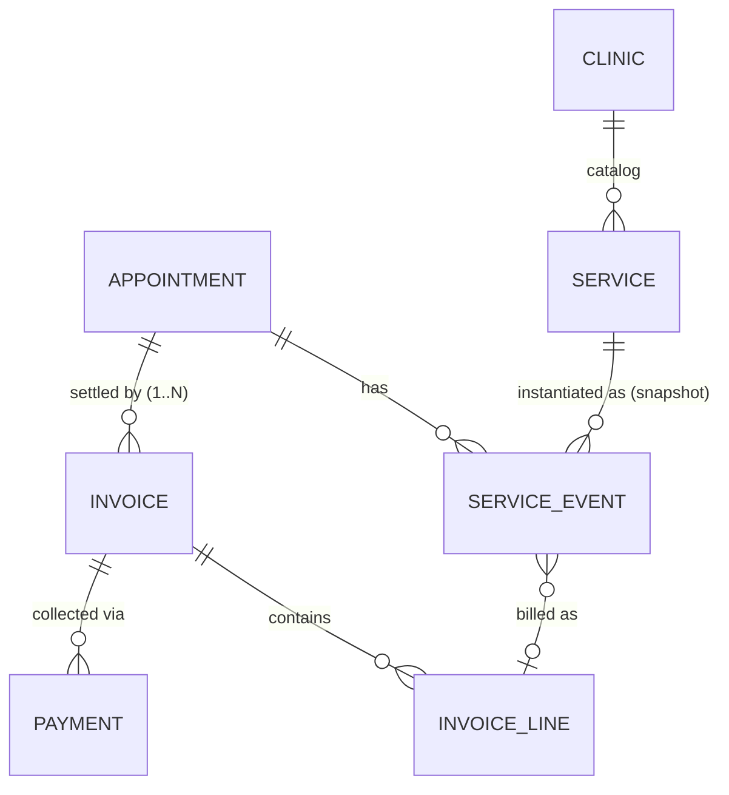

# Billing & Revenue Architecture Review

**Type:** Architecture review / decision pre-work for **Milestone 3** (Configurable Billing Policy + Services). **Analysis only — no engineering plan, no code.**
**Requested by:** Product Office, before any M3 engineering, because M3 is the first milestone that changes **business rules**, not just workflow.
**Governing decisions (already approved):** clinic-wide billing policy (Prepaid default / Postpaid / Hybrid); Doctor adds *clinical* services, Reception adds *financial* charges; **Service-Event-first** architecture; categorized service catalog; draft→finalized integrity (adjustments/reversals after payment).

---

## 0. Executive summary & recommendation

**The current invoice model is good for what it does (a clean cash ledger for a single consult) but is not sufficient for M3.** Three structural facts block the approved direction:

1. **Billing is invoice-first, not event-first.** An invoice is drafted *from* an appointment on completion; there is no record of "a service was performed." The PO's rule inverts this.
2. **`Invoice.appointment_id` is `@unique` (1:1).** Prepaid + services-after needs **two settlements per visit** — impossible with a 1:1 link.
3. **Line items are a JSON blob (`items_json`), not rows,** and the `Service` catalog has **no category and no clinical/financial type** — so per-service permissions, reporting, tax, and packages have nowhere to live.

**Recommendation:** introduce one new relational entity — **`ServiceEvent`** (the atomic clinical/financial fact) — as the source of truth, extend the `Service` catalog (category + kind + tax-ready), relax the invoice↔appointment 1:1, and make **invoices a *settlement* of finalized service events** at the clinic's chosen collection point. This is **additive and incremental** — existing invoices/print/QA keep working through a denormalized snapshot. It future-proofs packages, insurance, GST, analytics, and inventory **without redesigning the workflow again**.

---

## 1. Current architecture (as-is)



| Entity | Shape | Notes |
|---|---|---|
| `Invoice` | `appointment_id @unique`, `items_json` (string), `total` (int INR), status | **1:1** with appointment; line items are a JSON blob; frozen after issue |
| `Payment` | `invoice_id`, `amount`, `method`, `received_by` | **Many per invoice** → partial payment is representable (balance = total − Σpayments) |
| `Service` | name, `duration_minutes`, `price`, `buffer_minutes`, `is_active`, `sort_order` | **Scheduling-oriented.** No category, no clinical/financial type, **not linked to billing** |
| Invoice status machine | `draft → issued\|void`, `issued → paid\|void`, `paid/void` terminal | **Corrections after issue = void + new invoice, never an edit** (APS-018 E1) — a firm, good rule |

**Strengths (keep these):** a single cash-ledger choke point (`billing-service.ts`); immutability after issue; multi-payment; idempotent draft; clean status machine.

**Limits for M3:** invoice-first (no service events); 1:1 appointment↔invoice; JSON line items; no service categories/type; no tax/discount/refund/adjustment/package/insurance modeling.

---

## 2. The Product Office's questions — answered

| # | Question | As-is answer | With the proposed design |
|---|---|---|---|
| 1 | **Is the current invoice model sufficient?** | For one post-paid consult, yes. For M3 (prepaid, services, permissions, reporting), **no** — see §1 limits. | Yes — invoice becomes a *settlement* of service events; policy-aware. |
| 2 | **How do Services become Invoice Line Items?** | They don't — `Service` is scheduling-only; invoices are hand-built from JSON. | A **`ServiceEvent`** (service added to an appointment) is the source; **finalized** events generate invoice lines. |
| 3 | **Partial payments?** | Supported at data level (many `Payment`s); no explicit "partially paid" status — balance is computed (M1 already does this). | Keep balance-derived; optionally surface a `partially_paid` view state. Payment model unchanged. |
| 4 | **Service removed before payment?** | Only while the invoice is `draft` (`addInvoiceItem`/`setDraftInvoiceItems` reject non-draft). | A `draft` **ServiceEvent** can be **removed** (status `removed`) by the permitted role before finalize/payment. Clean, audited. |
| 5 | **What happens after payment?** | `paid` is terminal; corrections = void + new invoice. | Same immutability. Post-payment change = a **reversal/adjustment ServiceEvent** (negative) → a credit note; **never a silent edit**. |
| 6 | **Refunds / reversals?** | Not modeled (void voids the whole invoice; no partial refund). | **Reversal ServiceEvent** (negative amount) + a **refund `Payment`** (negative) or credit-note invoice. Auditable, partial-capable. |
| 7 | **Packages later?** | No model. | A `Package` (bundle of services at a price) expands into ServiceEvents on add — the event model already carries it. |
| 8 | **Insurance later?** | No model. | A future `Claim` references the invoice + its service events; payer/patient split sits on payments. No workflow redesign. |
| 9 | **GST / taxes later?** | `total` is a flat int; no tax lines/rates. | `Service.tax_rate` (+ HSN/SAC) → snapshot on ServiceEvent → tax breakdown on invoice. **Additive.** |
| 10 | **Compatible with current architecture?** | — | **Yes** — additive tables + a snapshot bridge keep the existing billing service, print, and UI working; migrate incrementally. |

---

## 3. Proposed architecture — Service-Event-first

### 3.1 The principle (the PO's rule, encoded)

**The clinical/operational event happens first; billing is its consequence.** An invoice is a *settlement document* over a set of finalized service events — not the origin of truth.

### 3.2 Entities (additive)



- **`Service` (extend):** add **`category`** (enum: Consultation · Procedure · Lab · Radiology · Vaccination · Injection · Therapy · Consumable · Administrative) and **`kind`** (`clinical` | `financial`) — `kind` drives *who can add it* (§3.4). Tax-ready: optional `tax_rate`, `hsn_sac`. Keep price/duration/is_active.
- **`ServiceEvent` (new — the keystone):** `appointment_id`, `service_id?` (nullable for ad-hoc), `clinic_id`, `patient_id`; **snapshots** `name`, `unit_price`, `qty`, `amount`, `category`, `kind`, (`tax_rate`); `added_by_user_id`, `added_by_role` (`doctor`|`reception`), `added_at`; **`status`**: `draft → finalized → reversed`, or `draft → removed`; `invoice_line_id?` once billed. *Snapshots protect against later catalog price changes.*
- **`Invoice` (relax + bridge):** drop the `appointment_id @unique` → **an appointment has 1..N invoices** (prepaid consult + later services). Lines are generated from **finalized** service events. **Keep `items_json` as the frozen snapshot at issue** (so existing print/UI/QA are untouched) — optionally add a relational `InvoiceLine` table later for tax/reporting depth (see §5).
- **`Payment` (unchanged):** still many-per-invoice; refunds are negative-amount payments.

### 3.3 Lifecycle — draft vs finalized (financial integrity)
```
Doctor adds ECG ₹500  →  ServiceEvent {draft, clinical, by doctor}
Patient leaves early   →  Reception removes it  →  {removed}   (allowed: not yet paid)
Consult ends           →  events FINALIZE into an invoice at the collection point
Invoice issued/paid    →  events {finalized} + invoice frozen (items_json snapshot)
Post-payment change    →  reversal ServiceEvent {reversed, −amount} → credit note   (never a silent edit)
```
- **Removable only before finalize/payment.** After payment → adjustment/reversal only. This is the existing "void+new / immutable" rule, extended to the event grain.

### 3.4 Permissions (the approved split)
| Role | May add (ServiceEvent `kind`) | Examples |
|---|---|---|
| **Doctor** (`doctor_workspace`) | **clinical** | Procedures, investigations, lab orders, injections, dressings, therapies |
| **Reception** (`reception`) | **financial** | Consultation fee, registration fee, admin charges, discounts (permission-gated), payment, packages (future) |
Reception **cannot** add clinical services; the doctor **need not** touch financial charges. Enforced at the service layer by `kind` × capability.

### 3.5 The three payment policies (clinic-wide setting)
A single `Clinic.billing_policy` (`prepaid` | `postpaid` | `hybrid`) governs **when** invoices are issued/collected relative to service events — **not** what the events are.

| Policy | Flow |
|---|---|
| **Prepaid** (default, new clinics) | Reception adds *consultation-fee* ServiceEvent at registration → **prepaid invoice issued + collected before the consult**. Clinical services added during the consult → a **second invoice** at checkout. |
| **Postpaid** | All service events accrue → **one invoice** finalized at completion → collect at the Desk. |
| **Hybrid** | Consult-fee invoice at registration + a services invoice at checkout. |
Existing clinics default to **postpaid** (zero behaviour change); new clinics default **prepaid**.

---

## 4. Compatibility & incremental migration (no big-bang)

1. **Add `ServiceEvent` + extend `Service`** (additive migrations; nothing existing breaks).
2. **Bridge:** `draftInvoiceForAppointment` and the Desk keep working; the invoice's `items_json` is now *generated from finalized service events* (a snapshot), so print/UI/QA are unchanged.
3. **Relax `Invoice.appointment_id @unique`** → 1:N (additive constraint change; existing 1:1 rows still valid).
4. **Add `Clinic.billing_policy`** (default `postpaid` for existing, `prepaid` for new).
5. **Wire the UIs** (doctor adds clinical events in the Workbench; reception adds financial + collects at the Desk) — reusing existing components.
6. Relational `InvoiceLine` + tax/packages/insurance are **later, additive** layers on the same event model.

Every step is additive and independently shippable — matching the Phase-1 discipline (no destructive schema change, no status-machine change to appointments).

---

## 5. Future-proofing (why event-first pays off)

| Capability | How the event model absorbs it |
|---|---|
| **Packages** | `Package` = named bundle of services; adding it expands into ServiceEvents (or one package event + components). |
| **Insurance** | `Claim` references invoice + service events; payer/patient split on payments; no workflow change. |
| **GST / taxes** | `Service.tax_rate`/`hsn_sac` → snapshot on event → tax breakdown on invoice (relational lines make per-line tax clean). |
| **Analytics** | Service events are relational, categorized, dated, role-attributed → real revenue/procedure/doctor-productivity reporting. |
| **Inventory** | Consumable service events decrement stock later — the event is the hook. |
| **AI** | Structured, categorized clinical+financial events are the substrate for the deferred clinical-intelligence release. |

---

## 6. Open questions for the Product Office (confirm before the M3 engineering plan)

1. **Invoice line storage:** keep `items_json` as the frozen snapshot (recommended, incremental) **and add relational `InvoiceLine` now, or later?** (Relational is better for GST/reporting but is more work.)
2. **One invoice or many per appointment in Hybrid/Prepaid?** Recommendation: **many** (prepaid consult invoice + services invoice). Confirm.
3. **"Partially paid":** keep balance-derived (recommended) or add an explicit status?
4. **Discounts:** a `financial` ServiceEvent with negative amount, permission-gated — confirm the capability that gates discounts.
5. **Ad-hoc services:** may a doctor/reception add a one-off not in the catalog (name + price), or catalog-only? (Recommendation: catalog-first, ad-hoc allowed with a flag for later cleanup.)
6. **Refund mechanism:** negative `Payment` vs a credit-note invoice — confirm the preferred artifact for the pilot.
7. **Reversal window:** who can reverse a finalized/paid service event, and does it need a reason (audit)?

---

## 7. Recommendation & next step

Adopt the **Service-Event-first** architecture (§3), migrated **incrementally** (§4). It satisfies every approved M3 decision, preserves the current cash ledger's integrity, and future-proofs packages/insurance/GST/analytics without another workflow redesign.

**Next step (after your review):** with §6 confirmed, I'll produce the **Milestone 3 Engineering Plan** — entities, service-layer changes, UI touch-points, migration order, risks, effort — for approval before any code, per the gated process.
