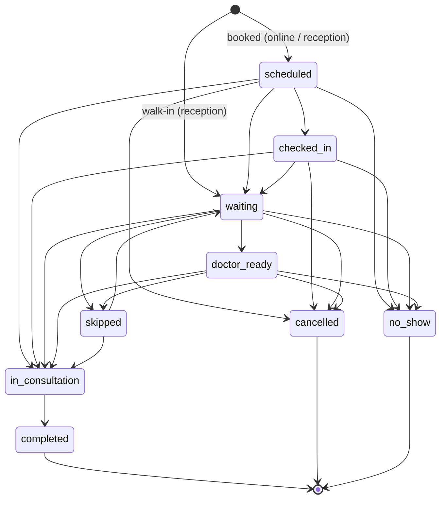
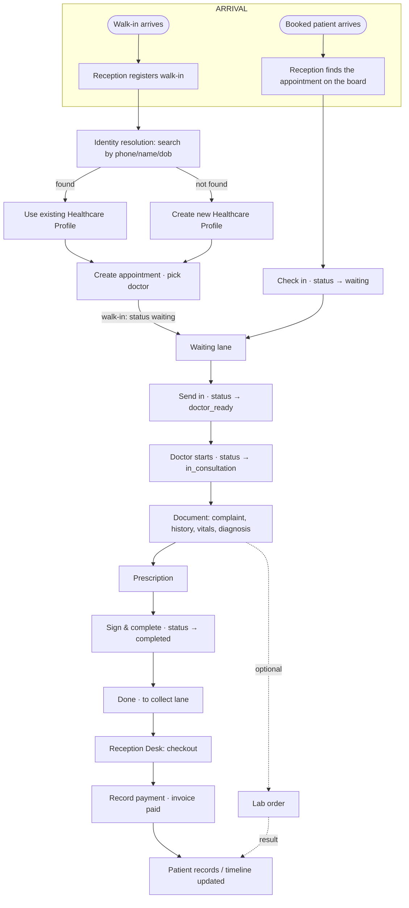
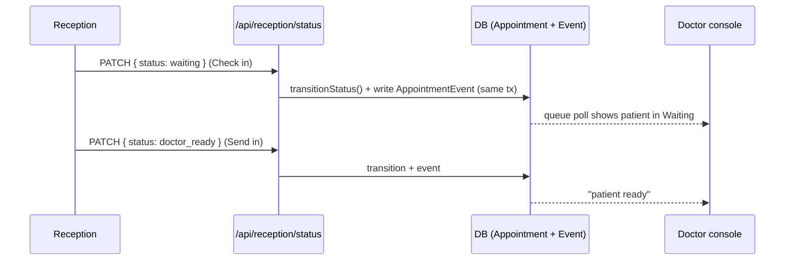
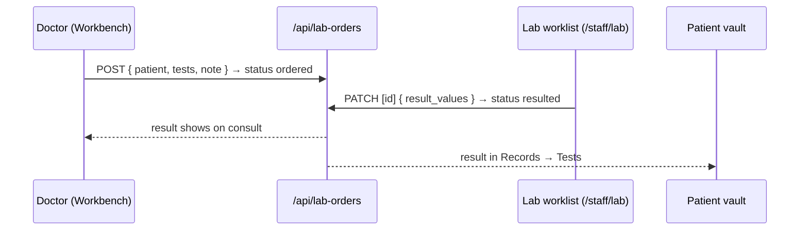
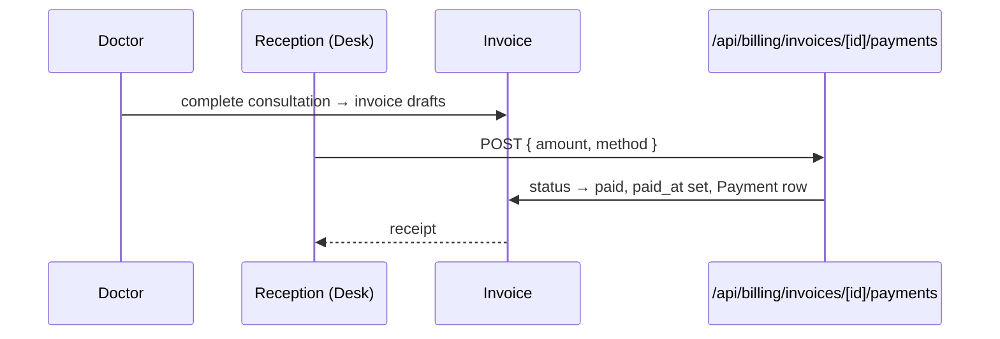

# Document 1 — Current End-to-End Operational Workflow

**Type:** Product Office analysis of the **actual implemented** workflow. Documents current state only — **no proposed solutions.**
**Scope:** patient arrival → consultation completion → checkout → records.
**Verified against:** `src/domain/appointment-status.ts`, `src/app/api/**`, the reception/doctor/patient components, `prisma/schema.prisma`.

---

## 0. The connective tissue: the appointment status machine

Everything below is driven by one state machine. Every surface reads and writes the **same** `Appointment.status`. This is the single most important fact about how Auriva works operationally.

**Verified transition table** (`TRANSITIONS` in `appointment-status.ts`):

| From | Allowed → |
|---|---|
| `scheduled` | checked_in, waiting, in_consultation, cancelled, no_show |
| `checked_in` | waiting, in_consultation, cancelled, no_show |
| `waiting` | doctor_ready, in_consultation, skipped, cancelled, no_show |
| `doctor_ready` | in_consultation, skipped, cancelled, no_show |
| `skipped` | waiting, in_consultation |
| `in_consultation` | **completed** (only) |
| `completed` / `no_show` / `cancelled` | — (terminal) |

**Automatic timestamps** (`timestampPatchFor`): `checked_in`/`waiting` → sets `checked_in_at`; `in_consultation` → sets `started_at`; `completed` → sets `completed_at`.

**Business-rule invariants** (from `technical-debt.md` §1):
- Every status change goes through `transitionStatus()` — no surface writes a status directly.
- Every appointment mutation writes an `AppointmentEvent` in the **same transaction** (audit trail).
- `scheduled → in_consultation` is intentionally allowed (the doctor console historically pre-dated check-in) — flagged as debt D13.

---

## 1. The full operational flow (both paths)

---

## 2. Step-by-step (with APIs, DB entities, status, rules)

### Step 1 — Patient arrival
- **Booked:** the appointment already exists (`status: scheduled`), created earlier by the patient (online) or reception. It shows on the Front-desk board.
- **Walk-in:** no appointment yet; reception creates one on the spot.
- **DB:** `Appointment`, `PatientProfile`, `Clinic`, `StaffProfile` (doctor).

### Step 2 — Walk-in vs booked (divergence)
| | Booked | Walk-in |
|---|---|---|
| Entry | Already on board as `scheduled` | Reception opens the Walk-in modal |
| Identity | Already linked to a profile | Must resolve/create a profile first |
| Doctor | Chosen at booking | Chosen in the walk-in modal |
| Landing status | `scheduled` → reception checks in → `waiting` | Created directly into the queue (`waiting`) |
| API | `POST /api/appointments` (earlier) | `POST /api/reception/walkin` |

### Step 3 — Patient search / identity resolution
- **API:** `GET /api/patients?phone=&health_id=&name=&dob=` → `resolveHealthcareProfile()`. Requires at least one of phone/health_id/name.
- Returns matching Healthcare Profiles (name, DOB, gender, guardian, health_id, phones).
- **Rule:** one phone may resolve to **many** profiles (family sharing) — the caller disambiguates.
- **DB:** `PatientProfile`, `Contact` (phone values, not unique), `AccountProfileLink`.

### Step 4 — Registration (new profile)
- If no match: `POST /api/patients` with `full_name` and/or `phone_number` (at least one).
- Creates a `PatientProfile` with a unique `health_id` (`AUR-XXXXXX`), a phone `Contact`, `registered_by_clinic_id` provenance, `verification_level`.
- **Rule:** a Healthcare Profile can exist with **no Auriva Account** (reception/emergency registration) — `user_id` is nullable.

### Step 5 — Appointment creation & doctor assignment
- **Walk-in:** `POST /api/reception/walkin` — patient + `doctor_id` + reason → creates `Appointment` (status `waiting`, a `queue_number`).
- **Booked (reception):** `POST /api/appointments` — patient + `doctor_id` + `scheduled_time` → status `scheduled`.
- **Doctor assignment is set at creation** (the walk-in modal / book dialog choose the doctor). There is **no separate "reassign to another doctor" action** on the board (the DoctorFilter is a *view* filter, not reassignment) — see Doc 2 limitations.
- **DB:** `Appointment` (patient_id, doctor_id, clinic_id, status, queue_number, scheduled_time, checked_in_at…), `AppointmentEvent`.

### Step 6 — Waiting queue
- Reception board groups the queue into **3 lanes**: Waiting (scheduled/checked-in/waiting/doctor_ready/skipped) · In consultation · Done·to collect (today's completed).
- **Check in** (booked): `POST /api/reception/checkin` or `PATCH /api/reception/status` → `waiting` (sets `checked_in_at`).
- **Send in:** `PATCH /api/reception/status` → `doctor_ready`.
- Progressive **wait-aging** (visual only): ≥20m honey · ≥30m orange · ≥45m red, computed from `checked_in_at`.
- **API:** `GET /api/reception/queue?doctor_id=&search=`, `GET /api/reception/dashboard`.

### Step 7 — Consultation
- Doctor opens the **Workbench** (`/doctor/workbench`), selects the patient.
- **Start:** `PATCH /api/appointments/[id]` → `in_consultation` (sets `started_at`).
- **API:** `GET /api/appointments?doctor_id=` (queue), `PATCH /api/appointments/[id]` (status + clinical fields).
- **Rule:** `/doctor` and `PATCH /api/appointments/[id]` are session-gated + clinic-scoped (debt D1 resolved).

### Step 8 — Clinical documentation
- Doctor records into the appointment: `chief_complaint`, `history_notes`, `vitals_json`, `diagnosis`, `prescription_notes`.
- Read-only **Clinical Safety** chips surface allergies / chronic conditions / abnormal recorded vitals (no inference).
- Auto-saved via `PATCH /api/appointments/[id]` (debounced).
- **DB:** clinical fields currently live **on the `Appointment` row** (debt TD-18, the "god table").

### Step 9 — Prescription
- Medicines stored in `prescription_medicines_json` (name/dosage/frequency/duration); templates + print.
- First-class `Prescription` model also exists in schema.
- **Rule:** no drug-interaction checking (deferred).

### Step 10 — Lab (optional, any time during consult)
- `POST /api/lab-orders` — patient + doctor + tests + clinical note → status `ordered`.
- Org worklist (`/staff/lab`) fulfils: `PATCH /api/lab-orders/[id]` → `resulted` with result values.
- Result lands back on the consult and the patient's health vault.
- **DB:** `LabOrder` (tests_json, status, result_values_json), `TestRecommendation`.

### Step 11 — Sign & complete
- **API:** `PATCH /api/appointments/[id]` → `completed` (sets `completed_at`); clinical fields persisted in the same action.
- **Rule:** `in_consultation → completed` is the **only** transition out of consultation; the flip is the **handoff to reception**.
- Card moves to **Done · to collect**.

### Step 12 — Billing (invoice)
- An `Invoice` drafts on completion (auto). Statuses: `draft → issued → paid → void`.
- **API:** `GET /api/billing/invoices?today=&status=`, `GET /api/patients/[id]/invoices`.
- **DB:** `Invoice` (total, status, items_json, appointment_id, patient_id), `Payment`.

### Step 13 — Checkout & payment
- Reception Desk (`/staff/billing`) collects: `POST /api/billing/invoices/[id]/payments` (UPI/Cash/Card) → `Payment`, invoice → `paid`, `paid_at` set.
- Receipt available; the visit leaves the desk.

### Step 14 — Patient records
- The completed visit + Dx + Rx + invoice ("Paid") appear on the patient timeline.
- **API:** `GET /api/patients/[id]/timeline`, `/invoices`, patient app `GET /api/appointments?patient_id=`.
- **Rule:** the patient owns their vault; the same profile/`health_id` carries the whole way through.

---

## 3. Entities touched across the flow

| Entity | Role in the flow |
|---|---|
| `PatientProfile` | The clinical identity (health_id); created/resolved at registration |
| `Contact` | Phone/email values (phone not unique = family sharing) |
| `AccountProfileLink` | Links an Auriva Account to profiles it can act for |
| `Appointment` | The visit — carries status + clinical fields (god table) |
| `AppointmentEvent` | Audit trail; written in the same tx as every status change |
| `StaffProfile` | The doctor (doctor_id) |
| `Clinic` / `Organization` | Tenancy + scoping |
| `Invoice` + `Payment` | The cash cycle |
| `LabOrder` / `TestRecommendation` | The lab loop |
| `Prescription` | First-class Rx model (alongside the JSON on the appointment) |

## 4. APIs touched across the flow

`/api/patients` (resolve/create) · `/api/reception/walkin` · `/api/reception/checkin` · `/api/reception/status` · `/api/reception/queue` · `/api/reception/dashboard` · `/api/appointments` · `/api/appointments/[id]` · `/api/lab-orders` (+`/[id]`) · `/api/billing/invoices` (+`/[id]/payments`) · `/api/patients/[id]/timeline` · `/api/patients/[id]/invoices`.

## 5. Where the current flow has friction (observed, no solutions proposed)

- Doctor assignment is **fixed at creation**; no board-level reassignment.
- Clinical data on the **Appointment god table** (TD-18) limits structured records.
- **No pagination** on list endpoints (TD-10).
- Identity resolution for a **shared phone** can be ambiguous for public booking (TD-12).
- The consult→invoice link is auto, but invoice **line items** are minimal (consult fee; services/treatments model exists but isn't deeply wired into the consult).

*(Detailed pain points per surface are in Documents 2–4; search/filter gaps in Document 5.)*
