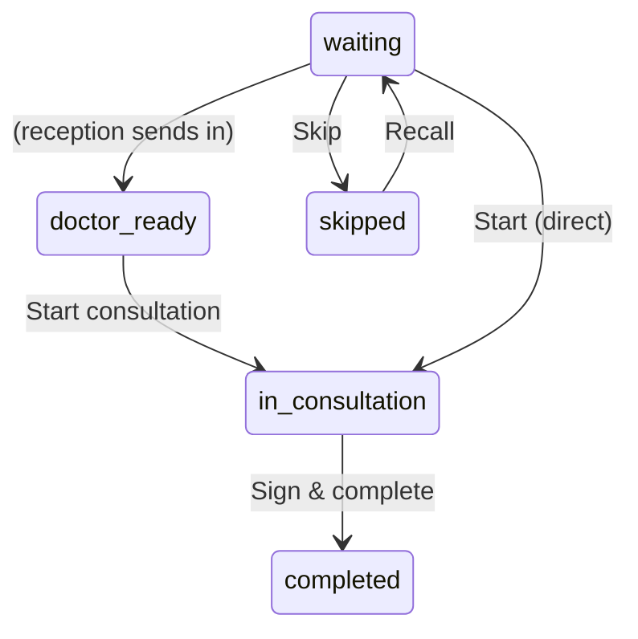

# Document 3 — Doctor Workflow Deep Dive

**Type:** Current-state audit of the Doctor (`/doctor`) workspace. **No proposed solutions.**
**Surface:** Doctor + Nurse (capability-gated). Session-authenticated; clinic-scoped.
**Verified against:** `doctor-shell.tsx`, `doctor-today.tsx`, `doctor-workbench-view.tsx`, `consult-workbench.tsx`, `queue-sidebar.tsx`, `context-panel.tsx`, `mission-control-bar.tsx`, `doctor-patients.tsx`, `prescription-editor.tsx`.

---

## 1. Login → surface resolution

```mermaid
sequenceDiagram
    participant U as Doctor
    participant L as /login
    participant S as Session + capabilities
    participant SR as resolveSurfacePath
    U->>L: phone + password
    L->>S: credential check (scrypt, rate-limited); must_change_password gate
    S->>SR: capabilities → surface
    SR-->>U: redirect to /doctor (Today)
```

- Staff login is credentialed; if `must_change_password`, a mandatory change gate precedes the surface.
- A person with more than one membership sees the **workspace selector** first; single membership → straight to `/doctor`.

---

## 2. Navigation (the shell)

```
Auriva          [S] Clinic · Doctor ▾           🔔  (avatar → Profile)  ⎋
├─ Today      → /doctor            (landing)
├─ Workbench  → /doctor/workbench
├─ Schedule   → /doctor/schedule
├─ Patients   → /doctor/patients
├─ Practice   → /doctor/practice
└─ Profile    → /doctor/profile
   (WorkspaceSwitcher at the bottom of the rail — solo surface switch)
```

---

## 3. Page: Today (`/doctor`) — the calm landing

**Purpose:** answer "who's next?" without opening the full consult.

**Regions:** Mission-Control daybar (greeting · date · clinic · metrics: patients/waiting[honey]/completed · "N min behind" [honey] · Next + Call in) → **Quick actions** (Start consultation · Open schedule · Pause booking) → **Waiting list** (max-w card, "Waiting · N", rows: #token · avatar · name · blood group · notes).

**Actions:**
| Action | Effect | API |
|---|---|---|
| Call in / select a waiting patient | Opens Workbench with that appointment | `router.push(/doctor/workbench?appointment=…)` |
| Start consultation | Opens Workbench | navigation |
| Open schedule | → `/doctor/schedule` | navigation |
| Pause booking | Toast: "clinic-wide setting" (informational) | none (no real toggle here) |

**Data:** `GET /api/appointments?doctor_id=` (poll 8s), `GET /api/patient/recommendations` (unused here).
**States:** loading skeleton rows; empty = "No one waiting — you're all caught up" + Open schedule CTA.

---

## 4. Page: Workbench (`/doctor/workbench`) — the consult

**Purpose:** answer "what does this patient need?" — the full 3-column consult.

```
┌ QUEUE SIDEBAR ─┬─ CONSULT (center) ───────────────────────┬─ CONTEXT PANEL ─┐
│ Patient Queue  │  [avatar] Name  [status badge]            │ Clinical        │
│ [Today|All]    │  age · gender · Token                     │ snapshot:       │
│ [search]       │  ── PROGRESS STEPPER ──                   │ blood group,    │
│ IN CONSULT     │  Ready → Consultation → Rx → Complete     │ emergency,      │
│ WAITING · N    │  ── CLINICAL SAFETY (read-only) ──        │ current meds,   │
│ SKIPPED · N    │  Allergy / Chronic / abnormal vital chips │ recent labs,    │
│  [Skip][Recall]│  Chief complaint & history                │ insurance(soon),│
│                │  Vitals (BP/Pulse/Temp/SpO2/Weight)       │ last visit,     │
│                │  Lab Orders                               │ AI assist       │
│                │  Diagnosis & E-Prescription               │ (reserved)      │
│                │  [Save draft][Print][Complete]            │                 │
└────────────────┴───────────────────────────────────────────┴─────────────────┘
```

**Actions & transitions:**
| Action | Status effect | API |
|---|---|---|
| Start consultation | (scheduled/waiting/doctor_ready/skipped) → `in_consultation` | `PATCH /api/appointments/[id]` |
| Save clinical fields | none (persists complaint/history/vitals/diagnosis/notes) | `PATCH /api/appointments/[id]` (debounced) |
| Order lab | creates order | `POST /api/lab-orders` |
| Add/apply prescription | persists `prescription_medicines_json` | `PATCH /api/appointments/[id]` |
| Skip / Recall | waiting↔skipped | `PATCH /api/appointments/[id]` |
| Sign & complete | `in_consultation` → `completed` (only exit) | `PATCH /api/appointments/[id]` |

**Progress stepper** (derived, no new workflow): Patient ready (arrived) → Consultation (complaint/history/dx/notes present) → Prescription (medicines present) → Complete (status completed).

**Clinical Safety chips** (factual, read-only, **no AI**): allergies + chronic conditions (from profile) + recorded vitals outside the standard reference range (BP ≥140/90, pulse >100/<50, temp ≥100.4, SpO₂ <94).

**Context panel:** Blood group, emergency contact, current medication (from prescriptions), recent labs ("coming soon"), insurance ("coming soon"), last visit with this doctor, AI Assist ("Reserved — not part of this release").

---

## 5. Page: Schedule (`/doctor/schedule`)

- Doctor calendar (Day / Week / Month) over the schedule read-model (`GET /api/clinic/schedule`); booked appointments + time blocks.
- Block time (`POST /api/doctors/[id]/time-blocks`) for availability management (owner/doctor).

## 6. Page: Patients (`/doctor/patients`)

- List of patients the doctor has seen (derived from their appointments); **name search only** (client-side).
- Shows visit count; row → patient detail/timeline.
- **Explicit limitation in UI:** *"Advanced patient filters will be available in a future release."*

## 7. Page: Practice (`/doctor/practice`)

- Practice/profile presentation (bio, fees, availability settings surfaces) — the doctor's clinic-facing presence.

## 8. Page: Profile (`/doctor/profile`)

- Doctor's own profile (name, specialty, qualifications, languages, registration, consultation fee, reviews).

---

## 9. Business rules (doctor-specific)

- `/doctor` + `PATCH /api/appointments/[id]` are session-gated and clinic-scoped (debt D1 resolved).
- The doctor is the **owner of the `in_consultation` stage**; "Sign & complete" is the handoff to reception (status flip → Done·to collect).
- `in_consultation → completed` is the **only** legal exit — a consult can't be cancelled/no-showed once started.
- Every mutation writes an `AppointmentEvent` (attributed to the doctor's session user).
- Clinical safety is **read-only and factual** — the product deliberately provides **no diagnostic AI or recommendations** (deferred).

## 10. Workflow transitions (doctor's slice)



## 11. Current limitations (observed)

| Area | Limitation |
|---|---|
| Patient search | Name-only, client-side; "advanced filters" explicitly deferred |
| Clinical data | Free-text on the Appointment god table (no structured taxonomies) |
| Prescription | No drug-interaction checking (verify manually) |
| Labs | "Recent labs" in context panel = "coming soon"; result display is basic |
| AI assist | Reserved / not in this release (deferred clinical intelligence) |
| Vitals/Reports | Context "Vitals · Reports" = coming soon in some paths |
| Pause booking | Today's "Pause booking" is informational only (no real per-doctor toggle there) |
| Follow-up | `follow_up_date` captured; no automated reminder delivery (no notification platform) |
| Insurance | "coming soon" placeholder |
