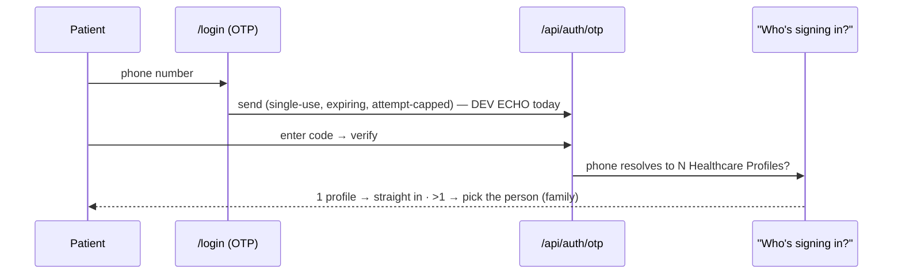

# Document 4 — Patient Workflow Deep Dive

**Type:** Current-state audit of the Patient (`/patient`) app. **No proposed solutions.**
**Surface:** one centered phone shell everywhere (desktop = centered frame, mobile = full-bleed). Bottom tabs: Home · Book · Records · Family · You.
**Verified against:** `patient-shell.tsx`, `patient/page.tsx` (Home), `book/page.tsx`, `doctors/[id]`, `records/page.tsx`, `family/page.tsx`, `you/page.tsx`, `profile/page.tsx`, `book-appointment-dialog.tsx`, `notification-center.tsx`, `health-vault.tsx`.

---

## 1. Login / identity



- **Rule:** one phone → many Healthcare Profiles (family). The selector shows each profile's **Health ID** to disambiguate.
- **Limitation:** OTP is a **dev echo** — no live SMS delivery yet.

---

## 2. Tabs & pages

```
┌───────────── PHONE FRAME (centered on desktop) ─────────────┐
│  Home │ Book │ Records │ Family │ You     (bottom tab bar)   │
└──────────────────────────────────────────────────────────────┘
```

### Home (`/patient`)
- **Greeting** (time-of-day + date) + notification bell.
- **Today summary** card: Appointment · Medicine · Payment (real data — next appt, active Rx count, outstanding invoice balance).
- **Next visit** hero (dark, honey glow): doctor, date·time, clinic, chips ("Bring previous reports", "Payment completed / ₹ to pay"), **Directions** + **Reschedule**. Empty = "You're free today."
- **For you today:** active prescribed medicines (from last completed visit, informational) + any report ready.
- **Quick actions:** Book → Records → Family → Payments.
- **API:** `GET /api/appointments?patient_id=`, `/api/patient/recommendations`, `/api/patients/[id]/invoices`.

### Book (`/patient/book`) — doctor discovery
- **Search:** client-side over **name + specialty + clinic** ("Search doctors, clinics, specialties").
- Doctor cards (name, specialty, clinic, rating). Tap → doctor profile.
- **API:** `GET /api/doctors` (cross-org directory).

### Doctor profile (`/patient/doctors/[id]`)
- Bio, specialty, fee, rating/reviews, slots.
- **Book flow:** BookAppointmentDialog → pick slot → confirm → "You're booked."
- **API:** `GET /api/doctors/[id]`, `/slots`, `/reviews`; `POST /api/public/bookings` or `/api/appointments`.

### Records (`/patient/records`) — visit timeline
- **Tabs:** Timeline · Rx · Bills · Tests (not free-text search — tab filters).
- Timeline = visits grouped, each opening Dx / prescription / reports / invoice.
- Bills = invoices (`GET /api/patients/[id]/invoices`); Tests = health vault / recommendations.
- **API:** `GET /api/patients/[id]/timeline`, `/invoices`, `/api/patient/recommendations`.
- Empty (timeline) = "Your first visit will appear here."

### Family (`/patient/family`)
- Linked Healthcare Profiles (self + family). One-tap **profile switch** (`/api/auth/switch-profile`) — greeting/context changes to that person.
- Add family member.
- **API:** `GET /api/patients/family-members`, `/api/patients/sessions`.

### You (`/patient/you`)
- Profile card (name · **Health ID** · phone).
- **Account** section: Personal details · Insurance (Soon) · Payments (→ Records/Bills) · Notifications (→ settings).
- **Settings:** Account & devices · Privacy & data. Sign out.

### Personal details (`/patient/profile`)
- Identity (name, DOB, gender, blood group, Health ID, phone) + **Health Summary** (allergies, conditions, emergency contact) edited in place via `HealthSummaryDialog` (`PATCH /api/patients/[id]`).

---

## 3. Search (patient side)

| Where | Fields | Backend |
|---|---|---|
| Book (doctor discovery) | name / specialty / clinic (client-side over the loaded list) | `GET /api/doctors` |
| Records | **no search** — tab filters (Timeline/Rx/Bills/Tests) | — |
| Family | list only (no search) | `GET /api/patients/family-members` |

**Note:** there is **no patient-side search for their own records** (only tabs), and doctor discovery search is **client-side over the fetched list** (no server-side doctor search / specialty filter / location filter).

---

## 4. Booking

- Slot-based; conflict never allowed (server-checked).
- Patient can **reschedule** from the Home hero (BookAppointmentDialog with `rescheduleAppointmentId`).
- New profile can be created during reception booking; the patient app books under the logged-in profile.

## 5. Payments

- Patient **views** bills/receipts (Records → Bills; "Payments" quick action).
- **No online payment** — collection happens at the reception Desk (in-person UPI/Cash/Card). The patient app is **read-only** on money.

## 6. Notifications

- **In-app NotificationCenter** (bell) only — `GET /api/patients/[id]/notifications`.
- **No SMS / email / push delivery exists** (the notification/announcement/preferences *platform* was never built — only event publishing). Reminders/results/confirmations do not reach the patient outside the app.

---

## 7. Current limitations (observed)

| Area | Limitation |
|---|---|
| OTP | Dev echo — no real SMS delivery |
| Doctor discovery | Client-side search only; no specialty/location/availability filters; no server search |
| Records | Tab filters only; no search within records |
| Family | Add/switch works; no granular per-member consent |
| Payments | Read-only; no online payment/gateway |
| Notifications | In-app only; no delivery channel |
| Insurance | "Soon" placeholder — not built |
| Medicines | Shown informationally ("from last visit"); no adherence tracking / reminders |
| Teleconsultation | Not built |
| Multi-clinic patient | Out of scope for the patient app |
